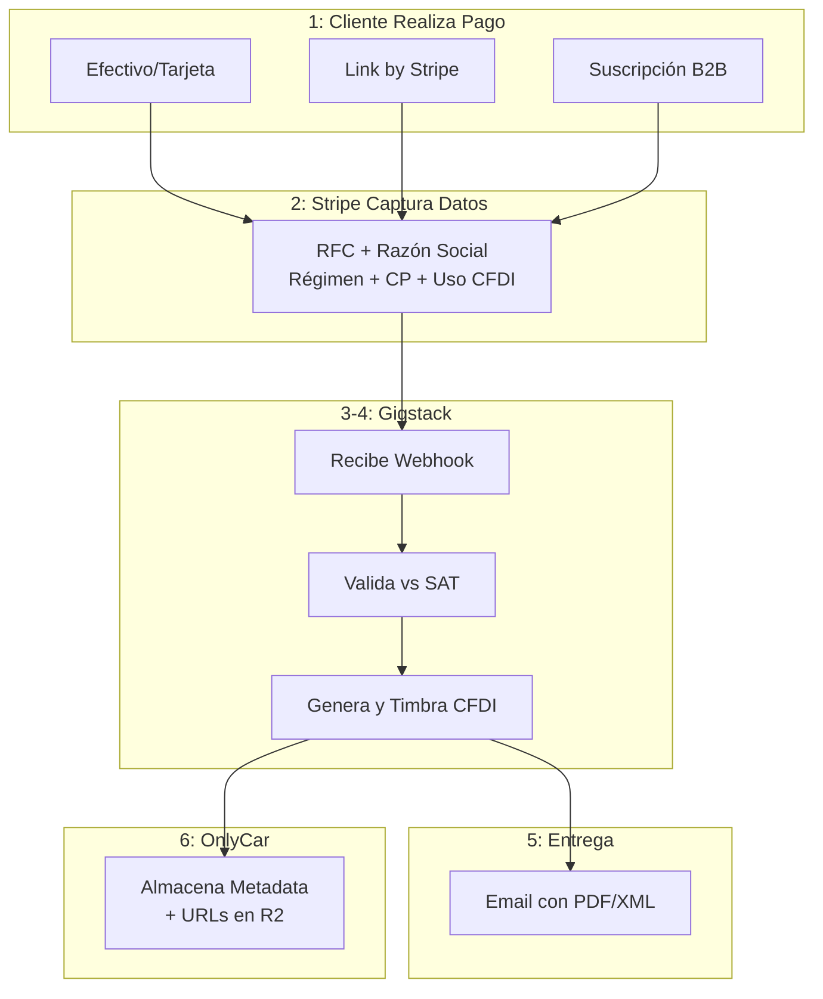

# 5.2 GIGSTACK - FACTURACIÓN AUTOMÁTICA CFDI

> Sistema integral que automatiza el ciclo operativo y fiscal completo. El flujo operativo es el siguiente: un cliente empresarial (B2B) o cliente final (B2C) genera una solicitud de servicio a través de la plataforma, el sistema notifica automáticamente, confirma disponibilidad, acepta el servicio de forma autónoma, el técnico realiza el trabajo de limpieza vehicular y finalmente marca el servicio como completado.


> [!IMPORTANT]
> OnlyCar delega **completamente** el procesamiento de datos fiscales y emisión de CFDIs a **Gigstack**, plataforma certificada que actúa como intermediario autorizado entre Stripe (pasarela de pagos) y el SAT (Servicio de Administración Tributaria).

---

## Delegación Total de Responsabilidad Fiscal

**Ventajas del modelo delegado:**

- ✅ OnlyCar **NO procesa** Constancias de Situación Fiscal (CSF)
- ✅ OnlyCar **NO almacena** datos fiscales sensibles
- ✅ Gigstack asume **toda la responsabilidad legal** como PAC autorizado
- ✅ Cumplimiento **automático** con SAT y LFPDPPP 2025
- ✅ Validaciones **oficiales** contra padrón SAT
- ✅ **Mínima superficie** de ataque de seguridad
- ✅ **Reducción del 95%** de complejidad legal y técnica

---

## Arquitectura del Sistema



```
FLUJO COMPLETO DE FACTURACIÓN AUTOMATIZADA:
┌─────────────────────────────────────────────────────────────┐
│ 1. CLIENTE REALIZA PAGO                                     │
│    • Efectivo/Tarjeta post-servicio                         │
│    • Link by Stripe post-servicio                           │
│    • Suscripción B2B mensual                                │
└────────────────────┬────────────────────────────────────────┘
                     │
                     ▼
┌─────────────────────────────────────────────────────────────┐
│ 2. STRIPE CAPTURA DATOS FISCALES                            │
│    • RFC (campo personalizado)                              │
│    • Razón Social (campo personalizado)                     │
│    • Régimen Fiscal (dropdown personalizado)                │
│    • Código Postal (billing address)                        │
│    • Uso de CFDI (dropdown personalizado)                   │
└────────────────────┬────────────────────────────────────────┘
                     │
                     ▼
┌─────────────────────────────────────────────────────────────┐
│ 3. GIGSTACK RECIBE WEBHOOK DE STRIPE                        │
│    • Detecta pago exitoso automáticamente                   │
│    • Valida datos fiscales contra SAT                       │
└────────────────────┬────────────────────────────────────────┘
                     │
                     ▼
┌─────────────────────────────────────────────────────────────┐
│ 4. GIGSTACK GENERA Y TIMBRA CFDI                            │
│    • Usa CSD de OnlyCar (previamente configurado)        │
│    • Timbra ante PAC autorizado por SAT                     │
│    • Genera PDF y XML del CFDI                              │
└────────────────────┬────────────────────────────────────────┘
                     │
                     ▼
┌─────────────────────────────────────────────────────────────┐
│ 5. GIGSTACK ENVÍA FACTURA AL CLIENTE                        │
│    • Email automático con PDF/XML adjuntos                  │
│    • Portal de autofactura (si cliente lo requiere)         │
└────────────────────┬────────────────────────────────────────┘
                     │
                     ▼
┌─────────────────────────────────────────────────────────────┐
│ 6. ONLYCARNLD RECIBE NOTIFICACIÓN                           │
│    • Webhook de Gigstack confirma factura timbrada          │
│    • Sistema almacena SOLO metadata + URLs de documentos    │
│    • Descarga PDF/XML y almacena en Cloudflare R2           │
│    • Conservación 5 años (Código Fiscal de la Federación)   │
└─────────────────────────────────────────────────────────────┘
```


---

## Métodos de Pago y Facturación

### MÉTODO 1: Pago en Efectivo/Tarjeta Post-Servicio (Gigstack API Directa)

Este método maneja pagos presenciales que se procesan mediante **Gigstack API directa** (NO a través de Stripe). Es fundamental comprender que estos pagos siguen un flujo diferente a los pagos digitales.

**Flujo de operación paso a paso:**

```
FLUJO DE CONFIRMACIÓN DE PAGO PRESENCIAL:

┌─────────────────────────────────────────────────────────────┐
│ PASO 1: Técnico marca servicio completado                   │
│ ┌─────────────────────────────────────────────────────────┐ │
│ │ PWA UMT: "¿Servicio completado?"                        │ │
│ │ [ Sí, completado ] [ Cancelar ]                         │ │
│ └─────────────────────────────────────────────────────────┘ │
└────────────────────┬────────────────────────────────────────┘
                     │
                     ▼
┌─────────────────────────────────────────────────────────────┐
│ PASO 2: Confirmar si hubo pago                              │
│ ┌─────────────────────────────────────────────────────────┐ │
│ │ "¿El cliente realizó el pago?"                          │ │
│ │ [ ✓ Sí, pagó ] [ ✗ No, pendiente ]                      │ │
│ └─────────────────────────────────────────────────────────┘ │
│                                                             │
│ Si "No, pendiente":                                         │
│   → Marcar como "Completado - Pago Pendiente"               │
│   → Enviar recordatorio al cliente                          │
│   → Salir del flujo                                         │
└────────────────────┬────────────────────────────────────────┘
                     │ (Cliente pagó)
                     ▼
┌─────────────────────────────────────────────────────────────┐
│ PASO 3: Seleccionar método de pago utilizado                │
│ ┌─────────────────────────────────────────────────────────┐ │
│ │ "¿Cómo pagó el cliente?"                                │ │
│ │ [ 💵 Efectivo ] [ 💳 Tarjeta física (terminal) ]        │ │
│ └─────────────────────────────────────────────────────────┘ │
│                                                             │
│ Registro interno:                                           │
│ • payment_method: "01" (Efectivo) o "04" (Tarjeta)          │
│ • payment_type: "presencial"                                │
│ • confirmed_by: ID del técnico                              │
│ • timestamp: Fecha y hora exacta                            │
└────────────────────┬────────────────────────────────────────┘
                     │
                     ▼
┌─────────────────────────────────────────────────────────────┐
│ PASO 4: Pregunta sobre facturación                          │
│ ┌─────────────────────────────────────────────────────────┐ │
│ │ "¿El cliente requiere factura?"                         │ │
│ │                                                         │ │
│ │ [ ✅ Sí, a su nombre ]  [ ❌ No requiere ]              │ │
│ └─────────────────────────────────────────────────────────┘ │
└────────────────────┬────────────────────────────────────────┘
                     │
         ┌───────────┴───────────┐
         │                       │
         ▼                       ▼
    FLUJO A                  FLUJO B
```

---

### FLUJO A: Cliente SÍ requiere factura a su nombre

```
FLUJO A: FACTURACIÓN CON AUTOFACTURA
┌─────────────────────────────────────────────────────────────┐
│ 1. INVOCACIÓN A GIGSTACK API DIRECTA                        │
│    Endpoint: POST /api/v1/invoices/self-service             │
│                                                             │
│    Payload:                                                 │
│    {                                                        │
│      "service_id": "uuid-servicio-123",                     │
│      "amount": 1000.00,                                     │
│      "currency": "MXN",                                     │
│      "payment_method": "01", // 01=Efectivo, 04=Tarjeta     │
│      "payment_type": "presencial",                          │
│      "self_invoice": true,                                  │
│      "customer_email": "cliente@example.com",               │
│      "customer_phone": "+525551234567",                     │
│      "description": "Servicio de limpieza vehicular..."     │
│    }                                                        │
│                                                             │
│ 2. GIGSTACK GENERA ENLACE ÚNICO                             │
│    Response:                                                │
│    {                                                        │
│      "autofactura_url": "https://gigstack.pro/auto/xyz",    │
│      "expires_at": "2025-12-14T23:59:59Z",                  │
│      "reference_id": "GIG-AF-123456"                        │
│    }                                                        │
└────────────────────┬────────────────────────────────────────┘
                     │
                     ▼
┌─────────────────────────────────────────────────────────────┐
│ 3. NOTIFICACIÓN MULTI-CANAL SIMULTÁNEA                      │
│                                                             │
│ 📧 EMAIL (Plantilla profesional):                           │
│    ┌──────────────────────────────────────────────────┐     │
│    │ Asunto: Solicitud de factura - OnlyCar        │     │
│    │                                                  │     │
│    │ Estimado cliente,                                │     │
│    │                                                  │     │
│    │ Hemos registrado su pago de $1,000 MXN.          │     │
│    │ Para generar su factura, ingrese aquí:           │     │
│    │                                                  │     │
│    │ [🧾 Generar mi factura]                          │     │
│    │                                                  │     │
│    │ Válido hasta: 14/12/2025                         │     │
│    └──────────────────────────────────────────────────┘     │
│                                                             │
│ 📱 WHATSAPP (Mensaje directo):                              │
│    ┌──────────────────────────────────────────────────┐     │
│    │ ✅ ¡Servicio completado!                         │     │
│    │ 💰 Pago recibido: $1,000 MXN                     │     │
│    │                                                  │     │
│    │ 🧾 Para tu factura, ingresa aquí:                │     │
│    │ https://gigstack.pro/auto/xyz                    │     │
│    │                                                  │     │
│    │ ⏰ Válido por 7 días                             │     │
│    └──────────────────────────────────────────────────┘     │
└────────────────────┬────────────────────────────────────────┘
                     │
                     ▼
┌─────────────────────────────────────────────────────────────┐
│ 4. CLIENTE COMPLETA AUTOFACTURA                             │
│    • Cliente accede al portal de Gigstack                   │
│    • Ingresa datos fiscales:                                │
│      - RFC (validación 12-13 caracteres)                    │
│      - Razón Social o Nombre Completo                       │
│      - Régimen Fiscal (catálogo SAT)                        │
│      - Código Postal                                        │
│      - Uso de CFDI (catálogo SAT)                           │
│    • Gigstack valida datos contra padrón SAT                │
│    • Gigstack genera CFDI 4.0                               │
│    • Gigstack timbra ante PAC autorizado                    │
└────────────────────┬────────────────────────────────────────┘
                     │
                     ▼
┌─────────────────────────────────────────────────────────────┐
│ 5. GIGSTACK ENVÍA FACTURA AL CLIENTE                        │
│    • Email con PDF + XML adjuntos                           │
│    • WhatsApp con enlace de descarga                        │
└────────────────────┬────────────────────────────────────────┘
                     │
                     ▼
┌─────────────────────────────────────────────────────────────┐
│ 6. WEBHOOK DE CONFIRMACIÓN                                  │
│    Gigstack → OnlyCar                                    │
│    Event: "invoice.created"                                 │
│                                                             │
│ 7. SISTEMA DESCARGA Y ALMACENA                              │
│    • Descargar PDF/XML desde Gigstack API                   │
│    • Almacenar en Cloudflare R2                             │
│    • Registrar metadata en PostgreSQL                       │
│    • Actualizar estado del servicio: "pagado_facturado"     │
└─────────────────────────────────────────────────────────────┘
```

---

### FLUJO B: Cliente NO requiere factura

```
FLUJO B: FACTURA A PÚBLICO EN GENERAL
┌─────────────────────────────────────────────────────────────┐
│ 1. INVOCACIÓN A GIGSTACK API DIRECTA                        │
│    Endpoint: POST /api/v1/invoices/public                   │
│                                                             │
│    Payload:                                                 │
│    {                                                        │
│      "service_id": "uuid-servicio-123",                     │
│      "amount": 1000.00,                                     │
│      "currency": "MXN",                                     │
│      "payment_method": "01", // 01=Efectivo, 04=Tarjeta     │
│      "payment_type": "presencial",                          │
│      "customer_rfc": "XAXX010101000",                       │
│      "customer_name": "PUBLICO EN GENERAL",                 │
│      "global_invoice": true,                                │
│      "include_in_monthly": true                             │
│    }                                                        │
│                                                             │
│ 2. GIGSTACK REGISTRA VENTA                                  │
│    Response:                                                │
│    {                                                        │
│      "status": "registered_for_global",                     │
│      "global_invoice_date": "2026-01-01",                   │
│      "reference_id": "GIG-PG-123456"                        │
│    }                                                        │
└────────────────────┬────────────────────────────────────────┘
                     │
                     ▼
┌─────────────────────────────────────────────────────────────┐
│ 3. SISTEMA ALMACENA METADATA                                │
│    PostgreSQL/Supabase:                                     │
│    • Venta registrada como "Público en General"             │
│    • Método de pago: Efectivo o Tarjeta                     │
│    • Sin factura individual emitida                         │
│    • Incluida en factura global del mes                     │
│    • Estado: "pagado_sin_factura_individual"                │
│    • Fecha de factura global esperada: 01/01/2026           │
└────────────────────┬────────────────────────────────────────┘
                     │
                     ▼
┌─────────────────────────────────────────────────────────────┐
│ 4. GIGSTACK PROCESA FACTURA GLOBAL MENSUAL                  │
│    Automáticamente el día 1 de cada mes:                    │
│    • Gigstack consolida todas las ventas a "Público en      │
│      General" del mes anterior                              │
│    • Genera CFDI global único (cumplimiento SAT)            │
│    • Timbra ante PAC autorizado                             │
│    • Envía webhook a OnlyCar con factura global          │
│                                                             │
│ 5. ONLYCARNLD RECIBE Y ALMACENA FACTURA GLOBAL              │
│    • Descargar PDF/XML de factura global                    │
│    • Almacenar en Cloudflare R2                             │
│    • Actualizar metadata de todas las ventas incluidas      │
│    • Registrar referencia a factura global consolidada      │
└─────────────────────────────────────────────────────────────┘
```

---

## Endpoint del Sistema para Pagos Presenciales

El sistema expone un endpoint API interno para la PWA UMT (operadores/técnicos):

```
POST /api/services/{service_id}/confirm-payment-presencial

Body:
{
  "payment_received": true,
  "payment_method": "01", // "01" = Efectivo, "04" = Tarjeta física
  "requires_invoice": true, // true = FLUJO A, false = FLUJO B
  "confirmed_by": "uuid-tecnico-456",
  "customer_email": "cliente@example.com",
  "customer_phone": "+525551234567"
}

Response (FLUJO A - Requiere factura):
{
  "success": true,
  "service_status": "completed_paid_invoice_pending",
  "autofactura_url": "https://gigstack.pro/auto/xyz",
  "autofactura_expires": "2025-12-14T23:59:59Z",
  "notifications_sent": {
    "email": true,
    "whatsapp": true,
    "push": true
  },
  "message": "Pago confirmado. Autofactura enviada al cliente."
}

Response (FLUJO B - No requiere factura):
{
  "success": true,
  "service_status": "completed_paid_public_invoice",
  "global_invoice_date": "2026-01-01",
  "gigstack_reference": "GIG-PG-123456",
  "message": "Pago confirmado. Registrado para factura global mensual."
}
```

---

## Comparativa de Integraciones con Gigstack

OnlyCar utiliza **DOS métodos diferentes** de integración con Gigstack según el tipo de pago:

```
MATRIZ DE INTEGRACIÓN GIGSTACK
═══════════════════════════════════════════════════════════════

┌─────────────────────┬──────────────────┬──────────────────┐
│ CARACTERÍSTICA      │ GIGSTACK API     │ GIGSTACK VIA     │
│                     │ DIRECTA          │ STRIPE APP       │
├─────────────────────┼──────────────────┼──────────────────┤
│ Usado para          │ Pagos            │ Pagos digitales  │
│                     │ presenciales     │ (Link by Stripe) │
│                     │ (Efectivo/       │                  │
│                     │ Tarjeta física)  │                  │
├─────────────────────┼──────────────────┼──────────────────┤
│ Endpoint            │ api.gigstack.pro │ Automático via   │
│                     │ /v1/invoices/... │ Stripe webhooks  │
├─────────────────────┼──────────────────┼──────────────────┤
│ Autenticación       │ API Key en       │ Gestionada por   │
│                     │ headers          │ Stripe           │
├─────────────────────┼──────────────────┼──────────────────┤
│ Trigger             │ Manual (técnico  │ Automático       │
│                     │ confirma pago)   │ (webhook Stripe) │
├─────────────────────┼──────────────────┼──────────────────┤
│ Datos fiscales      │ Portal de        │ Capturados en    │
│                     │ autofactura      │ Payment Link     │
├─────────────────────┼──────────────────┼──────────────────┤
│ Notificaciones      │ OnlyCar envía │ Gigstack envía   │
│                     │ (Email/WhatsApp/ │ automáticamente  │
│                     │ Push)            │                  │
├─────────────────────┼──────────────────┼──────────────────┤
│ Factura global      │ Sí (para "No     │ No (siempre      │
│                     │ requiere         │ requiere datos   │
│                     │ factura")        │ fiscales)        │
├─────────────────────┼──────────────────┼──────────────────┤
│ Registro en Stripe  │ Opcional (solo   │ Sí (obligatorio) │
│                     │ metadata)        │                  │
└─────────────────────┴──────────────────┴──────────────────┘
```

---

## Configuración de Gigstack API Directa

Para pagos presenciales (Efectivo/Tarjeta física):

```javascript
// Credenciales API REST
const gigstackDirectConfig = {
  api_url: 'https://api.gigstack.pro/v1',
  api_key: process.env.GIGSTACK_API_KEY,
  api_secret: process.env.GIGSTACK_API_SECRET,
  environment: 'production', // o 'sandbox' para pruebas
  
  // Configuración del emisor (OnlyCar)
  issuer: {
    rfc: process.env.EMISOR_RFC,
    business_name: process.env.EMISOR_RAZON_SOCIAL,
    tax_regime: process.env.EMISOR_REGIMEN,
    postal_code: process.env.EMISOR_CP
  },
  
  // Endpoints específicos
  endpoints: {
    self_invoice: '/invoices/self-service',
    public_invoice: '/invoices/public',
    download_pdf: '/invoices/{uuid}/pdf',
    download_xml: '/invoices/{uuid}/xml'
  },
  
  // Webhooks para API directa
  webhooks: {
    invoice_created: 'https://onlycar.mx/api/webhooks/gigstack/invoice-created',
    invoice_cancelled: 'https://onlycar.mx/api/webhooks/gigstack/invoice-cancelled',
    self_invoice_completed: 'https://onlycar.mx/api/webhooks/gigstack/self-invoice-completed'
  },
  
  // Configuración de autofactura
  self_invoice_config: {
    expiration_days: 7, // Días para completar autofactura
    reminder_enabled: true,
    reminder_days: [3, 1], // Enviar recordatorios a 3 y 1 día antes de vencer
    auto_send_email: true,
    auto_send_whatsapp: true
  },
  
  // Configuración de factura global
  global_invoice_config: {
    enabled: true,
    generation_day: 1, // Día del mes (1-28)
    rfc_public: 'XAXX010101000',
    business_name_public: 'PUBLICO EN GENERAL'
  }
};
```

---

## Datos Almacenados por OnlyCar

**ÚNICAMENTE se almacena metadata en Supabase/PostgreSQL:**

La tabla `facturas_emitidas` contiene exclusivamente referencias y metadatos:
- Identificador único del registro
- Referencia al cliente (foreign key)
- UUID del CFDI asignado por el SAT
- Sello digital del SAT
- Fecha de timbrado ante el PAC
- Serie y folio del comprobante
- Fecha de emisión del CFDI
- Monto total y moneda
- URLs de los archivos PDF y XML almacenados en Cloudflare R2
- Estado actual (vigente o cancelada)
- Fecha y motivo de cancelación (si aplica)
- Proveedor que emitió (siempre 'gigstack')
- Timestamps de auditoría

**NO se almacenan datos fiscales del cliente:**
- ❌ RFC del cliente
- ❌ Razón Social
- ❌ Régimen Fiscal
- ❌ Código Postal fiscal
- ❌ Constancia de Situación Fiscal (CSF)
- ❌ Ningún dato fiscal sensible del cliente

Estos datos son capturados por Stripe y procesados exclusivamente por Gigstack. OnlyCar nunca tiene acceso directo a esta información.

---

## Reglas Defensivas y Manejo de Excepciones

Para mitigar riesgos operativos derivados de la falta de validación en tiempo real en Stripe Payment Links, el sistema implementa las siguientes reglas defensivas estrictas:

**1. Fallback de Validación (Error de Timbrado):**
Si el webhook de Gigstack retorna un error de timbrado (usualmente por RFC inválido capturado en Stripe):
- **Acción del Sistema:** Detecta el fallo en el webhook `invoice.payment_succeeded`.
- **Notificación al Cliente:** Envía inmediatamente un correo automático: *"Tu pago fue exitoso, pero detectamos un error en tu RFC. Por favor genera tu factura correctamente aquí: [Link Autofactura Gigstack]"*.
- **Notificación al Admin:** Genera una alerta catalogada como `WARN_BILLING_DATA` en el dashboard.

**2. Política de "Cierre de Mes" (Ventas Huérfanas):**
Para ventas digitales donde el cliente no corrigió sus datos fiscales:
- **Regla de Negocio:** Toda transacción digital (Stripe) que permanezca sin timbrar por >72 horas o al llegar el día 30/31 del mes.
- **Acción Automática:** El sistema marca la transacción como "Público en General" en la base de datos local.
- **Consecuencia:** Gigstack incluirá automáticamente este monto en la Factura Global del mes siguiente, asegurando la cuadratura contable sin intervención manual.

---

## Costos por Transacción

| Tipo de Pago | Costo Gigstack | Total Overhead |
|--------------|----------------|----------------|
| Presencial con factura individual | ~$2-5 MXN | $2-5 MXN |
| Presencial para factura global | ~$0.50-1 MXN (prorrateado) | ~$0.50-1 MXN |
| Digital via Stripe | ~$2-5 MXN | Ver costos Stripe |

---

## Credenciales Requeridas

Variables de entorno necesarias:

```env
GIGSTACK_API_KEY=...
GIGSTACK_API_SECRET=...
GIGSTACK_ENV=sandbox|production
EMISOR_RFC=...
EMISOR_RAZON_SOCIAL=...
EMISOR_REGIMEN=612
EMISOR_CP=88000
```

---

## Navegación

| ⬆️ Padre             | [[Proyecto OnlyCarNLD/Datos/5.0. integraciones]]           |
| -------------------- | -------------------------------- |
| ⬅️ Hermano anterior  | [[Proyecto OnlyCarNLD/Datos/5.1. stripe_pagos]]            |
| ➡️ Hermano siguiente | [[Proyecto OnlyCarNLD/Datos/5.3. mifiel_firmas]]           |

---
