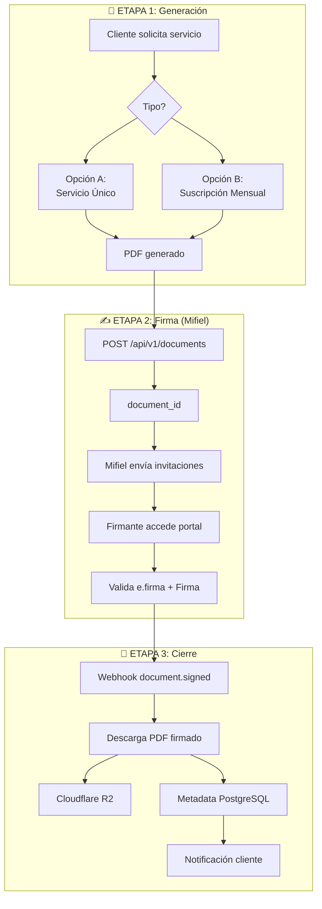

# 5.3 MIFIEL - FIRMA DIGITAL DE CONTRATOS

> Módulo de generación y firma digital de contratos **exclusivamente para clientes B2B**.

> [!IMPORTANT]
> OnlyCar **NUNCA gestiona, procesa ni almacena certificados digitales**.
> Todo el proceso de firma electrónica avanzada es manejado por Mifiel (PSC acreditado).

---

El sistema implementa un módulo de generación y firma digital de contratos **exclusivamente para clientes empresariales B2B**. La arquitectura está diseñada bajo un modelo de **delegación completa** a Mifiel, un Prestador de Servicios de Certificación (PSC) acreditado ante la Secretaría de Economía.

**Principio fundamental de delegación:**

OnlyCar **NUNCA gestiona, procesa ni almacena certificados digitales** de ningún tipo. Todo el proceso de firma electrónica avanzada (e.firma/FIEL) es manejado completamente por Mifiel, incluyendo:
- Validación de identidad de firmantes
- Custodia temporal de certificados digitales
- Validación de certificados contra el SAT
- Aplicación de firmas criptográficas
- Generación de evidencias legales
- Emisión de constancias NOM-151 (cuando aplique)

OnlyCar actúa únicamente como **orquestador del flujo**, generando el documento contractual y enviándolo a Mifiel para su firma.

---

## Arquitectura del Flujo de Firma

El proceso se divide en **3 etapas operativas claramente definidas**:



```
FLUJO COMPLETO DE CONTRATOS Y FIRMAS:

┌─────────────────────────────────────────────────────────────┐
│ ETAPA 1: GENERACIÓN DE CONTRATOS DINÁMICOS (Back-Office)   │
│                                                             │
│ Cliente solicita servicio → Sistema identifica tipo         │
│                     ↓                                       │
│ Plantilla base legal + Cláusulas dinámicas                 │
│                     ↓                                       │
│ Variables: Opción A (Pago por servicio)                    │
│            Opción B (Suscripción mensual)                  │
│                     ↓                                       │
│ OUTPUT: PDF generado internamente ANTES de firma           │
└────────────────────┬────────────────────────────────────────┘
                     │
                     ▼
┌─────────────────────────────────────────────────────────────┐
│ ETAPA 2: ORQUESTACIÓN DE FIRMA CON MIFIEL API              │
│                                                             │
│ Sistema prepara payload:                                   │
│ • PDF generado (base64)                                    │
│ • Lista de firmantes (nombres + emails)                    │
│ • Configuración: send_invites: true                        │
│                     ↓                                       │
│ POST /api/v1/documents → Mifiel API                        │
│                     ↓                                       │
│ Mifiel responde con document_id                            │
│                     ↓                                       │
│ Mifiel envía invitaciones por email a cada firmante        │
│                     ↓                                       │
│ Firmantes acceden a portal web de Mifiel                   │
│                     ↓                                       │
│ Mifiel valida identidad + e.firma/FIEL + Aplica firmas     │
│                     ↓                                       │
│ OnlyCar NO participa en el proceso de firma             │
└────────────────────┬────────────────────────────────────────┘
                     │
                     ▼
┌─────────────────────────────────────────────────────────────┐
│ ETAPA 3: CIERRE Y PERSISTENCIA                             │
│                                                             │
│ Mifiel completa todas las firmas                           │
│                     ↓                                       │
│ Webhook a OnlyCar: document.signed                      │
│                     ↓                                       │
│ Sistema descarga PDF firmado desde Mifiel                  │
│                     ↓                                       │
│ Almacenamiento en Cloudflare R2 (conservación legal)       │
│                     ↓                                       │
│ Registro de metadata en PostgreSQL:                        │
│ • document_id de Mifiel                                    │
│ • Hashes de verificación SHA-256                           │
│ • Timestamps de firma                                      │
│ • URLs de descarga del documento                           │
│                     ↓                                       │
│ Notificación al cliente: Contrato disponible               │
└─────────────────────────────────────────────────────────────┘
```

---
## ETAPA 1: Generación de Contratos Dinámicos

El sistema implementa un generador de contratos que combina plantillas legales base con cláusulas variables según el tipo de servicio contratado.
## Tipos de Contratos

| Tipo | Contenido |
|------|-----------|
| **Opción A - Servicio Único** | Identificación partes, descripción servicio, monto, términos pago único |
| **Opción B - Suscripción Mensual** | Plan suscripción, servicios incluidos, monto mensual, renovación automática |

**Opción A - Contrato por Servicio Único:**
Para servicios específicos de pago único, el contrato incluye:
- Identificación completa de las partes (cliente empresarial y OnlyCar)
- Descripción detallada del servicio a prestar
- Especificaciones técnicas del servicio
- Monto total del servicio
- Términos de pago (pago único al finalizar)
- Condiciones de cancelación
- Garantías y responsabilidades
- Jurisdicción y ley aplicable

**Opción B - Contrato de Suscripción Mensual:**
Para servicios recurrentes, el contrato incluye:
- Identificación de las partes
- Descripción del plan de suscripción
- Cantidad de servicios incluidos por mes
- Monto mensual recurrente
- Fecha de inicio y renovación automática
- Términos de cobro automático
- Condiciones de uso de servicios incluidos
- Política de servicios no utilizados
- Condiciones de cancelación de suscripción
- Garantías y responsabilidades
- Jurisdicción y ley aplicable

### Proceso de generación:

El sistema mantiene plantillas legales previamente revisadas por asesores jurídicos. Al crear un nuevo contrato, el sistema:

1. Identifica el tipo de servicio solicitado
2. Extrae los datos del cliente desde la base de datos (razón social, RFC, domicilio fiscal, representante legal)
3. Extrae los datos del servicio (descripción, especificaciones, monto, fechas)
4. Selecciona la plantilla contractual correspondiente
5. Reemplaza las variables dinámicas con los datos extraídos
6. Genera el documento PDF con formato profesional
7. Añade pie de página con fecha de generación y número de contrato
8. Almacena temporalmente el PDF generado para su envío a Mifiel

El PDF generado está listo para firma pero aún no tiene ninguna firma digital aplicada. Este documento será el que se envíe a Mifiel en la siguiente etapa.

---

## ETAPA 2: Orquestación de Firma con Mifiel API

Una vez generado el contrato en formato PDF, el sistema orquesta el proceso de firma delegando completamente a Mifiel.

### Preparación del payload:

El sistema prepara la información necesaria para invocar la API de Mifiel:

- **Documento**: El PDF generado codificado en base64
- **Firmantes**: Lista con los datos de cada persona que debe firmar
  - Nombre completo del firmante
  - Dirección de correo electrónico
  - Rol en el contrato (cliente o proveedor)
- **Configuración**: Parámetro `send_invites: true` para que Mifiel envíe automáticamente las invitaciones por correo
- **Metadatos**: Información adicional como ID del servicio, tipo de contrato, fecha de solicitud

### Invocación de la API:

El sistema realiza una petición HTTP POST al endpoint `/api/v1/documents` de Mifiel. La respuesta incluye un `document_id` único que identifica el documento en la plataforma de Mifiel. Este ID se almacena inmediatamente en la base de datos como referencia.

### Proceso gestionado por Mifiel:

A partir de este momento, Mifiel asume el control completo del proceso:

1. Mifiel recibe el documento y lo almacena de forma segura en su infraestructura
2. Envía correos electrónicos personalizados a cada firmante con un enlace único y seguro
3. Cuando el firmante accede al enlace, Mifiel presenta una interfaz web donde puede:
   - Revisar el documento completo
   - Cargar su certificado digital e.firma/FIEL
   - Ingresar su contraseña de forma segura
   - Firmar digitalmente el documento
4. Mifiel valida la autenticidad del certificado digital contra el SAT
5. Aplica la firma criptográfica al documento PDF
6. Notifica al siguiente firmante si hay más de uno
7. Una vez completadas todas las firmas, notifica a OnlyCar mediante webhook

**Importante:** Durante todo este proceso, OnlyCar **NO tiene acceso** a los certificados digitales ni participa en la aplicación de las firmas. La interfaz de firma, validación y custodia temporal de certificados es responsabilidad exclusiva de Mifiel como PSC acreditado.

---

## ETAPA 3: Cierre y Persistencia

Cuando Mifiel completa el proceso de firma con todas las firmas requeridas, envía una notificación webhook a OnlyCar.

### Procesamiento del webhook:

El sistema recibe el webhook con el evento `document.signed` que incluye el `document_id`. Este webhook se valida criptográficamente para garantizar que proviene de Mifiel y no ha sido alterado.

### Descarga del documento firmado:

El sistema invoca el endpoint de la API de Mifiel para descargar el PDF firmado. Este documento ahora contiene todas las firmas digitales integradas con sus respectivos sellos criptográficos.

### Almacenamiento en Cloudflare R2:

El PDF firmado se almacena en Cloudflare R2 con las siguientes configuraciones:
- Encriptación server-side habilitada
- Ruta: `contratos_firmados/contrato_{id}.pdf`
- Metadata incluida: fecha de firma, tipo de contrato, número de firmantes
- Política de conservación: permanente (evidencia legal)

### Registro de metadata en PostgreSQL:

El sistema almacena exclusivamente los metadatos del contrato en la tabla `contratos_firmados`:
- ID del contrato interno
- Referencia al cliente
- `document_id` de Mifiel (para futuras consultas)
- Hash SHA-256 del documento original (sin firmas)
- Hash SHA-256 del documento firmado (con firmas)
- Timestamps de cada firma realizada
- URL del documento firmado en Cloudflare R2
- Estado del contrato (firmado, vigente, cancelado)
- Timestamps de auditoría

**CRÍTICO:** Nunca se almacenan certificados digitales, claves privadas ni contraseñas. Solo referencias, hashes y URLs.

### Notificación al cliente:

El sistema envía una notificación por correo electrónico al cliente informando que el contrato ha sido firmado por todas las partes y está disponible para descarga. El correo incluye:
- Confirmación de firma exitosa
- Resumen del contrato
- Enlace directo de descarga desde el panel del cliente
- Información de contacto para soporte

El cliente puede descargar el contrato firmado en cualquier momento desde su panel de usuario. El documento tiene plena validez legal conforme a la Ley de Firma Electrónica Avanzada y el Código de Comercio.

---

## Constancias NOM-151

Mifiel como PSC acreditado emite constancias de conservación NOM-151 automáticamente cuando se requiere máxima fuerza probatoria en juicios.

---

## Validez Legal

La integración con Mifiel como PSC acreditado proporciona:

- Validez legal plena conforme a Ley de Firma Electrónica Avanzada
- Constancias NOM-151 (cuando aplique)
- Trazabilidad completa de firmantes
- Evidencias legales robustas
- Cero responsabilidad de custodia de certificados para OnlyCar

---

## Costos por Documento

| Tipo | Costo Mifiel | Incluye |
|------|--------------|---------|
| Contrato con firma digital | ~$30-50 MXN | Validación SAT, firma, constancia |

---

## Credenciales Requeridas

Variables de entorno necesarias:

```env
MIFIEL_APP_ID=...
MIFIEL_APP_SECRET=...
MIFIEL_ENV=sandbox|production
MIFIEL_WEBHOOK_URL=https://onlycar.mx/api/webhooks/mifiel
```

---

## Navegación

| ⬆️ Padre             | [[Proyecto OnlyCarNLD/Datos/5.0. integraciones]]           |
| -------------------- | -------------------------------- |
| ⬅️ Hermano anterior  | [[Proyecto OnlyCarNLD/Datos/5.2. gigstack_facturacion]]    |
| ➡️ Hermano siguiente | [[Proyecto OnlyCarNLD/Datos/5.4. cumplimiento_legal_fiscal]]|
| 🔗 Ver también       | [[Proyecto OnlyCarNLD/Datos/1.1.7 contratos_b2b]]          |

---
