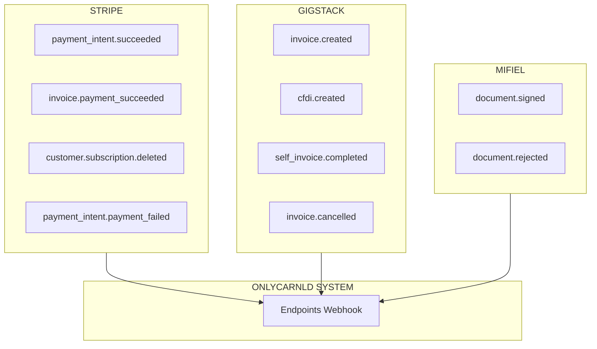

# 5.5 WEBHOOKS E INTEGRACIÓN TÉCNICA

> OnlyCar recibe notificaciones de tres proveedores externos mediante webhooks.

---

## Arquitectura de Webhooks




```
ARQUITECTURA DE WEBHOOKS
═══════════════════════════════════════════════════════════════

                    ┌─────────────────┐
                    │  ONLYCARNLD     │
                    │    SISTEMA      │
                    └────────┬────────┘
                             │
              ┌──────────────┼──────────────┐
              │              │              │
              ▼              ▼              ▼
     ┌──────────────┐ ┌──────────────┐ ┌──────────────┐
     │   STRIPE     │ │   GIGSTACK   │ │   MIFIEL     │
     └──────────────┘ └──────────────┘ └──────────────┘
              │              │              │
              ▼              ▼              ▼
     • payment_intent │ • invoice.      │ • document.
       .succeeded     │   created       │   signed
     • invoice.       │ • cfdi.created  │ • document.
       payment_       │ • self_invoice. │   rejected
       succeeded      │   completed     │
     • customer.      │ • invoice.      │
       subscription.  │   cancelled     │
       deleted        │                 │
     • payment_intent │                 │
       .payment_      │                 │
       failed         │                 │
```

---

## Endpoints del Sistema

### Webhooks Recibidos

| Proveedor | Endpoint                   | Eventos              |
| --------- | -------------------------- | -------------------- |
| Stripe    | `/api/webhooks/stripe`     | Pagos, suscripciones |
| Gigstack  | `/api/webhooks/gigstack/*` | Facturas CFDI        |
| Mifiel    | `/api/webhooks/mifiel`     | Firmas digitales     |

### API Interna (PWA Operadores)

```
POST /api/services/{id}/confirm-payment-presencial
```

---

## Segregación de Datos

| Almacén | Contenido |
|---------|-----------|
| PostgreSQL (Supabase) | clientes, servicios, facturas_emitidas (metadata), contratos |
| Cloudflare R2 | facturas/ (PDF/XML), contratos_firmados/ (PDF) |
| Cloudflare D1 | cache_metadata (no sensibles) |
| Workers KV | sesiones_temporales, rate limiting |

---

## Webhook de Stripe

### Endpoint del Sistema

```
POST /api/webhooks/stripe
```

### Eventos Procesados

El sistema expone un endpoint que recibe notificaciones de eventos de Stripe. Al recibir una notificación, primero verifica la firma criptográfica del webhook para garantizar autenticidad. Luego procesa los eventos relevantes:

**payment_intent.succeeded** (Pago exitoso)
- Actualiza el servicio en la base de datos marcándolo como pagado
- Almacena el payment_id de Stripe
- Registra fecha y monto
- Gigstack factura automáticamente sin requerir acción adicional

**invoice.payment_succeeded** (Pago de suscripción)
- Actualiza el contrato B2B correspondiente
- Registra el último pago
- Reinicia el contador de servicios disponibles
- Actualiza la fecha del próximo cobro

**customer.subscription.deleted** (Suscripción cancelada)
- Marca el contrato como inactivo
- Notifica al equipo interno

**payment_intent.payment_failed** (Pago fallido)
- Registra el error
- Envía notificación al cliente para actualizar su método de pago

### Verificación de Firma

```javascript
const stripe = require('stripe')(process.env.STRIPE_SECRET_KEY);

const sig = request.headers['stripe-signature'];
let event;

try {
  event = stripe.webhooks.constructEvent(
    request.body,
    sig,
    process.env.STRIPE_WEBHOOK_SECRET
  );
} catch (err) {
  return response.status(400).send(`Webhook Error: ${err.message}`);
}
```

---

## Webhook de Gigstack

### Endpoints del Sistema

```
POST /api/webhooks/gigstack/invoice-created
POST /api/webhooks/gigstack/cfdi-created
POST /api/webhooks/gigstack/self-invoice-completed
POST /api/webhooks/gigstack/invoice-cancelled
```

### Eventos Procesados

El sistema recibe notificaciones cuando Gigstack completa el timbrado de una factura. Al recibir el webhook, primero verifica la firma de seguridad para validar autenticidad.

**invoice.created** (API directa - Factura creada)
- Evento enviado cuando se genera una autofactura
- Contiene referencia para seguimiento

**cfdi.created** (Via Stripe - CFDI timbrado)
- Evento enviado cuando Gigstack timbra automáticamente vía Stripe
- Contiene UUID del SAT

**self_invoice.completed** (Autofactura completada)
- Cliente completó sus datos fiscales en portal de autofactura
- CFDI fue timbrado exitosamente

**invoice.cancelled** (Factura cancelada)
- CFDI fue cancelado ante el SAT
- Actualizar estado en base de datos

### Flujo de Procesamiento

1. **Descarga de documentos**: El sistema solicita a la API de Gigstack los archivos PDF y XML de la factura timbrada utilizando el UUID del CFDI.

2. **Almacenamiento en Cloudflare R2**: Los documentos se almacenan en R2 con encriptación server-side habilitada. El PDF se guarda con caché de 5 años (cumplimiento del Código Fiscal de la Federación). Los metadatos incluyen el UUID del SAT, fecha de emisión, monto total y tipo de documento.

3. **Registro de metadata en PostgreSQL**: El sistema almacena únicamente los metadatos de la factura en la base de datos: UUID del SAT, sello digital del SAT, fecha de timbrado, serie, folio, fecha de emisión, monto total, moneda, URLs de los archivos en R2, estado (vigente/cancelada) y proveedor (gigstack).

4. **Notificación opcional**: Opcionalmente, el sistema puede enviar una notificación adicional al cliente confirmando que su factura está disponible, aunque Gigstack ya la envió automáticamente.

---

## Webhook de Mifiel

### Endpoint del Sistema

```
POST /api/webhooks/mifiel
```

### Eventos Procesados

**document.signed** (Documento firmado)
- Todas las firmas requeridas fueron completadas
- Descargar PDF firmado desde Mifiel API
- Almacenar en Cloudflare R2
- Registrar metadata en PostgreSQL
- Notificar al cliente

**document.rejected** (Documento rechazado)
- Algún firmante rechazó firmar el documento
- Notificar al equipo interno
- Marcar contrato como rechazado

### Procesamiento del Webhook

El sistema recibe el webhook con el evento `document.signed` que incluye el `document_id`. Este webhook se valida criptográficamente para garantizar que proviene de Mifiel y no ha sido alterado.

---

## Endpoints API Internos

### Para PWA UMT (Operadores/Técnicos)

```
POST /api/services/{id}/confirm-payment-presencial
Body: {
  "payment_received": true,
  "payment_method": "01" | "04",
  "requires_invoice": boolean,
  "customer_email": "cliente@example.com",
  "customer_phone": "+525551234567"
}
```

### Para Gigstack API Directa

```
POST https://api.gigstack.pro/v1/invoices/self-service
POST https://api.gigstack.pro/v1/invoices/public
GET  https://api.gigstack.pro/v1/invoices/{uuid}/pdf
GET  https://api.gigstack.pro/v1/invoices/{uuid}/xml
```

### Webhooks Recibidos (URLs de OnlyCar)

```
POST /api/webhooks/stripe                           (pagos digitales)
POST /api/webhooks/gigstack/invoice-created         (API directa)
POST /api/webhooks/gigstack/cfdi-created            (via Stripe)
POST /api/webhooks/gigstack/self-invoice-completed  (API directa)
POST /api/webhooks/mifiel                           (firmas digitales)
```


---


## Almacenamiento de Documentos en Cloudflare R2

### Facturas Timbradas

El sistema almacena los archivos PDF y XML de las facturas CFDI 4.0 en Cloudflare R2. Los documentos se guardan con encriptación server-side habilitada automáticamente por R2. El PDF se configura con cache-control de 5 años para cumplir con el requisito del Código Fiscal de la Federación. Los metadatos asociados incluyen el UUID del SAT, fecha de emisión y tipo de documento.

### Contratos Firmados

Los contratos con firmas digitales integradas se almacenan con encriptación habilitada. Los metadatos incluyen el ID del contrato, fecha de firma, tipo de contrato (servicio único o suscripción) y el document_id de Mifiel para trazabilidad.

### Política de Acceso

Los documentos en R2 no son públicos. El acceso se controla mediante URLs firmadas con expiración temporal que se generan bajo demanda cuando un usuario autorizado solicita descargar un documento. El sistema verifica que el usuario tenga permisos sobre el documento antes de generar la URL firmada.

---

## Segregación de Datos y Almacenamiento

```
PostgreSQL (Supabase) - Base de Datos Principal
├── clientes (datos de identificación y contacto)
├── servicios (agendados, completados, pagados)
├── facturas_emitidas (SOLO metadata: UUID, fecha, monto, URLs de R2)
├── contratos_b2b (suscripciones, servicios únicos, metadata)
├── contratos_firmados (metadata + Mifiel document_id, URLs de R2)
└── logs_auditoria (accesos, operaciones sensibles, timestamps)

Cloudflare R2 - Almacenamiento de Objetos
├── facturas/ (PDF/XML de CFDI timbrados - conservación 5 años CFF)
├── contratos_firmados/ (PDF con firmas digitales integradas)
└── evidencias/ (hashes, timestamps, registros de consentimiento)

Cloudflare D1 - Base de Datos Edge (Caché)
├── cache_metadata (índices rápidos, referencias)
└── NO almacena datos sensibles

Cloudflare Workers KV - Key-Value Store
└── sesiones_temporales (tokens de sesión, rate limiting)

Stripe + Gigstack (Servicios Externos)
├── Stripe: Procesa pagos y captura datos fiscales
└── Gigstack: Almacena datos fiscales y emite CFDIs
    → OnlyCar NO tiene acceso directo a datos fiscales del cliente

Mifiel (Servicio Externo)
└── Gestión completa de firma digital
    ├── Custodia temporal de certificados digitales
    ├── Validación de e.firma/FIEL contra SAT
    ├── Aplicación de firmas criptográficas
    └── Generación de constancias legales
    → OnlyCar NO tiene acceso a certificados digitales
```

---

## Checklist Pre-Producción

### Gigstack API Directa

- [ ] API Key y Secret configurados en variables de entorno
- [ ] Webhooks configurados con URLs de producción
- [ ] CSD del emisor cargado y validado en Gigstack
- [ ] Plantillas de email/WhatsApp configuradas
- [ ] Endpoint de confirmación de pago probado
- [ ] Flujo de autofactura probado end-to-end
- [ ] Factura global mensual configurada (día 1)
- [ ] Alertas configuradas para fallos

### Gigstack via Stripe

- [ ] Gigstack App instalada en Stripe
- [ ] Payment Links con campos fiscales configurados
- [ ] Webhooks de Stripe configurados
- [ ] Conexión Stripe-Gigstack autorizada
- [ ] CSD del emisor configurado en Gigstack
- [ ] Flujo completo probado con pago de prueba
- [ ] Verificar recepción de webhook de Gigstack

### Mifiel

- [ ] APP ID y Secret configurados
- [ ] Webhook configurado con URL de producción
- [ ] Flujo de firma probado en sandbox
- [ ] Plantillas de contrato revisadas por legal
- [ ] Verificar acreditación vigente de Mifiel como PSC

### Infraestructura

- [ ] Cloudflare R2 configurado para almacenamiento
- [ ] PostgreSQL/Supabase con tablas creadas
- [ ] Rate limiting configurado en endpoints
- [ ] Logs de auditoría habilitados
- [ ] Sistema de queue para procesamiento asíncrono
- [ ] Monitoreo de disponibilidad de APIs externas

---

## Recomendaciones de Implementación

1. **Implementar primero Gigstack via Stripe** (más simple, completamente automatizado)
2. **Luego implementar Gigstack API directa** (requiere más lógica de negocio)
3. **Finalmente implementar Mifiel** (solo para clientes B2B)
4. **Probar exhaustivamente ambos flujos** en ambiente sandbox antes de producción
5. **Configurar alertas** para webhooks fallidos (>3 consecutivos)
6. **Implementar dashboard de monitoreo** que muestre:
    - Facturas emitidas por método
    - Tasa de conversión de autofacturas
    - Ventas registradas para factura global
    - Errores de facturación por tipo
    - Contratos pendientes de firma

---

## Variables de Entorno Completas

```env
# Stripe
STRIPE_PUBLISHABLE_KEY=pk_...
STRIPE_SECRET_KEY=sk_...
STRIPE_WEBHOOK_SECRET=whsec_...
STRIPE_ACCOUNT_ID=acct_...
STRIPE_GIGSTACK_CONNECTION_ID=...

# Gigstack
GIGSTACK_API_KEY=...
GIGSTACK_API_SECRET=...
GIGSTACK_ENV=sandbox|production

# Mifiel
MIFIEL_APP_ID=...
MIFIEL_APP_SECRET=...
MIFIEL_ENV=sandbox|production
MIFIEL_WEBHOOK_URL=https://onlycar.mx/api/webhooks/mifiel

# Emisor (OnlyCar)
EMISOR_RFC=...
EMISOR_RAZON_SOCIAL=...
EMISOR_REGIMEN=612
EMISOR_CP=88000

# Cloudflare R2
R2_ACCOUNT_ID=...
R2_ACCESS_KEY_ID=...
R2_SECRET_ACCESS_KEY=...
R2_BUCKET_NAME=onlycar-docs

# Supabase
SUPABASE_URL=...
SUPABASE_ANON_KEY=...
SUPABASE_SERVICE_ROLE_KEY=...
```

---

## Navegación

| ⬆️ Padre             | [[Proyecto OnlyCarNLD/Datos/5.0. integraciones]]           |
| -------------------- | -------------------------------- |
| ⬅️ Hermano anterior  | [[Proyecto OnlyCarNLD/Datos/5.4. cumplimiento_legal_fiscal]]|
| ➡️ Hermano siguiente | [[Proyecto OnlyCarNLD/Datos/5.6. autenticacion]]           |

---
