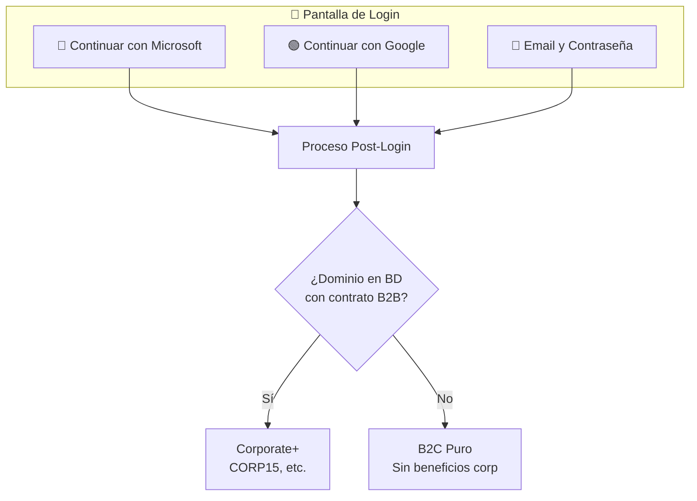

# 5.6 Sistema de Autenticación

> Sistema dual de autenticación que permite acceso mediante OAuth (Azure/Google) 
> o credenciales tradicionales (Email/Password blindado).

---

## Principio de Diseño

> [!IMPORTANT]
> **Autenticación Dual:**
> 1. **OAuth** — Login rápido via Azure o Google (NO almacena credenciales)
> 2. **Email/Password** — Para usuarios sin OAuth (almacenamiento blindado)
>
> La detección del tipo de usuario ocurre **post-login** analizando el dominio.

---

## Arquitectura General




```
┌─────────────────────────────────────────────────────────────────┐
│                      PANTALLA DE LOGIN                          │
├─────────────────────────────────────────────────────────────────┤
│                                                                 │
│   ┌─────────────────────────┐  ┌─────────────────────────┐      │
│   │  🔵 Continuar con       │  │  🟢 Continuar con       │      │
│   │     Microsoft           │  │     Google              │      │
│   │  (Personal o Trabajo)   │  │  (Personal o Trabajo)   │      │
│   └─────────────────────────┘  └─────────────────────────┘      │
│                                                                 │
│   ────────────────────── o ──────────────────────               │
│                                                                 │
│   ┌─────────────────────────────────────────────────────────┐   │
│   │  📧 Continuar con Email y Contraseña                    │   │
│   │     (Cualquier dominio: ISP, empresarial, personal)     │   │
│   └─────────────────────────────────────────────────────────┘   │
│                                                                 │
└─────────────────────────────────────────────────────────────────┘
```


---

## Estructura de Hijos

| ID                                       | Nombre                  | Descripción                  | Estado |
| ---------------------------------------- | ----------------------- | ---------------------------- | ------ |
| [[Proyecto OnlyCarNLD/Datos/5.6.1 arquitectura_auth\|5.6.1]]       | Arquitectura Auth       | Diagrama técnico completo    | ✅      |
| [[Proyecto OnlyCarNLD/Datos/5.6.2 oauth_proveedores\|5.6.2]]       | OAuth Proveedores       | Azure + Google OAuth mixto   | ✅      |
| [[Proyecto OnlyCarNLD/Datos/5.6.3 email_password_blindado\|5.6.3]] | Email/Password Blindado | Sistema tradicional seguro   | ✅      |
| [[Proyecto OnlyCarNLD/Datos/5.6.4 deteccion_tipo_usuario\|5.6.4]]  | Detección Tipo Usuario  | Lógica de dominio post-login | ✅      |
| [[Proyecto OnlyCarNLD/Datos/5.6.5 seguridad_auth\|5.6.5]]          | Seguridad Auth          | MFA, rate limiting, headers  | ✅      |
| [[Proyecto OnlyCarNLD/Datos/5.6.6 migracion_usuarios\|5.6.6]]      | Migración Usuarios      | Migración de usuarios legacy | ✅      |
| [[Proyecto OnlyCarNLD/Datos/5.6.7 arquitectura_verificacion_hibrida\|5.6.7]] | Arq. Verificación Híbrida | Manual → Auto (Adapter) | ✅ |

---

## Comparativa de Métodos

| Aspecto         | OAuth            | Email/Password        |
| --------------- | ---------------- | --------------------- |
| **Proveedores** | Azure + Google   | Cualquier dominio     |
| **Credenciales**| Delegadas        | Almacenadas (hasheadas)|
| **Velocidad**   | 1 clic           | Registro manual       |
| **MFA**         | Del proveedor    | TOTP opcional         |
| **Recuperación**| Del proveedor    | Reset por email       |

---

## Flujo Post-Login (Ambos Métodos)

```
LOGIN EXITOSO
    │
    ▼
EXTRAER EMAIL
    │
    ▼
OBTENER DOMINIO
    │
    ▼
┌───────────────────────┐
│ ¿Dominio en BD con    │
│ contrato B2B activo?  │
└───────────┬───────────┘
            │
     ┌──────┴──────┐
     ▼             ▼
   [ SÍ ]       [ NO ]
     │             │
     ▼             ▼
Corporate+     B2C Puro
(CORP15, etc) (Sin beneficios corp)
```

---

## Navegación

| ⬆️ Padre             | [[Proyecto OnlyCarNLD/Datos/5.0. integraciones]]           |
| -------------------- | -------------------------------- |
| ⬅️ Hermano anterior  | [[Proyecto OnlyCarNLD/Datos/5.5. webhooks_integracion]]    |
| ➡️ Hermano siguiente | [[Proyecto OnlyCarNLD/Datos/5.7. pdfme_generacion]]        |

---

**Fecha de especificación:** Diciembre 2025  
**Versión:** 1.0 (Dual Auth)
