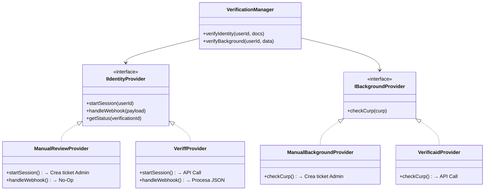

# 5.6.7 Arquitectura Verificación Híbrida

> **Principio Rector:** "Construir para manual, diseñar para escalar". El sistema debe permitir cambiar el proveedor de verificación (Humano vs IA) mediante un simple "switch" de configuración, sin reescribir el frontend ni la lógica de negocio core.

---

## 1. Patrón de Arquitectura: "Strategy Adapter"

Utilizamos el patrón Strategy para desacoplar la intención ("Verificar Usuario") de la implementación ("Mirar foto manualmente" o "Llamar API Veriff").

### Diagrama de Clases Conceptual



---

## 2. Configuración Dinámica (El "Switch")

El comportamiento se controla desde `config_global` en base de datos o variables de entorno, permitiendo despliegues graduales (Canary Releases).

```json
// global_config
{
  "trust_and_safety": {
    "identity_kyc": {
      "provider": "manual",  // Opciones: "manual", "veriff"
      "auto_approve_threshold": 0.95,
      "manual_review_queue": "admin_kyc_queue"
    },
    "background_check": {
      "provider": "manual",  // Opciones: "manual", "verificaid"
      "check_criminal_records": true,
      "check_blacklist": true
    }
  }
}
```

---

## 3. Modelo de Datos Unificado (Agnóstico)

Las tablas NO deben llamarse `veriff_sessions` ni `manual_reviews`. Deben ser genéricas para sobrevivir al cambio de proveedor.

### Tabla: `verification_sessions`

| Columna | Tipo | Descripción |
|---------|------|-------------|
| `id` | UUID | PK |
| `user_id` | UUID | FK Operador |
| `type` | Enum | `identity` (INE), `background` (Legal) |
| `provider` | Enum | `manual`, `veriff`, `verificaid` |
| `status` | Enum | `pending`, `in_review`, `approved`, `rejected` |
| `external_id` | String | ID de sesión de Veriff/VerificaID (Null si manual) |
| `risk_score` | Float | 0.0 - 1.0 (Manual = 0/1, Auto = Score real) |
| `provider_data` | JSONB | Respuesta cruda del proveedor (Snapshot) |
| `admin_notes` | Text | Notas del revisor humano (si aplica) |
| `created_at` | Timestamptz | |

---

## 4. Flujos de Transición

### Escenario A: Verificación Manual (Fase 1)

1.  **Operador:** Sube fotos de INE y Selfie en la App.
2.  **Backend:**
    *   Detecta `provider: "manual"`.
    *   Sube fotos a Storage seguro (`private/kyc/{uid}/`).
    *   Crea registro en `verification_sessions` con estado `pending`.
    *   **Trigger:** Notifica al canal de Slack/Dashboard `#admin-reviews`.
3.  **Admin:**
    *   Entra al "God View".
    *   Ve fotos lado a lado.
    *   Clic en "Aprobar" o "Rechazar + Motivo".
4.  **Sistema:** Actualiza estado a `approved`.

### Escenario B: Verificación Automática (Fase 2)

1.  **Operador:** Inicia flujo en App.
2.  **Backend:**
    *   Detecta `provider: "veriff"`.
    *   Llama API Veriff -> Obtiene `session_url`.
    *   Crea registro en `verification_sessions` con `external_id`.
3.  **App:** Abre SDK/Webview de Veriff.
4.  **Veriff:** Procesa biometría.
5.  **Webhook:**
    *   Veriff notifica al Backend.
    *   Backend procesa JSON.
    *   Si `status == 'approved'`, actualiza base de datos.
    *   Si `status == 'resubmission_requested'`, notifica al Operador.

---

## 5. UI/UX: Diseño Atómico

La interfaz del operador **NO CAMBIA** drásticamente, solo el componente de captura.

*   **Componente:** `VerificationStatusCard`
    *   Estado `pending`: "Tus documentos están siendo analizados por nuestro equipo." (Manual)
    *   Estado `processing`: "Verificando tu identidad en tiempo real..." (Auto)
    *   Estado `approved`: "✅ Identidad Verificada"

*   **Componente:** `IdentityCapture`
    *   Props: `mode` ('upload' | 'sdk')
    *   Si `upload`: Muestra input file estándar.
    *   Si `sdk`: Muestra botón "Iniciar Verificación" (Veriff).

---

## 6. Lógica de Negocio Adaptable

### Pseudo-código del Servicio

```typescript
// services/VerificationService.ts

async function requestVerification(userId: string, type: 'identity' | 'background') {
  const config = await getConfig();
  const provider = config.trust_and_safety[type].provider;
  
  // Factory Pattern
  const adapter = VerificationAdapterFactory.get(provider);
  
  // Ejecución polimórfica
  const session = await adapter.startSession(userId);
  
  // Persistencia agnóstica
  await db.verification_sessions.insert({
    user_id: userId,
    type: type,
    provider: provider,
    status: 'pending',
    external_id: session.id, // null si manual
    meta: session.meta
  });
  
  return session.clientPayload; // URL redirect o instrucciones manuales
}
```

---

## 7. Roadmap de Implementación

1.  **Iteración 1 (Manual):**
    *   Implementar tabla `verification_sessions`.
    *   Implementar `ManualStrategy`.
    *   Construir Dashboard Admin básico para aprobar/rechazar.
    *   **Costo:** $0 USD.

2.  **Iteración 2 (Híbrida):**
    *   Implementar `VeriffStrategy`.
    *   Añadir Switch en Configuración.
    *   Activar Veriff solo para nuevos usuarios (Rollout gradual).
    *   **Costo:** Pay-per-verification.

3.  **Iteración 3 (Full Auto):**
    *   Implementar `VerificaIDStrategy` para antecedentes.
    *   Desactivar flujo manual (Admin solo maneja disputas/errores).

---

## 8. Consideraciones de Seguridad (Nuclearmente Lógico)

*   **Logs Inmutables:** Cada cambio de estado en una verificación debe generar un log de auditoría.
*   **Privacidad (LFPDPPP):**
    *   En modo Manual: Las fotos se borran automáticamente tras 30 días de aprobación.
    *   En modo Veriff: No almacenamos biometría, solo el resultado (Tokenización).
*   **Fail-Over:** Si Veriff cae, el sistema debe permitir hacer fallback a manual automáticamente (Circuit Breaker).

---

## Relaciones

- Define arquitectura para: [[Proyecto OnlyCarNLD/Datos/1.2.2.1.2 verificacion_identidad]]
- Define arquitectura para: [[Proyecto OnlyCarNLD/Datos/1.2.2.1.3 verificacion_antecedentes]]
- Integra: [[Proyecto OnlyCarNLD/Datos/1.2.2.1.3.2 integracion_verificaid]]

---

## Navegación

| ⬆️ Padre             | [[Proyecto OnlyCarNLD/Datos/5.6. autenticacion]]        |
| -------------------- | ----------------------------- |
| ⬅️ Hermano anterior  | [[Proyecto OnlyCarNLD/Datos/5.6.6 migracion_usuarios]]  |
| ➡️ Hermano siguiente | *(Último hijo de 5.6)*        |

---
