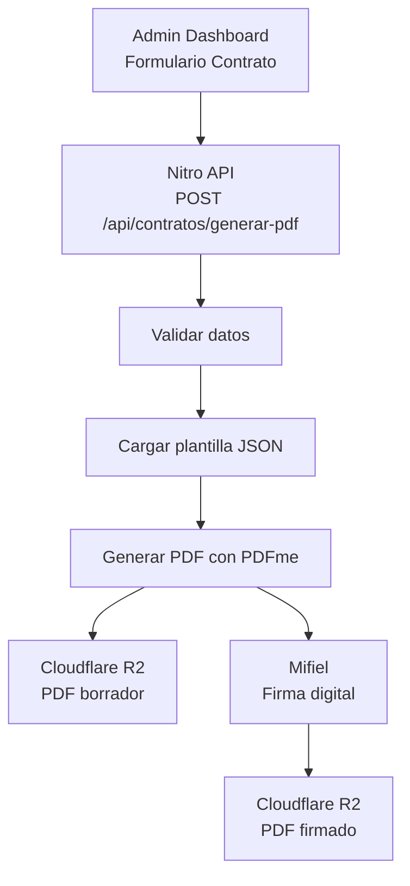

# 5.7 Integración PDFme

> Sistema de generación dinámica de documentos PDF para contratos B2B.

---

## Características

| Característica | Valor |
|----------------|-------|
| **Tipo** | Open Source (MIT) |
| **Runtime** | Browser + Node.js |
| **Plantillas** | JSON-based |
| **Campos** | Text, Image, Table, Barcode, QR |
| **Output** | PDF estándar |

---

## Por qué PDFme

| Alternativa | Problema | PDFme |
|-------------|----------|-------|
| PDF-lib | Bajo nivel, complejo | ✅ Plantillas visuales |
| Puppeteer | Pesado, HTML→PDF | ✅ Nativo PDF |
| DocuSign | Costo por documento | ✅ Open source |
| React-PDF | Solo React | ✅ Framework agnostic |

---

## Arquitectura




```
┌─────────────────────────────────────────────────────────────────┐
│                        ADMIN DASHBOARD                          │
│                                                                 │
│   Formulario de Contrato ───────────────────────────────────┐   │
│   • Empresa, paquete, vehículos, etc.                       │   │
│                                                             ▼   │
└─────────────────────────────────────────────────────────────────┘
                                                              │
                                                              ▼
┌─────────────────────────────────────────────────────────────────┐
│                    NITRO API ENDPOINT                           │
│                                                                 │
│   POST /api/contratos/generar-pdf                               │
│                                                                 │
│   1. Recibe datos del formulario                                │
│   2. Valida datos                                               │
│   3. Calcula totales y descuentos                               │
│   4. Carga plantilla JSON                                       │
│   5. Genera PDF con PDFme                                       │
│   6. Sube a Cloudflare R2                                       │
│   7. Retorna URL del PDF                                        │
│                                                                 │
└─────────────────────────────────────────────────────────────────┘
                                                              │
                            ┌─────────────────────────────────┤
                            │                                 │
                            ▼                                 ▼
                 ┌─────────────────────┐         ┌─────────────────────┐
                 │   CLOUDFLARE R2     │         │      MIFIEL         │
                 │   (Storage)         │         │   (Firma digital)   │
                 │                     │         │                     │
                 │ • PDF borrador      │         │ • Enviar a firmas   │
                 │ • PDF firmado       │         │ • Webhooks          │
                 └─────────────────────┘         └─────────────────────┘
```


---

## Instalación

```bash
npm install @pdfme/generator @pdfme/common
```


## Uso Actual: Contratos B2B

### Template JSON

```json
{
  "basePdf": "template_contrato_b2b.pdf",
  "schemas": [
    {
      "numero_contrato": {
        "type": "text",
        "position": { "x": 450, "y": 40 },
        "width": 120,
        "height": 12,
        "fontSize": 10
      },
      "fecha_generacion": {
        "type": "text",
        "position": { "x": 450, "y": 55 },
        "width": 120,
        "height": 12,
        "fontSize": 10
      },
      "cliente_razon_social": {
        "type": "text",
        "position": { "x": 100, "y": 120 },
        "width": 300,
        "height": 15,
        "fontSize": 12,
        "fontWeight": "bold"
      }
      // ... más campos
    }
  ]
}
```

### Inputs (Datos)

```json
{
  "numero_contrato": "CONT-B2B-2025-01-15-ABC123",
  "fecha_generacion": "15 de Enero de 2025",
  "cliente_razon_social": "Empresa XYZ S.A. de C.V.",
  "cliente_rfc": "XYZ123456ABC",
  "paquete_nombre": "Express Flotilla",
  "vehiculos_mes": 15,
  "precio_unitario": 224,
  "descuento_total": "35%",
  "total_mensual": 3360
}
```

### Generación

```typescript
// server/api/contratos/generar-pdf.post.ts
import { generate } from '@pdfme/generator';

export default defineEventHandler(async (event) => {
  const body = await readBody(event);
  
  // Cargar template
  const template = await loadTemplate('contrato_b2b');
  
  // Preparar inputs
  const inputs = [
    {
      numero_contrato: generarNumeroContrato(),
      fecha_generacion: formatDate(new Date()),
      cliente_razon_social: body.empresa.razon_social,
      cliente_rfc: body.empresa.rfc,
      paquete_nombre: body.paquete.nombre,
      vehiculos_mes: body.vehiculos,
      precio_unitario: calcularPrecioUnitario(body),
      descuento_total: calcularDescuentoTotal(body),
      total_mensual: calcularTotalMensual(body)
    }
  ];
  
  // Generar PDF
  const pdfBuffer = await generate({ template, inputs });
  
  // Subir a R2
  const url = await uploadToR2(pdfBuffer, `contratos/${inputs[0].numero_contrato}.pdf`);
  
  return { url, numero_contrato: inputs[0].numero_contrato };
});
```


---

## Usos

| Documento | Estado |
|-----------|--------|
| Contratos B2B | ✅ Implementado |
| Cotizaciones | 🔮 Futuro |
| Reportes mensuales | 🔮 Futuro |
| Constancias servicio | 🔮 Futuro |

---

## Navegación

| ⬆️ Padre             | [[Proyecto OnlyCarNLD/Datos/5.0. integraciones]]           |
| -------------------- | -------------------------------- |
| ⬅️ Hermano anterior  | [[Proyecto OnlyCarNLD/Datos/5.6. autenticacion]]           |
| ➡️ Hermano siguiente | [[Proyecto OnlyCarNLD/Datos/5.8. geolocalizacion]]         |
| 🔗 Ver también       | [[Proyecto OnlyCarNLD/Datos/1.1.7.4 generacion_pdfme]]     |

---
