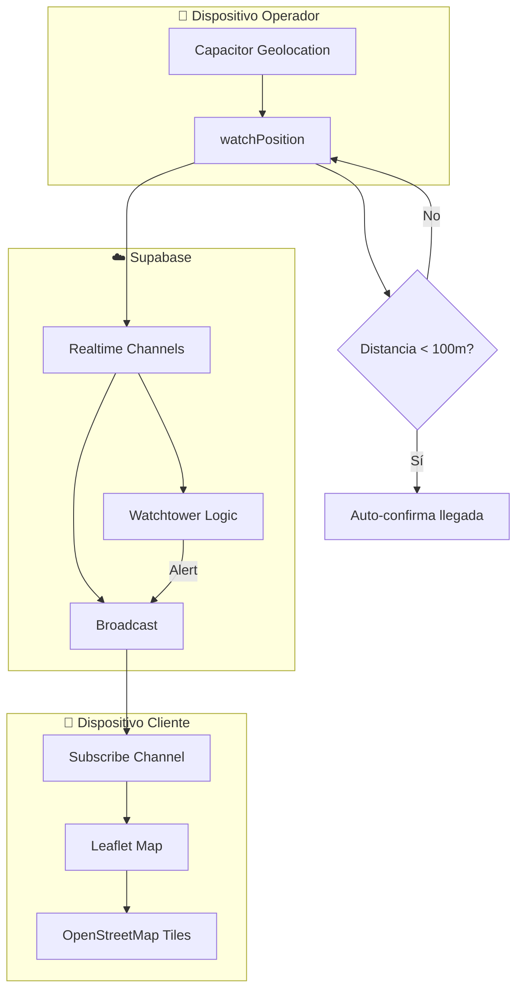
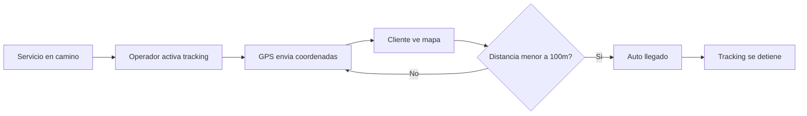

# 5.8 Geolocalización y Ubicación en Tiempo Real

> Sistema integral de tracking GPS para servicios móviles.

---

## Arquitectura Híbrida (Costo: $0/mes)



---

## Stack Tecnológico

| Componente  | Tecnología                   | Costo    |
| ----------- | ---------------------------- | -------- |
| GPS nativo  | `@capacitor/geolocation`     | Gratis   |
| Realtime    | Supabase Realtime (Channels) | Incluido |
| Mapas       | Leaflet.js + OpenStreetMap   | Gratis   |
| Navegación  | Links Waze/GMaps             | Gratis   |
| **Total**   | —                            | **$0/mes** |

---

## Principios

> [!IMPORTANT]
> - GPS **solo activo durante estado `en_camino`** (ahorro de batería)
> - Broadcast configurable desde panel admin (default: 5s, **recomendado: 10s** ⭐)
> - Confirmación de llegada **automática** pero con **fallback manual**
> - **Sin geocoding** (cliente ingresa ubicación o usa GPS propio)

---

## Flujo Principal




```
1. Servicio pasa a estado "en_camino"
   → Operador activa tracking
   → Cliente recibe CARD de ubicación

2. Durante tracking:
   → GPS cada Xs (configurable) → Broadcast Supabase → Cliente actualiza mapa
   → Sistema calcula distancia a destino

3. Llegada detectada (< 100m):
   → Auto-cambio a estado "llegado"
   → Tracking se detiene
   → Notificación a cliente

4. Fallback manual:
   → Operador puede confirmar llegada manualmente
   → Botón "Ya llegué" siempre disponible
```


---

## Integración con Flujo de Servicio

| Estado Servicio       | Tracking   | Mapa Cliente |
| --------------------- | ---------- | ------------ |
| `cita_confirmada`     | ❌          | ❌            |
| `operador_asignado`   | ❌          | ❌            |
| **`en_camino`**       | ✅ Activo   | ✅ Visible    |
| **`llegado`**         | ❌ Se detiene | ❌ Se oculta  |
| `en_servicio`         | ❌          | ❌            |
| `completado`          | ❌          | ❌            |

---

## Estructura de Hijos

| ID                                     | Nombre                | Descripción            | Nietos | Estado |
| -------------------------------------- | --------------------- | ---------------------- | ------ | ------ |
| [[Proyecto OnlyCarNLD/Datos/5.8.1 capacitor_geolocation\|5.8.1]] | Capacitor Geolocation | Plugin GPS nativo      | 0 | ✅      |
| [[Proyecto OnlyCarNLD/Datos/5.8.2 realtime_broadcast\|5.8.2]]    | Realtime Broadcast    | Supabase channels      | 0 | ✅      |
| [[Proyecto OnlyCarNLD/Datos/5.8.3 mapas_visualizacion\|5.8.3]]   | Mapas Visualización   | Leaflet + OSM          | 0 | ✅      |
| [[Proyecto OnlyCarNLD/Datos/5.8.4 navegacion_externa\|5.8.4]]    | Navegación Externa    | Links Waze/GMaps       | 0      | ✅      |
| [[Proyecto OnlyCarNLD/Datos/5.8.5 deteccion_llegada\|5.8.5]]     | Detección Llegada     | Auto-confirmar llegada | 0 | ✅      |
| [[Proyecto OnlyCarNLD/Datos/5.8.6 backend_ubicaciones\|5.8.6]]   | Backend Ubicaciones   | API + historial        | 0 | ✅      |
| [[Proyecto OnlyCarNLD/Datos/5.8.7 edge_cases\|5.8.7]]            | Edge Cases            | Errores y fallbacks    | 0 | ✅      |
| [[Proyecto OnlyCarNLD/Datos/5.8.8 testing\|5.8.8]]               | Testing               | Pruebas de ubicación   | 0 | ✅      |
| [[Proyecto OnlyCarNLD/Datos/5.8.9 configuracion_remota\|5.8.9]]  | Config Remota         | Panel de configuración | 0      | ✅      |
| [[Proyecto OnlyCarNLD/Datos/5.8.10 watchtower_algorithm\|5.8.10]] | Watchtower Algorithm  | Seguridad y Anomalías  | 0      | ✅      |
| [[Proyecto OnlyCarNLD/Datos/5.8.11 client_timeline_ui\|5.8.11]]  | Client Timeline UI    | UX Mapa + Timeline     | 0      | ✅      |
| [[Proyecto OnlyCarNLD/Datos/5.8.12 admin_god_view\|5.8.12]]      | Admin God View        | Dashboard Supervisión  | 0      | ✅      |

---

## Variables de Configuración

```typescript
export const GEO_CONFIG = {
  // Tracking (valores default, sobrescritos por config remota)
  WATCH_INTERVAL_MS: 5000,          // Default: 5s, Recomendado: 10s ⭐
  HIGH_ACCURACY: true,               // GPS de alta precisión
  TIMEOUT_MS: 10000,                 // Timeout por lectura
  MAXIMUM_AGE_MS: 0,                 // No usar cache
  
  // Llegada
  ARRIVAL_THRESHOLD_METERS: 100,     // Distancia para auto-confirmar
  ARRIVAL_CONFIRM_COUNT: 2,          // Lecturas consecutivas
  
  // Supabase Channel
  CHANNEL_PREFIX: 'servicio:',       // Prefijo de canales
  
  // Mapa
  DEFAULT_ZOOM: 15,                  // Zoom inicial
  TILE_URL: 'https://{s}.tile.openstreetmap.org/{z}/{x}/{y}.png',
  
  // Battery saving
  BACKGROUND_UPDATES: false,         // No tracking en background
  PAUSE_ON_MINIMIZE: true            // Pausar si app minimizada
};
```

---

## Navegación

| ⬆️ Padre             | [[Proyecto OnlyCarNLD/Datos/5.0. integraciones]]           |
| -------------------- | -------------------------------- |
| ⬅️ Hermano anterior  | [[Proyecto OnlyCarNLD/Datos/5.7. pdfme_generacion]]        |
| ➡️ Hermano siguiente | [[Proyecto OnlyCarNLD/Datos/5.9 soporte_externo]]          |
| 🔗 Ver también       | [[Proyecto OnlyCarNLD/Datos/1.3.3.3 flujo_servicio_chat]]  |

---

**Fecha:** Diciembre 2025  
**Versión:** 1.0
