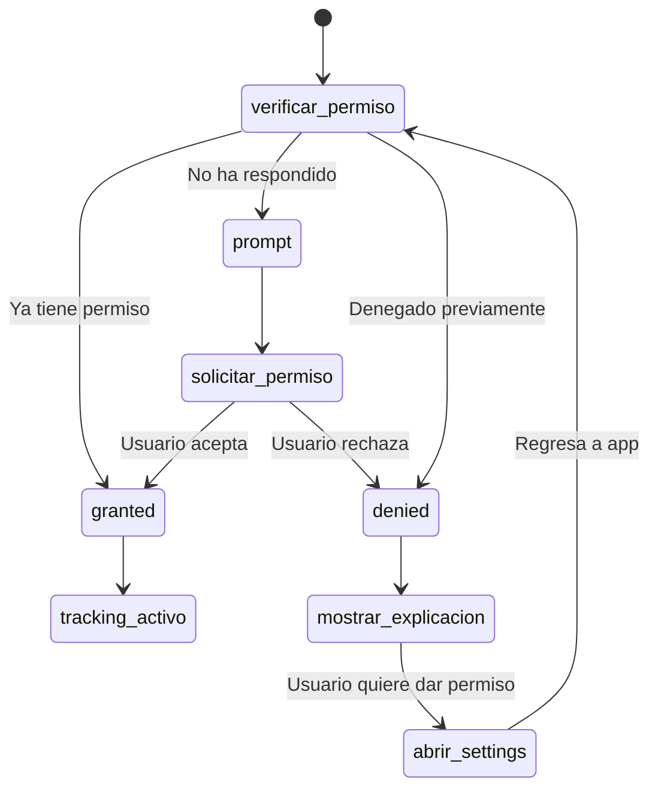

# 5.8.1.1 Permisos GPS

Manejo de permisos de geolocalización en iOS y Android.

---

## Flujo de Permisos



---

## Composable de Permisos

```typescript
// composables/useGeoPermissions.ts
import { Geolocation } from '@capacitor/geolocation';

type PermissionState = 'granted' | 'denied' | 'prompt';

export const useGeoPermissions = () => {
  const permissionStatus = ref<PermissionState>('prompt');
  const hasPermission = computed(() => permissionStatus.value === 'granted');
  
  /**
   * Verificar estado actual del permiso
   */
  const checkPermission = async (): Promise<PermissionState> => {
    const status = await Geolocation.checkPermissions();
    permissionStatus.value = status.location as PermissionState;
    return permissionStatus.value;
  };
  
  /**
   * Solicitar permiso al usuario
   */
  const requestPermission = async (): Promise<boolean> => {
    const status = await Geolocation.requestPermissions();
    permissionStatus.value = status.location as PermissionState;
    return permissionStatus.value === 'granted';
  };
  
  /**
   * Abrir configuración del sistema (si denegó permanentemente)
   */
  const openSettings = async () => {
    // En Capacitor, usamos @capacitor/app-launcher o similar
    // Fallback: mostrar instrucciones manuales
    if (Capacitor.isNativePlatform()) {
      await NativeSettings.open({
        optionAndroid: AndroidSettings.ApplicationDetails,
        optionIOS: IOSSettings.App
      });
    }
  };
  
  return {
    permissionStatus: readonly(permissionStatus),
    hasPermission,
    checkPermission,
    requestPermission,
    openSettings
  };
};
```

---

## Componente de Solicitud

```vue
<!-- components/GeoPermissionRequest.vue -->
<script setup lang="ts">
const { permissionStatus, hasPermission, checkPermission, requestPermission, openSettings } = useGeoPermissions();

const showExplanation = ref(false);

onMounted(async () => {
  await checkPermission();
  
  if (permissionStatus.value === 'denied') {
    showExplanation.value = true;
  }
});

const handleRequestPermission = async () => {
  showExplanation.value = false;
  const granted = await requestPermission();
  
  if (!granted) {
    showExplanation.value = true;
  }
};
</script>

<template>
  <!-- Modal de explicación -->
  <Modal v-if="showExplanation" @close="showExplanation = false">
    <template #header>
      📍 Necesitamos tu ubicación
    </template>
    
    <template #body>
      <div class="permission-explanation">
        <p>Para que el cliente pueda ver tu ruta en tiempo real, 
           necesitamos acceso a tu ubicación.</p>
        
        <ul class="benefits">
          <li>✅ El cliente ve cuándo llegarás</li>
          <li>✅ Confirma llegada automáticamente</li>
          <li>✅ Solo se usa durante el servicio</li>
        </ul>
        
        <p class="privacy">
          🔒 Tu ubicación solo se comparte mientras estás "en camino"
        </p>
      </div>
    </template>
    
    <template #footer>
      <button 
        v-if="permissionStatus === 'prompt'"
        @click="handleRequestPermission"
        class="btn-primary"
      >
        Permitir ubicación
      </button>
      
      <button 
        v-else-if="permissionStatus === 'denied'"
        @click="openSettings"
        class="btn-secondary"
      >
        Abrir configuración
      </button>
    </template>
  </Modal>
  
  <!-- Indicador de estado -->
  <div v-if="hasPermission" class="permission-granted">
    ✅ Ubicación activa
  </div>
</template>
```

---

## Configuración por Plataforma

### Android

```xml
<!-- android/app/src/main/AndroidManifest.xml -->
<manifest>
  <!-- Permiso básico -->
  <uses-permission android:name="android.permission.ACCESS_COARSE_LOCATION" />
  
  <!-- Permiso de alta precisión (GPS) -->
  <uses-permission android:name="android.permission.ACCESS_FINE_LOCATION" />
  
  <!-- NO necesitamos background location -->
  <!-- android:name="android.permission.ACCESS_BACKGROUND_LOCATION" -->
</manifest>
```

### iOS

```xml
<!-- ios/App/App/Info.plist -->
<plist>
  <dict>
    <!-- Permiso mientras usa la app -->
    <key>NSLocationWhenInUseUsageDescription</key>
    <string>OnlyCar usa tu ubicación para mostrar al cliente tu ruta en tiempo real durante el servicio.</string>
    
    <!-- Descripción corta → mejor UX -->
    <key>NSLocationUsageDescription</key>
    <string>Para compartir tu ubicación con el cliente</string>
  </dict>
</plist>
```

---

## Textos Localizados

```typescript
// i18n/es/geo.ts
export default {
  permission: {
    title: '📍 Necesitamos tu ubicación',
    body: 'Para que el cliente pueda ver tu ruta en tiempo real.',
    benefits: [
      'El cliente ve cuándo llegarás',
      'Confirma llegada automáticamente',
      'Solo se usa durante el servicio'
    ],
    privacy: 'Tu ubicación solo se comparte mientras estás "en camino"',
    allow: 'Permitir ubicación',
    openSettings: 'Abrir configuración',
    denied: 'Permiso denegado. Abre configuración para activarlo.'
  }
};
```

---

## Buenas Prácticas


| Práctica | Razón |
|----------|-------|
| Explicar **antes** de pedir | Mayor tasa de aceptación |
| Mostrar **beneficios claros** | Usuario entiende el valor |
| **No pedir en pantalla inicial** | Esperar contexto relevante |
| Ofrecer **fallback** si rechaza | No bloquear funcionalidad |
| Usar permiso **mínimo necesario** | Solo `whenInUse`, no background |

---

→ Ver tracking: [[Proyecto OnlyCarNLD/Datos/5.8.1.2 watch_position]]

---

## Navegación

| ⬆️ Padre             | [[Proyecto OnlyCarNLD/Datos/5.8.1 capacitor_geolocation]]            |
| -------------------- | ---------------------- |
| ➡️ Hermano siguiente | [[Proyecto OnlyCarNLD/Datos/5.8.1.2 watch_position]]              |
