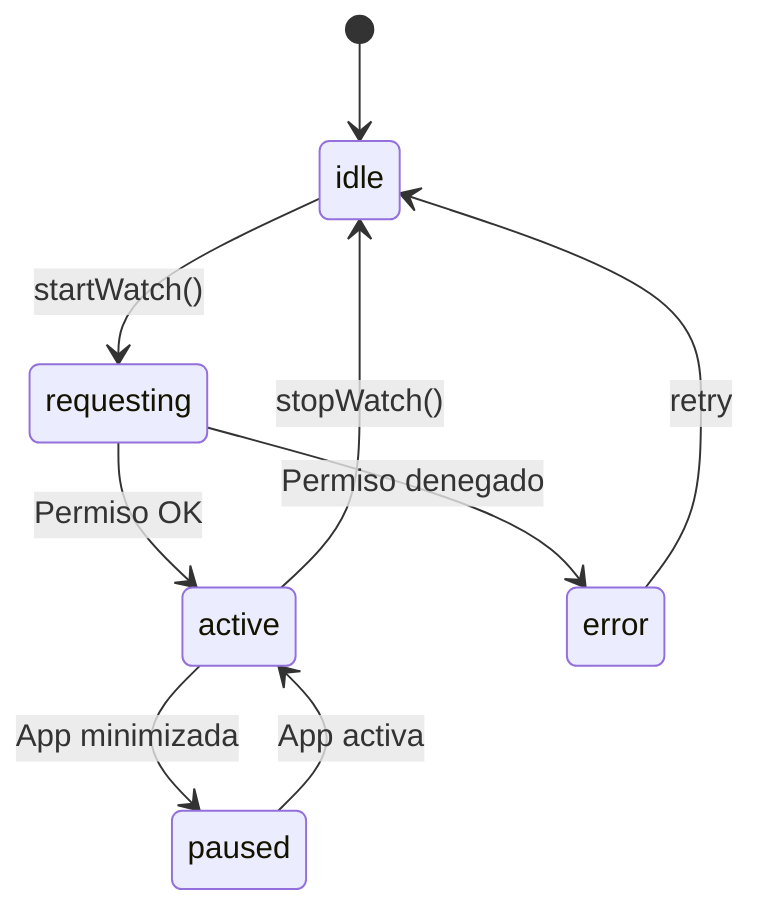

# 5.8.1.2 Watch Position

Tracking continuo de ubicación del operador.

---

## Implementación

```typescript
// composables/useWatchPosition.ts
import { Geolocation, type Position } from '@capacitor/geolocation';
import { GEO_CONFIG } from '~/config/geolocation';

interface WatchState {
  isActive: boolean;
  lastUpdate: Date | null;
  position: { lat: number; lng: number; accuracy: number } | null;
  updateCount: number;
}

export const useWatchPosition = () => {
  const state = reactive<WatchState>({
    isActive: false,
    lastUpdate: null,
    position: null,
    updateCount: 0
  });
  
  const watchId = ref<string | null>(null);
  const callbacks = new Set<(pos: WatchState['position']) => void>();
  
  /**
   * Iniciar tracking con throttle
   */
  const startWatch = async () => {
    if (state.isActive) return;
    
    state.isActive = true;
    state.updateCount = 0;
    
    let lastBroadcast = 0;
    
    watchId.value = await Geolocation.watchPosition(
      {
        enableHighAccuracy: GEO_CONFIG.HIGH_ACCURACY,
        timeout: GEO_CONFIG.TIMEOUT_MS,
        maximumAge: GEO_CONFIG.MAXIMUM_AGE_MS
      },
      (pos: Position | null) => {
        if (!pos) return;
        
        // Throttle: intervalo configurable desde panel admin (ver 5.8.9)
        const now = Date.now();
        if (now - lastBroadcast < GEO_CONFIG.WATCH_INTERVAL_MS) return;
        lastBroadcast = now;
        
        state.position = {
          lat: pos.coords.latitude,
          lng: pos.coords.longitude,
          accuracy: pos.coords.accuracy
        };
        state.lastUpdate = new Date();
        state.updateCount++;
        
        // Notificar a todos los callbacks
        callbacks.forEach(cb => cb(state.position));
      }
    );
  };
  
  /**
   * Detener tracking
   */
  const stopWatch = async () => {
    if (watchId.value) {
      await Geolocation.clearWatch({ id: watchId.value });
      watchId.value = null;
    }
    state.isActive = false;
  };
  
  /**
   * Registrar callback para cada update
   */
  const onUpdate = (callback: (pos: WatchState['position']) => void) => {
    callbacks.add(callback);
    return () => callbacks.delete(callback);
  };
  
  // Cleanup
  onUnmounted(() => {
    stopWatch();
    callbacks.clear();
  });
  
  return {
    state: readonly(state),
    startWatch,
    stopWatch,
    onUpdate
  };
};
```

---

## Throttling y Optimización

```typescript
// Problema: GPS puede enviar 1 update/segundo = 60/minuto = demasiado
// Solución: Throttle configurable desde panel admin (default 5s, recomendado 10s ⭐)
// Ver módulo 5.8.9 para configuración remota

┌─────────────────────────────────────────────────────────────────┐
│  GPS NATIVO                                                     │
│  ─────────────────────────────────────────────              │
│  0s    1s    2s    3s    4s    5s    6s    7s    8s    9s  10s  │
│  ●     ●     ●     ●     ●     ●     ●     ●     ●     ●    ●   │
│                                                                 │
│  DESPUÉS DE THROTTLE (configurable: 5s/10s/15s/20s)             │
│  ─────────────────────────────────────────────              │
│  Con 10s ⭐: 0s          10s         20s                        │
│             ●           ●           ●                           │
│                                                                 │
│  Resultado: -83% de broadcasts con 10s (⭐ recomendado)         │
└─────────────────────────────────────────────────────────────────┘
```

---

## Filtrado de Ruido GPS

```typescript
// Filtrar ubicaciones con baja precisión
const ACCURACY_THRESHOLD = 50; // metros

const filterPosition = (pos: Position): boolean => {
  // Ignorar si precisión > 50 metros
  if (pos.coords.accuracy > ACCURACY_THRESHOLD) {
    console.warn(`GPS impreciso: ${pos.coords.accuracy}m`);
    return false;
  }
  return true;
};

// Filtrar saltos imposibles (teletransportación)
const MAX_SPEED_MS = 50; // 180 km/h máximo

const filterTeleport = (
  newPos: { lat: number; lng: number },
  oldPos: { lat: number; lng: number },
  deltaTimeMs: number
): boolean => {
  const distance = calcularDistancia(
    oldPos.lat, oldPos.lng,
    newPos.lat, newPos.lng
  );
  
  const speed = distance / (deltaTimeMs / 1000);
  
  if (speed > MAX_SPEED_MS) {
    console.warn(`Salto GPS detectado: ${speed.toFixed(1)} m/s`);
    return false;
  }
  return true;
};
```

---

## Estados del Watch



---

## Indicador Visual

```vue
<!-- components/TrackingIndicator.vue -->
<script setup lang="ts">
const { state } = useWatchPosition();

const pulseClass = computed(() => 
  state.isActive ? 'pulse-active' : ''
);

const statusText = computed(() => {
  if (!state.isActive) return 'GPS inactivo';
  if (!state.lastUpdate) return 'Conectando GPS...';
  return `Última actualización:** 2026-01-01
});
</script>

<template>
  <div :class="['tracking-indicator', pulseClass]">
    <span class="dot" />
    <span class="text">{{ statusText }}</span>
    <span class="count">{{ state.updateCount }} updates</span>
  </div>
</template>

<style scoped>
.tracking-indicator {
  display: flex;
  align-items: center;
  gap: 8px;
  padding: 8px 12px;
  background: var(--color-surface);
  border-radius: 20px;
}

.dot {
  width: 8px;
  height: 8px;
  border-radius: 50%;
  background: var(--color-warning);
}

.pulse-active .dot {
  background: var(--color-success);
  animation: pulse 2s infinite;
}

@keyframes pulse {
  0%, 100% { opacity: 1; }
  50% { opacity: 0.5; }
}
</style>
```

---

→ Ver broadcast: [[Proyecto OnlyCarNLD/Datos/5.8.2 realtime_broadcast]]

---

## Navegación

| ⬆️ Padre             | [[Proyecto OnlyCarNLD/Datos/5.8.1 capacitor_geolocation]]            |
| -------------------- | ---------------------- |
| ⬅️ Hermano anterior  | [[Proyecto OnlyCarNLD/Datos/5.8.1.1 permisos_gps]]              |
| ➡️ Hermano siguiente | [[Proyecto OnlyCarNLD/Datos/5.8.1.3 background_tracking]]              |
