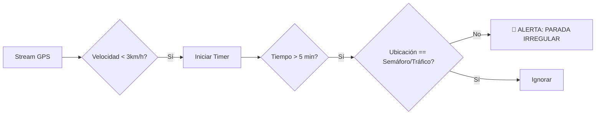

# 5.8.10 Watchtower Algorithm

El "Ojo que todo lo ve". Cerebro analítico encargado de la seguridad proactiva y la predicción de eventos durante el servicio.

> [!IMPORTANT]
> **Diferenciación de Responsabilidades:**
> *   **Watchtower (Este módulo):** Monitorea seguridad, detecta anomalías y predice aproximación ("A 5 mins").
> *   **[[Proyecto OnlyCarNLD/Datos/5.8.5 deteccion_llegada]]:** Determina y confirma exclusivamente el evento de llegada final ("Estoy aquí").

---

## 1. Lógica de Detección de Anomalías

Algoritmos que corren en background (Edge Functions) para detectar comportamientos inusuales.

### 1.1 Detección de Parada No Autorizada (Red Flag)
Se dispara si el vehículo se detiene fuera del origen o destino por más tiempo del permitido.

> [!TIP]
> **Heurística de Tráfico (V1 vs V2):**
> *   **V1:** La excepción "Tráfico" se determina si el tiempo de detención es **< 2 minutos**.
> *   **V2:** Se integrará API de Google Traffic para validar congestión real.

### 1.2 Detección de Desvío (Yellow Flag)
Verifica si el operador se aleja significativamente de la ruta óptima calculada.

*   **Umbral:** > 500 metros de desviación ortogonal de la polilínea de ruta.
*   **Acción:** Notificación push al operador ("¿Todo bien con tu ruta?") + Alerta silenciosa al Admin.

### 1.3 Pérdida de Señal (Black Flag)
*   **Trigger:** No se recibe `heartbeat` o `location_update` por > 10 minutos.
*   **Acción:** Marcado automático en Dashboard Admin como "OFFLINE - REQUIERE ATENCIÓN".

---

## 2. Geofencing Predictivo (Approaching)

Sistema para generar la notificación "Tu experto se acerca" y reducir la ansiedad del cliente.

### 2.1 Lógica de "Approaching"
El estado `approaching` es un estado transitorio virtual, no un estado de la base de datos del servicio.

**Condiciones de Disparo (OR):**
1.  **Distancia:** < 1.5 km del destino.
2.  **ETA:** < 4 minutos calculado via OSRM/Google Routes.

**Acciones:**
*   Enviar Push Notification al cliente: *"🚗 ¡[Nombre] está llegando! Prepárate para tu servicio."*
*   Activar UI de "Preparación" en App Cliente (Ver [[Proyecto OnlyCarNLD/Datos/5.8.11 client_timeline_ui]]).

---

## 3. Algoritmo de ETA Dinámico

Cálculo continuo del Tiempo Estimado de Llegada para mostrar en la UI.

$$ETA_{final} = \frac{Distancia_{restante}}{Velocidad_{promedio\_segmento}} \times Factor_{trafico}$$

*   **Frecuencia de Recálculo:** Cada 30-60 segundos (para no saturar APIs).
*   **Fuente de Tráfico:** Integración opcional con Waze/Google o heurística basada en la velocidad actual del operador.

---

## Navegación

| ⬆️ Padre             | [[Proyecto OnlyCarNLD/Datos/5.8. geolocalizacion]]            |
| -------------------- | ----------------------------------- |
| ⬅️ Hermano anterior  | [[Proyecto OnlyCarNLD/Datos/5.8.9 configuracion_remota]]      |
| ➡️ Hermano siguiente | [[Proyecto OnlyCarNLD/Datos/5.8.11 client_timeline_ui]]       |
