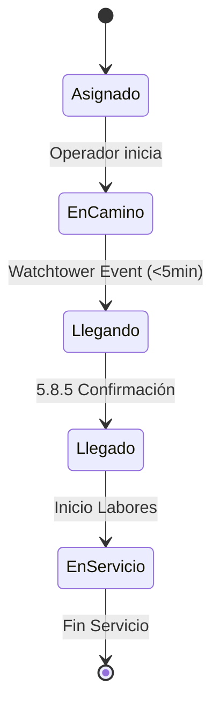

# 5.8.11 Client Timeline UI

Definición de la Experiencia de Usuario (UX) de seguimiento. Fusiona la inmediatez visual de un mapa en tiempo real con la claridad de proceso de un timeline de estados.

---

## 1. El Concepto Híbrido

Combinamos lo mejor de dos mundos para maximizar la confianza:

1.  **Mapa (Estilo Uber):** "¿Dónde está físicamente ahora?" -> Responde a la inmediatez.
2.  **Timeline (Estilo MeLi):** "¿En qué paso del proceso vamos?" -> Responde al contexto global.

---

## 2. Componente de Mapa Real-Time

Ubciado en la mitad superior de la pantalla de "Servicio Activo".

### 2.1 Características Visuales
*   **Icono del Vehículo:** No un punto abstracto, sino un modelo 3D o icono de auto estilizado (OnlyCar branded).
*   **Rotación:** El icono rota según el `heading` del GPS para indicar dirección real.
*   **Interpolación:** Movimiento suavizado entre actualizaciones de GPS (no "saltos" bruscos).
*   **Polyline de Ruta:** Trazo del camino restante hasta el destino.

### 2.2 Estados del Mapa
*   **Modo Aproximación:** Zoom automático que encuadra al Operador y al Destino.
*   **Modo Llegado:** Zoom al punto de encuentro.
*   **Modo Servicio:** El mapa se minimiza o se oscurece, dando paso al cronómetro de servicio.

---

## 3. Componente Timeline (Barra de Estado)

Ubicado en la mitad inferior (BottomSheet deslizable).

### 3.1 Secuencia de Estados
La barra de progreso se llena conforme avanzamos:

| Estado Visual | Trigger | Color UX |
|---------------|---------|----------|
| **1. Asignado** | Operador acepta match | Gris/Azul |
| **2. En Camino** | Operador inicia viaje | Azul Primary |
| **3. Llegando** | `Watchtower` event (< 5min) | **Naranja (Atención)** |
| **4. Llegado** | `5.8.5` confirma llegada | Verde Éxito |
| **5. En Servicio** | Inicio de labores | Púrpura (OnlyCar) |

### 3.1.1 Diagrama de Estados

> [!NOTE]
> Dependencia UI: El componente **BottomSheet** (panel deslizable inferior) se considera una variante futura de `[[6.3.4 modales]]` y debe ser implementado en el Sistema de Diseño.

### 3.2 Micro-Interacciones
*   **Estado "Llegando":** La barra late suavemente (pulse animation) y muestra el texto "¡Prepara tu auto!".
*   **Estado "Llegado":** Confeti sutil o checkmark animado.

---

## 4. Dependencias Técnicas

*   **Broadcast:** Consume eventos de [[Proyecto OnlyCarNLD/Datos/5.8.2 realtime_broadcast]].
*   **Diseño:** Utiliza tokens de color y tipografía de [[Proyecto OnlyCarNLD/Datos/6.1. Design_System]].
*   **Lógica:** Reacciona a eventos de estado del almacén de datos (Pinia/Supabase).

---

## Navegación

| ⬆️ Padre             | [[Proyecto OnlyCarNLD/Datos/5.8. geolocalizacion]]            |
| -------------------- | ----------------------------------- |
| ⬅️ Hermano anterior  | [[Proyecto OnlyCarNLD/Datos/5.8.10 watchtower_algorithm]]     |
| ➡️ Hermano siguiente | [[Proyecto OnlyCarNLD/Datos/5.8.12 admin_god_view]]           |
