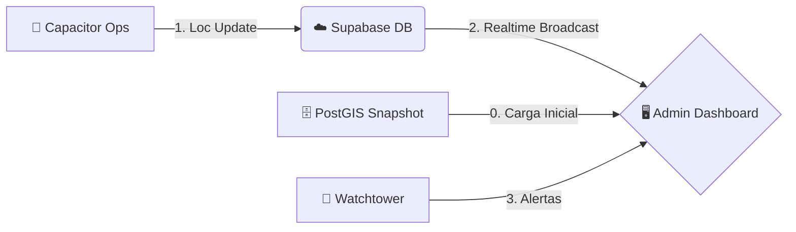

# 5.8.12 Admin God View

Dashboard conocido internamente como "La Torre de Control" o "God View". Permite a los administradores visualizar la operación completa en tiempo real y gestionar incidentes de seguridad.

---

## 1. Visualización Geoespacial (El Mapa)

### 1.1 Mapa de Calor y Clusters
No mostramos 1000 pines individuales si la vista está alejada (Zoom Out).
*   **Clusterización:** Agrupamos operadores cercanos en burbujas con contador (ej. "(15)").
*   **Código de Colores (Status):**
    *   🟢 **Verde:** En servicio / Disponible.
    *   🔵 **Azul:** En camino (Ruta normal).
    *   🟡 **Amarillo:** Detenido (Tráfico o pausa corta).
    *   🔴 **Rojo:** Incidente (Watchtower Alert: Parada larga, Desvío, Pánico).
    *   ⚫ **Gris:** Offline / Sin señal.

### 1.2 Detalle de Operador ("Drill Down")
Al hacer clic en un operador:
*   Foto y Nombre.
*   Servicio actual (ID, Cliente).
*   Batería del dispositivo (Dato crítico de seguridad).
*   Última conexión (Heartbeat).
*   **Botones Acción:** "Llamar", "Mensaje Prioritario", "Ver Historial".

---

## 2. Panel de Incidentes (Watchtower Feed)

Barra lateral derecha con lista de alertas activas generadas por [[Proyecto OnlyCarNLD/Datos/5.8.10 watchtower_algorithm]].

*   **Prioridad Alta:** Botones de pánico, desconexiones largas en ruta.
*   **Prioridad Media:** Retrasos en ETA, desvíos de ruta.
*   **Prioridad Baja:** Batería baja (< 15%).

---

## 3. Integración Técnica

Este dashboard es un **consumidor masivo** de datos.

### 3.1 Flujo de Datos

*   **Realtime:** Suscripción al canal global `admin:tracking` de Supabase Broadcast.
*   **Snapshot:** Carga inicial de posiciones desde Tabla `ultima_ubicacion_operadores` (PostGIS).
*   **Rendimiento:**
    *   Uso de `Canvas` rendering en Leaflet/Mapbox para soportar > 500 marcadores móviles sin lag.
    *   Throttling de actualizaciones visuales (FPS limitados) para no congelar el navegador del admin.

---

## Navegación

| ⬆️ Padre             | [[Proyecto OnlyCarNLD/Datos/5.8. geolocalizacion]]            |
| -------------------- | ----------------------------------- |
| ⬅️ Hermano anterior  | [[Proyecto OnlyCarNLD/Datos/5.8.11 client_timeline_ui]]       |
| ➡️ Hermano siguiente | [[Proyecto OnlyCarNLD/Datos/5.9 soporte_externo]]             |
