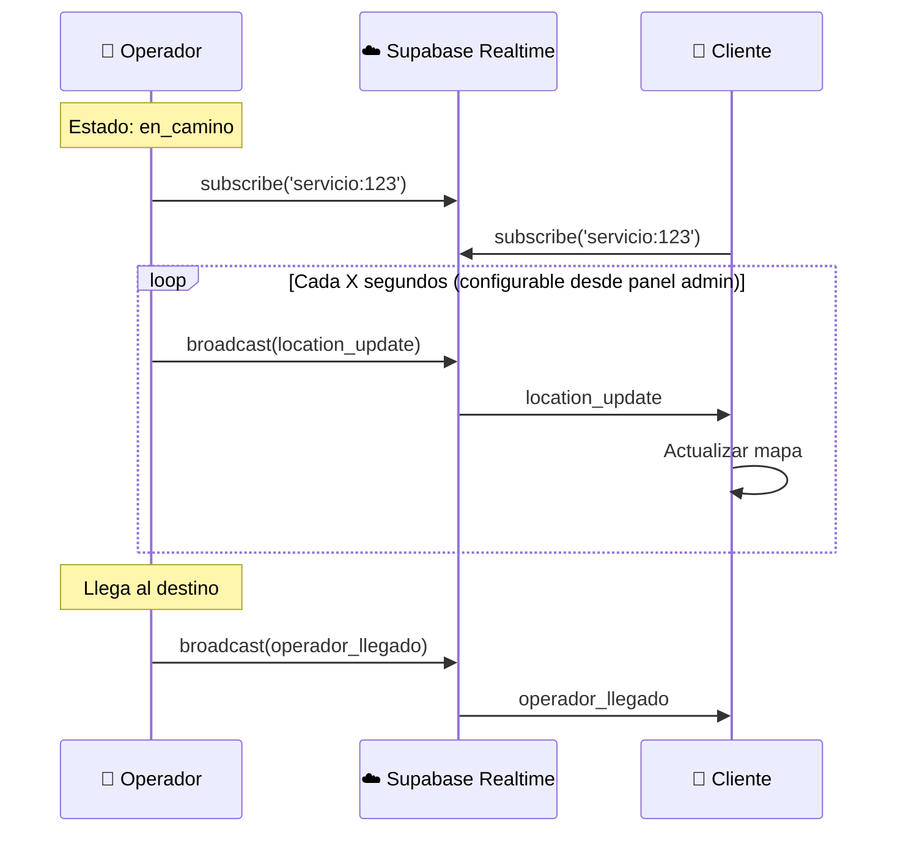

# 5.8.2 Realtime Broadcast

Transmisión de ubicación en tiempo real vía Supabase.

---

## Arquitectura



---

## Composable Principal

```typescript
// composables/useLocationBroadcast.ts
import { GEO_CONFIG } from '~/config/geolocation';

interface LocationPayload {
  lat: number;
  lng: number;
  accuracy: number;
  timestamp: number;
  heading?: number;
  speed?: number;
}

export const useLocationBroadcast = (servicioId: string) => {
  const supabase = useSupabaseClient();
  const channelName = `${GEO_CONFIG.CHANNEL_PREFIX}${servicioId}`;
  
  const channel = ref<RealtimeChannel | null>(null);
  const isConnected = ref(false);
  const lastBroadcast = ref<Date | null>(null);
  
  /**
   * Conectar al canal
   */
  const connect = () => {
    if (channel.value) return;
    
    channel.value = supabase.channel(channelName, {
      config: {
        broadcast: { self: false }, // No recibir propios mensajes
        presence: { key: '' }       // Sin presence por ahora
      }
    });
    
    channel.value.subscribe((status) => {
      isConnected.value = status === 'SUBSCRIBED';
    });
  };
  
  /**
   * Operador: Enviar ubicación
   */
  const broadcastLocation = async (
    lat: number, 
    lng: number, 
    accuracy: number = 0,
    heading?: number,
    speed?: number
  ) => {
    if (!channel.value || !isConnected.value) {
      console.warn('Canal no conectado');
      return;
    }
    
    const payload: LocationPayload = {
      lat,
      lng,
      accuracy,
      timestamp: Date.now(),
      heading,
      speed
    };
    
    await channel.value.send({
      type: 'broadcast',
      event: 'location_update',
      payload
    });
    
    lastBroadcast.value = new Date();
  };
  
  /**
   * Enviar evento de llegada
   */
  const broadcastArrival = async () => {
    if (!channel.value) return;
    
    await channel.value.send({
      type: 'broadcast',
      event: 'operador_llegado',
      payload: { timestamp: Date.now() }
    });
  };
  
  /**
   * Cliente: Recibir ubicaciones
   */
  const onLocationUpdate = (
    callback: (payload: LocationPayload) => void
  ) => {
    if (!channel.value) connect();
    
    channel.value?.on('broadcast', { event: 'location_update' }, ({ payload }) => {
      callback(payload as LocationPayload);
    });
  };
  
  /**
   * Cliente: Recibir llegada
   */
  const onArrival = (callback: () => void) => {
    if (!channel.value) connect();
    
    channel.value?.on('broadcast', { event: 'operador_llegado' }, () => {
      callback();
    });
  };
  
  /**
   * Desconectar
   */
  const disconnect = async () => {
    if (channel.value) {
      await supabase.removeChannel(channel.value);
      channel.value = null;
      isConnected.value = false;
    }
  };
  
  // Auto-conectar
  onMounted(() => connect());
  
  // Cleanup
  onUnmounted(() => disconnect());
  
  return {
    isConnected: readonly(isConnected),
    lastBroadcast: readonly(lastBroadcast),
    connect,
    disconnect,
    broadcastLocation,
    broadcastArrival,
    onLocationUpdate,
    onArrival
  };
};
```

---

## Estructura de Hijos

| ID                                         | Nombre                | Descripción              | Estado |
| ------------------------------------------ | --------------------- | ------------------------ | ------ |
| [[Proyecto OnlyCarNLD/Datos/5.8.2.1 channels_servicio\|5.8.2.1]]     | Channels Servicio     | Configuración de canales | ✅      |
| [[Proyecto OnlyCarNLD/Datos/5.8.2.2 payload_ubicacion\|5.8.2.2]]     | Payload Ubicación     | Estructura del payload   | ✅      |
| [[Proyecto OnlyCarNLD/Datos/5.8.2.3 reconnection_strategy\|5.8.2.3]] | Reconnection Strategy | Estrategia de reconexión | ✅      |
| [[Proyecto OnlyCarNLD/Datos/5.8.2.4 error_handling\|5.8.2.4]]        | Error Handling        | Manejo de errores        | ✅      |
| [[Proyecto OnlyCarNLD/Datos/5.8.2.5 presence_tracking\|5.8.2.5]]     | Presence Tracking     | Tracking de presencia    | ✅      |
| [[Proyecto OnlyCarNLD/Datos/5.8.2.6 rls_security\|5.8.2.6]]          | RLS Security          | Seguridad RLS            | ✅      |

---

## Uso: Lado Operador

```vue
<!-- pages/operador/servicio/[id].vue -->
<script setup lang="ts">
const route = useRoute();
const servicioId = route.params.id as string;

const { startWatch, stopWatch, onUpdate } = useWatchPosition();
const { broadcastLocation, broadcastArrival, isConnected } = useLocationBroadcast(servicioId);
const { calcularDistancia } = useGeoUtils();

// Destino del cliente
const destino = ref<{ lat: number; lng: number } | null>(null);

// Cuando recibimos ubicación del GPS
onUpdate((pos) => {
  if (!pos) return;
  
  // Broadcast al cliente
  broadcastLocation(pos.lat, pos.lng, pos.accuracy);
  
  // Verificar si llegamos
  if (destino.value) {
    const distancia = calcularDistancia(
      pos.lat, pos.lng,
      destino.value.lat, destino.value.lng
    );
    
    if (distancia < 100) {
      handleArrival();
    }
  }
});

const handleArrival = async () => {
  stopWatch();
  await broadcastArrival();
  await cambiarEstado(servicioId, 'llegado');
};
</script>
```

---

## Uso: Lado Cliente

```vue
<!-- components/chat/CardUbicacionOperador.vue -->
<script setup lang="ts">
const props = defineProps<{ servicioId: string }>();

const { onLocationUpdate, onArrival, isConnected } = useLocationBroadcast(props.servicioId);

const operadorPosition = ref<{ lat: number; lng: number } | null>(null);
const operadorLlego = ref(false);

// Recibir updates de ubicación
onLocationUpdate((payload) => {
  operadorPosition.value = {
    lat: payload.lat,
    lng: payload.lng
  };
});

// Recibir evento de llegada
onArrival(() => {
  operadorLlego.value = true;
  toast.success('¡El operador ha llegado!');
});
</script>

<template>
  <div class="card-ubicacion">
    <div class="card-header">
      <span>📍 Ubicación del operador</span>
      <span v-if="isConnected" class="status-dot connected" />
      <span v-else class="status-dot disconnected" />
    </div>
    
    <MapaUbicacion 
      v-if="operadorPosition"
      :lat="operadorPosition.lat"
      :lng="operadorPosition.lng"
    />
    
    <div v-if="operadorLlego" class="arrival-banner">
      ✅ ¡El operador ha llegado!
    </div>
  </div>
</template>
```

---

## Manejo de Reconexión

```typescript
// Reconectar automáticamente si pierde conexión
const setupReconnection = () => {
  channel.value?.on('system', { event: 'disconnect' }, () => {
    console.log('Desconectado, intentando reconectar...');
    isConnected.value = false;
    
    // Retry con backoff exponencial
    let attempt = 0;
    const maxAttempts = 5;
    
    const retry = async () => {
      if (attempt >= maxAttempts) {
        toast.error('No se pudo reconectar');
        return;
      }
      
      attempt++;
      const delay = Math.min(1000 * Math.pow(2, attempt), 30000);
      
      await new Promise(r => setTimeout(r, delay));
      
      try {
        await connect();
      } catch {
        retry();
      }
    };
    
    retry();
  });
};
```

---

→ Ver canales: [[Proyecto OnlyCarNLD/Datos/5.8.2.1 channels_servicio]]
→ Ver payload: [[Proyecto OnlyCarNLD/Datos/5.8.2.2 payload_ubicacion]]

---

## Navegación

| ⬆️ Padre             | [[Proyecto OnlyCarNLD/Datos/5.8. geolocalizacion]]            |
| -------------------- | ---------------------- |
| ⬅️ Hermano anterior  | [[Proyecto OnlyCarNLD/Datos/5.8.1 capacitor_geolocation]]              |
| ➡️ Hermano siguiente | [[Proyecto OnlyCarNLD/Datos/5.8.3 mapas_visualizacion]]              |
