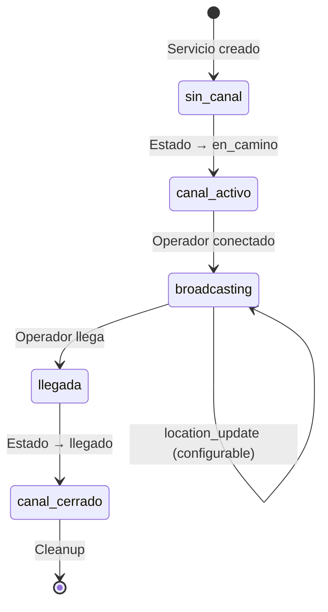

# 5.8.2.1 Channels por Servicio

Configuración de canales Supabase por servicio activo.

---

## Nomenclatura de Canales

```typescript
// Formato: servicio:{servicioId}
const channelName = `servicio:${servicioId}`;

// Ejemplos:
// servicio:a1b2c3d4-e5f6-7890-abcd-ef1234567890
// servicio:srv_20251225_001
```

---

## Diagrama de Canales

```
┌─────────────────────────────────────────────────────────────────┐
│  SUPABASE REALTIME                                              │
├─────────────────────────────────────────────────────────────────┤
│                                                                 │
│  Canal: servicio:abc123                                         │
│  ┌─────────────────────────────────────────────────────────┐    │
│  │                                                         │    │
│  │  SUSCRIPTORES:                                          │    │
│  │  • 📱 Operador (Carlos M.) — BROADCASTER                │    │
│  │  • 📱 Cliente (Juan G.) — LISTENER                      │    │
│  │  • 💻 Admin Dashboard — LISTENER (opcional)             │    │
│  │                                                         │    │
│  │  EVENTOS:                                               │    │
│  │  • location_update                                      │    │
│  │  • operador_llegado                                     │    │
│  │  • operador_retrasado (opcional)                        │    │
│  │                                                         │    │
│  └─────────────────────────────────────────────────────────┘    │
│                                                                 │
│  Canal: servicio:xyz789                                         │
│  ┌─────────────────────────────────────────────────────────┐    │
│  │  (Otro servicio activo simultáneo)                      │    │
│  └─────────────────────────────────────────────────────────┘    │
│                                                                 │
└─────────────────────────────────────────────────────────────────┘
```

---

## Ciclo de Vida del Canal



---

## Implementación del Canal

```typescript
// services/channelManager.ts
class ChannelManager {
  private channels = new Map<string, RealtimeChannel>();
  private supabase: SupabaseClient;
  
  constructor(supabase: SupabaseClient) {
    this.supabase = supabase;
  }
  
  /**
   * Obtener o crear canal por servicio
   */
  getChannel(servicioId: string): RealtimeChannel {
    const channelName = `servicio:${servicioId}`;
    
    if (!this.channels.has(servicioId)) {
      const channel = this.supabase.channel(channelName, {
        config: {
          broadcast: { 
            self: false,        // No recibir propios mensajes
            ack: false          // Sin confirmación (menor latencia)
          }
        }
      });
      
      this.channels.set(servicioId, channel);
    }
    
    return this.channels.get(servicioId)!;
  }
  
  /**
   * Cerrar canal cuando servicio termina
   */
  async closeChannel(servicioId: string): Promise<void> {
    const channel = this.channels.get(servicioId);
    
    if (channel) {
      await this.supabase.removeChannel(channel);
      this.channels.delete(servicioId);
    }
  }
  
  /**
   * Cerrar todos los canales (cleanup)
   */
  async closeAll(): Promise<void> {
    for (const [id] of this.channels) {
      await this.closeChannel(id);
    }
  }
}

// Singleton
export const channelManager = new ChannelManager(useSupabaseClient());
```

---

## Seguridad del Canal

```typescript
// Los canales de Supabase Realtime son públicos por defecto
// Pero solo quienes conocen el servicioId pueden conectarse

// Medidas adicionales:
// 1. IDs de servicio son UUIDs aleatorios
// 2. No exponer servicioId en URLs públicas
// 3. Validar que usuario tenga relación con servicio

// middleware/canal.ts
export default defineNuxtRouteMiddleware(async (to) => {
  const servicioId = to.params.id as string;
  const user = useSupabaseUser();
  
  // Verificar que usuario es cliente u operador del servicio
  const { data } = await supabase
    .from('servicios')
    .select('cliente_id, operador_id')
    .eq('id', servicioId)
    .single();
  
  if (!data) {
    throw createError({ statusCode: 404 });
  }
  
  const isAuthorized = 
    data.cliente_id === user.value?.id ||
    data.operador_id === user.value?.id ||
    user.value?.rol === 'admin';
  
  if (!isAuthorized) {
    throw createError({ statusCode: 403 });
  }
});
```

---

## Límites y Consideraciones

| Aspecto | Límite Supabase Free |
|---------|---------------------|
| Conexiones simultáneas | 200 |
| Mensajes/seg | 100 |
| Canales activos | Sin límite |

**Para OnlyCar:**
- ~10-20 servicios simultáneos máximo = ~40-60 conexiones
- ✅ Muy por debajo del límite

---

→ Ver payload: [[Proyecto OnlyCarNLD/Datos/5.8.2.2 payload_ubicacion]]

---

## Navegación

| ⬆️ Padre             | [[Proyecto OnlyCarNLD/Datos/5.8.2 realtime_broadcast]]            |
| -------------------- | ---------------------- |
| ➡️ Hermano siguiente | [[Proyecto OnlyCarNLD/Datos/5.8.2.2 payload_ubicacion]]              |
