# 5.8.5 Detección de Llegada

Sistema automático para confirmar llegada del operador.

---

## Lógica de Detección

```mermaid
flowchart TD
    A[GPS Update] --> B[Calcular distancia al destino]
    B --> C{distancia < UMBRAL?}
    C -->|No| D[Continuar tracking]
    C -->|Sí| E[Incrementar contador]
    E --> F{contador >= CONFIRMACIONES?}
    F -->|No| D
    F -->|Sí| G[Confirmar llegada]
    G --> H[Broadcast operador_llegado]
    H --> I[Cambiar estado a 'llegado']
    I --> J[Detener tracking]
```



---

## Constantes

```typescript
// config/geolocation.ts
export const ARRIVAL_CONFIG = {
  // Distancia para considerar "llegado"
  THRESHOLD_METERS: 100,
  
  // Lecturas consecutivas necesarias (anti-ruido GPS)
  CONFIRMATIONS_REQUIRED: 2,
  
  // Tiempo mínimo en zona para confirmar
  MIN_TIME_IN_ZONE_MS: 5000,
  
  // Permitir confirmación manual siempre
  ALLOW_MANUAL_OVERRIDE: true
};
```

---

## Composable Principal

```typescript
// composables/useArrivalDetection.ts
import { GEO_CONFIG, ARRIVAL_CONFIG } from '~/config/geolocation';
import { calcularDistancia } from '~/utils/geoUtils';

interface ArrivalState {
  isNear: boolean;
  confirmationCount: number;
  distanceToDestino: number | null;
  arrivedAt: Date | null;
}

export const useArrivalDetection = (
  destino: Ref<{ lat: number; lng: number } | null>
) => {
  const state = reactive<ArrivalState>({
    isNear: false,
    confirmationCount: 0,
    distanceToDestino: null,
    arrivedAt: null
  });
  
  const hasArrived = computed(() => state.arrivedAt !== null);
  
  /**
   * Verificar si llegó al destino
   */
  const checkArrival = (
    currentLat: number, 
    currentLng: number
  ): boolean => {
    if (!destino.value || hasArrived.value) {
      return false;
    }
    
    // Calcular distancia
    const distance = calcularDistancia(
      currentLat, currentLng,
      destino.value.lat, destino.value.lng
    );
    
    state.distanceToDestino = Math.round(distance);
    
    // Verificar umbral
    if (distance < ARRIVAL_CONFIG.THRESHOLD_METERS) {
      state.isNear = true;
      state.confirmationCount++;
      
      // Si alcanzamos confirmaciones requeridas
      if (state.confirmationCount >= ARRIVAL_CONFIG.CONFIRMATIONS_REQUIRED) {
        return confirmArrival();
      }
    } else {
      // Reset si se aleja
      state.isNear = false;
      state.confirmationCount = 0;
    }
    
    return false;
  };
  
  /**
   * Confirmar llegada (automática o manual)
   */
  const confirmArrival = (): boolean => {
    if (hasArrived.value) return true;
    
    state.arrivedAt = new Date();
    return true;
  };
  
  /**
   * Reset (para nuevo servicio)
   */
  const reset = () => {
    state.isNear = false;
    state.confirmationCount = 0;
    state.distanceToDestino = null;
    state.arrivedAt = null;
  };
  
  return {
    state: readonly(state),
    hasArrived,
    checkArrival,
    confirmArrival,
    reset
  };
};
```

---

## Integración con Tracking

```typescript
// En la vista del operador
const destino = ref<{ lat: number; lng: number } | null>(null);
const servicioId = route.params.id as string;

const { startWatch, stopWatch, onUpdate } = useWatchPosition();
const { broadcastLocation, broadcastArrival } = useLocationBroadcast(servicioId);
const { state: arrivalState, checkArrival, hasArrived } = useArrivalDetection(destino);

// Escuchar updates de GPS
onUpdate(async (pos) => {
  if (!pos) return;
  
  // Broadcast ubicación
  broadcastLocation(pos.lat, pos.lng, pos.accuracy);
  
  // Verificar llegada
  const arrived = checkArrival(pos.lat, pos.lng);
  
  if (arrived) {
    await handleArrival();
  }
});

const handleArrival = async () => {
  // 1. Detener tracking
  stopWatch();
  
  // 2. Notificar al cliente
  await broadcastArrival();
  
  // 3. Cambiar estado del servicio
  await updateServicio(servicioId, { estado: 'llegado' });
  
  // 4. Mostrar confirmación
  toast.success('¡Has llegado al destino!');
};
```

---

## UI de Llegada

```vue
<!-- components/ArrivalIndicator.vue -->
<script setup lang="ts">
const props = defineProps<{
  distancia: number | null;
  isNear: boolean;
  hasArrived: boolean;
}>();

const emit = defineEmits<{
  (e: 'manualConfirm'): void;
}>();

const distanciaFormateada = computed(() => {
  if (!props.distancia) return '--';
  if (props.distancia < 1000) {
    return `${props.distancia}m`;
  }
  return `${(props.distancia / 1000).toFixed(1)}km`;
});
</script>

<template>
  <div class="arrival-indicator">
    <!-- Distancia -->
    <div class="distance">
      <span class="label">Distancia al destino</span>
      <span class="value" :class="{ near: isNear }">
        {{ distanciaFormateada }}
      </span>
    </div>
    
    <!-- Barra de progreso visual -->
    <div class="progress-bar">
      <div 
        class="progress-fill"
        :style="{ width: isNear ? '100%' : '50%' }"
      />
    </div>
    
    <!-- Estado -->
    <div v-if="hasArrived" class="arrived">
      ✅ ¡Has llegado!
    </div>
    
    <div v-else-if="isNear" class="arriving">
      📍 Estás muy cerca...
    </div>
    
    <!-- Botón manual -->
    <button 
      v-if="!hasArrived"
      @click="emit('manualConfirm')"
      class="btn-manual"
    >
      Confirmar llegada manualmente
    </button>
  </div>
</template>

<style scoped>
.arrival-indicator {
  padding: 16px;
  background: var(--color-surface);
  border-radius: 12px;
}

.distance {
  display: flex;
  justify-content: space-between;
  margin-bottom: 8px;
}

.value {
  font-size: 1.5rem;
  font-weight: bold;
}

.value.near {
  color: var(--color-success);
}

.progress-bar {
  height: 4px;
  background: var(--color-border);
  border-radius: 2px;
  overflow: hidden;
  margin-bottom: 12px;
}

.progress-fill {
  height: 100%;
  background: var(--color-primary);
  transition: width 0.3s ease;
}

.arrived {
  text-align: center;
  color: var(--color-success);
  font-weight: bold;
  font-size: 1.2rem;
}

.arriving {
  text-align: center;
  color: var(--color-warning);
  animation: pulse 2s infinite;
}

.btn-manual {
  width: 100%;
  margin-top: 12px;
  padding: 10px;
  background: transparent;
  border: 1px solid var(--color-border);
  border-radius: 8px;
  color: var(--color-text-secondary);
  cursor: pointer;
}
</style>
```

---

## Estructura de Hijos

| ID                                     | Nombre            | Descripción              | Estado |
| -------------------------------------- | ----------------- | ------------------------ | ------ |
| [[Proyecto OnlyCarNLD/Datos/5.8.5.1 haversine_formula\|5.8.5.1]] | Haversine Formula | Cálculo de distancia GPS | ✅      |

---

→ Ver cálculo distancia: [[Proyecto OnlyCarNLD/Datos/5.8.5.1 haversine_formula]]

---

## Navegación

| ⬆️ Padre             | [[Proyecto OnlyCarNLD/Datos/5.8. geolocalizacion]]            |
| -------------------- | ---------------------- |
| ⬅️ Hermano anterior  | [[Proyecto OnlyCarNLD/Datos/5.8.4 navegacion_externa]]              |
| ➡️ Hermano siguiente | [[Proyecto OnlyCarNLD/Datos/5.8.6 backend_ubicaciones]]              |
