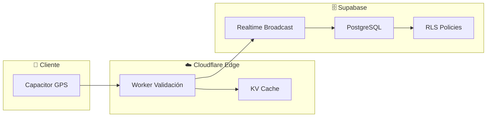

# 5.8.6 Backend de Ubicaciones

Sistema de persistencia y procesamiento de ubicaciones en el servidor.

---

## Arquitectura



---

## Stack Específico

| Componente | Tecnología | Función |
|------------|------------|---------|
| **API Routes** | Nitro v3 | Endpoints RESTful |
| **Database** | Supabase/PostgreSQL | Persistencia ubicaciones |
| **Security** | RLS Policies | Control acceso por servicio |
| **Cache** | Cloudflare KV | Última ubicación rápida |
| **Edge Processing** | Cloudflare Workers | Validación y filtrado |

---

## Flujo de Datos

```
1. Operador envía ubicación (Capacitor)
        ↓
2. Cloudflare Worker valida payload
   - Formato correcto
   - Coordenadas válidas
   - Usuario autenticado
        ↓
3. Supabase Realtime broadcast (inmediato)
        ↓
4. Cloudflare KV actualiza última ubicación (cache)
        ↓
5. PostgreSQL guarda historial (asíncrono, opcional)
```

---

## Decisiones de Diseño

> [!IMPORTANT]
> **Decisión adoptada: Opción C (Historial Completo con Autolimpieza)**
> 
> - Persistir todas las ubicaciones durante el servicio
> - Limpieza automática a 30 días (excepto llegadas y disputas)
> - Retención de ubicaciones de llegada: 1 año
> - Storage estimado: ~18 KB/servicio, ~22 MB/año
> - Justificación: Evidencia B2B, analytics, diferenciador

---

## Estructura de Hijos

| ID                                         | Nombre                | Descripción              | Nietos | Estado |
| ------------------------------------------ | --------------------- | ------------------------ | ------ | ------ |
| [[Proyecto OnlyCarNLD/Datos/5.8.6.1 nitro_endpoints\|5.8.6.1]]       | Nitro Endpoints       | API endpoints            | 0      | ✅      |
| [[Proyecto OnlyCarNLD/Datos/5.8.6.2 supabase_schema\|5.8.6.2]]       | Supabase Schema       | Esquema BD ubicaciones   | 0      | ✅      |
| [[Proyecto OnlyCarNLD/Datos/5.8.6.3 rls_policies\|5.8.6.3]]          | RLS Policies          | Políticas RLS            | 0      | ✅      |
| [[Proyecto OnlyCarNLD/Datos/5.8.6.4 cloudflare_edge\|5.8.6.4]]       | Cloudflare Edge       | Workers y KV cache       | 0      | ✅      |
| [[Proyecto OnlyCarNLD/Datos/5.8.6.5 historial_ubicaciones\|5.8.6.5]] | Historial Ubicaciones | Almacenamiento histórico | 0 | ✅      |

---

## Variables de Entorno

```env
# Supabase
SUPABASE_URL=https://xxxxx.supabase.co
SUPABASE_ANON_KEY=eyJhbGc...
SUPABASE_SERVICE_ROLE_KEY=eyJhbGc... # Solo server-side

# Cloudflare
CLOUDFLARE_KV_NAMESPACE_ID=xxxxx
CLOUDFLARE_ACCOUNT_ID=xxxxx
```

---

→ Ver Nitro endpoints: [[Proyecto OnlyCarNLD/Datos/5.8.6.1 nitro_endpoints]]

---

## Navegación

| ⬆️ Padre             | [[Proyecto OnlyCarNLD/Datos/5.8. geolocalizacion]]            |
| -------------------- | ---------------------- |
| ⬅️ Hermano anterior  | [[Proyecto OnlyCarNLD/Datos/5.8.5 deteccion_llegada]]              |
| ➡️ Hermano siguiente | [[Proyecto OnlyCarNLD/Datos/5.8.7 edge_cases]]              |
