# 5.8.6.4 Cloudflare Edge

Procesamiento de ubicaciones en el Edge con Cloudflare Workers.

---

## Arquitectura Edge

```mermaid
flowchart LR
    A[📱 Dispositivo] --> B[🌐 Cloudflare Edge]
    
    subgraph CF[Cloudflare]
        B --> C{Worker Validación}
        C --> D[KV Cache]
        C --> E[Durable Objects]
    end
    
    C --> F[Supabase]
```



---

## Cloudflare Workers KV

Con GitHub + CloudflarePages, accedemos a servicios Cloudflare directamente:

| Servicio | Uso en Geolocalización |
|----------|------------------------|
| **Workers** | Validación y filtrado de payload |
| **KV** | Cache de última ubicación |
| **D1** | Cache de metadata (opcional) |
| **Durable Objects** | Rate limiting por usuario |

---

## Implementación con Workers KV

### Configuración wrangler.toml

```toml
# wrangler.toml
name = "onlycar-api"
compatibility_date = "2024-01-01"

[[kv_namespaces]]
binding = "UBICACION_KV"
id = "your-kv-namespace-id"
```

### Storage KV para Ubicación

```typescript
// server/api/ubicacion/[servicioId]/actual.get.ts
export default defineEventHandler(async (event) => {
  const servicioId = getRouterParam(event, 'servicioId');
  
  // Cloudflare Workers KV directo via binding
  const kv = event.context.cloudflare.env.UBICACION_KV;
  
  // Intentar cache primero
  const cached = await kv.get(`ubicacion:${servicioId}`);
  if (cached) {
    return JSON.parse(cached);
  }
  
  // Fallback a Supabase
  const supabase = await serverSupabaseClient(event);
  const { data } = await supabase
    .from('ubicacion_actual')
    .select('*')
    .eq('servicio_id', servicioId)
    .single();
  
  if (data) {
    // Guardar en cache por 30 segundos
    await kv.put(`ubicacion:${servicioId}`, JSON.stringify(data), {
      expirationTtl: 30
    });
  }
  
  return data;
});
```

### Guardar con Cache-Aside

```typescript
// server/api/ubicacion/[servicioId]/index.post.ts
export default defineEventHandler(async (event) => {
  const servicioId = getRouterParam(event, 'servicioId');
  const body = await readBody(event);
  
  // Validar en Edge (rápido)
  if (!isValidPayload(body)) {
    throw createError({ statusCode: 400 });
  }
  
  const kv = event.context.cloudflare.env.UBICACION_KV;
  
  // 1. Actualizar cache inmediatamente
  await kv.put(`ubicacion:${servicioId}`, JSON.stringify({
    ...body,
    timestamp: Date.now()
  }), { expirationTtl: 300 });
  
  // 2. Persistir en Supabase (puede ser async)
  const supabase = await serverSupabaseClient(event);
  await supabase.from('ubicaciones_servicio').insert({
    servicio_id: servicioId,
    operador_id: (await serverSupabaseUser(event))?.id,
    lat: body.lat,
    lng: body.lng,
    accuracy: body.accuracy
  });
  
  return { success: true };
});
```

---

## Worker de Validación

```typescript
// server/middleware/geo-validation.ts
export default defineEventHandler(async (event) => {
  if (!event.path.startsWith('/api/ubicacion')) return;
  if (event.method !== 'POST') return;
  
  const body = await readBody(event);
  
  // Validación rápida en Edge
  const errors: string[] = [];
  
  if (typeof body.lat !== 'number' || body.lat < -90 || body.lat > 90) {
    errors.push('lat inválida');
  }
  
  if (typeof body.lng !== 'number' || body.lng < -180 || body.lng > 180) {
    errors.push('lng inválida');
  }
  
  if (body.accuracy !== undefined && (typeof body.accuracy !== 'number' || body.accuracy < 0)) {
    errors.push('accuracy inválida');
  }
  
  if (errors.length > 0) {
    throw createError({
      statusCode: 400,
      message: 'Payload inválido',
      data: { errors }
    });
  }
});
```

---

## Rate Limiting con KV

```typescript
// server/middleware/geo-rate-limit.ts
const LIMIT = 60;  // requests
const WINDOW = 60; // segundos

export default defineEventHandler(async (event) => {
  if (!event.path.includes('/ubicacion')) return;
  
  const user = await serverSupabaseUser(event);
  if (!user) return;
  
  const kv = event.context.cloudflare.env.UBICACION_KV;
  const key = `ratelimit:geo:${user.id}`;
  
  const current = await kv.get(key);
  const count = current ? parseInt(current) : 0;
  
  if (count >= LIMIT) {
    throw createError({
      statusCode: 429,
      message: 'Demasiadas solicitudes. Espera un minuto.'
    });
  }
  
  // Incrementar contador
  await kv.put(key, String(count + 1), {
    expirationTtl: WINDOW
  });
});
```

---

## Beneficios del Edge

| Aspecto | Sin Edge | Con Edge |
|---------|----------|----------|
| Latencia validación | ~200ms | ~20ms |
| Cache última ubicación | DB query | KV instant |
| Rate limiting | Por request | Distribuido |
| Geofencing | Backend | Edge (15ms) |

---

## Navegación

| ⬆️ Padre             | [[Proyecto OnlyCarNLD/Datos/5.8.6 backend_ubicaciones]]       |
| -------------------- | ----------------------------------- |
| ⬅️ Hermano anterior  | [[Proyecto OnlyCarNLD/Datos/5.8.6.3 rls_policies]]            |
| ➡️ Hermano siguiente | [[Proyecto OnlyCarNLD/Datos/5.8.6.5 historial_ubicaciones]]   |

---
