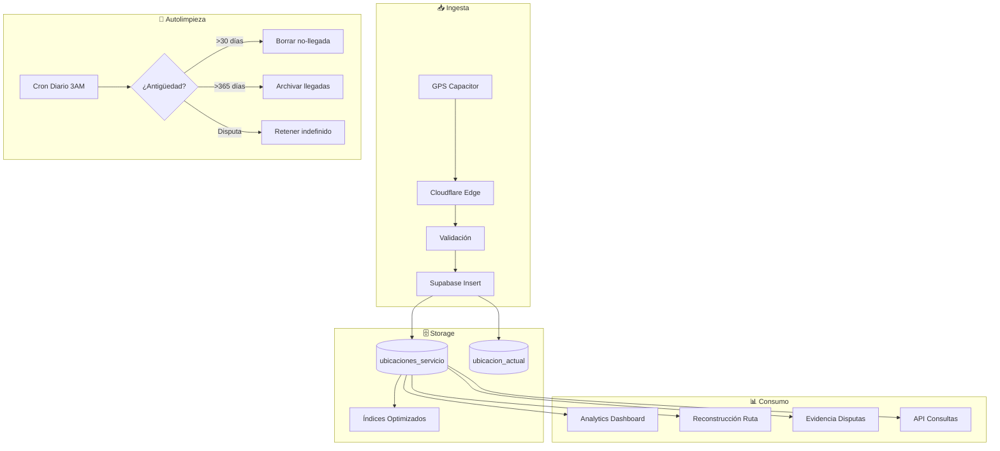

# 5.8.6.5 Historial de Ubicaciones

Sistema completo de almacenamiento histórico de ubicaciones GPS con autolimpieza programada.

---

## Decisión Adoptada

> [!IMPORTANT]
> Historial Completo con Autolimpieza**
> 
> Persistir **todas** las ubicaciones durante el servicio, con limpieza automatizada para controlar storage.

---

## Justificación para OnlyCar

| Factor | Razón |
|--------|-------|
| **Contratos B2B** | Clientes Corporate+ requieren prueba de servicio |
| **Disputas** | "El operador nunca llegó" vs "Aquí está el GPS" |
| **SLAs** | Demostrar tiempo de llegada cumplido |
| **Métricas** | Tiempo promedio por zona, rutas eficientes |
| **Diferenciador** | "Vea el recorrido de su servicio" |
| **Costo** | ~216 MB/año está dentro de Supabase Free |

---

## Arquitectura



---

## Casos de Uso

### Caso 1: Disputa de Cliente B2B

```
┌─────────────────────────────────────────────────────────────────┐
│  ESCENARIO: Cliente Corporate+ reclama operador no llegó        │
├─────────────────────────────────────────────────────────────────┤
│                                                                 │
│  SIN HISTORIAL:                                                 │
│  • Cliente: "El operador nunca llegó"                           │
│  • Admin: "Según el operador sí llegó"                          │
│  • Resultado: Palabra contra palabra → Cliente insatisfecho     │
│                                                                 │
│  CON HISTORIAL:                                                 │
│  • Cliente: "El operador nunca llegó"                           │
│  • Admin: "Aquí está el recorrido GPS completo:"                │
│    - 14:00 Salió de base (lat, lng)                             │
│    - 14:15 Llegó a destino (lat, lng)                           │
│    - 14:16 Confirmó llegada automática                          │
│  • Resultado: Evidencia irrefutable → Caso cerrado              │
│                                                                 │
└─────────────────────────────────────────────────────────────────┘
```

### Caso 2: SLA Incumplido

```
┌─────────────────────────────────────────────────────────────────┐
│  ESCENARIO: SLA de 30 min máximo para llegar                    │
├─────────────────────────────────────────────────────────────────┤
│                                                                 │
│  CON HISTORIAL:                                                 │
│  • Servicio confirmado: 14:00                                   │
│  • Primera ubicación: 14:05 (operador salió 5 min después)      │
│  • Llegada detectada: 14:42 (42 min totales)                    │
│  • SLA: INCUMPLIDO → Aplicar compensación automática            │
│                                                                 │
│  BENEFICIO: Proceso automatizado sin intervención humana        │
│                                                                 │
└─────────────────────────────────────────────────────────────────┘
```

### Caso 3: Optimización Operacional

```
┌─────────────────────────────────────────────────────────────────┐
│  ESCENARIO: Análisis de eficiencia                              │
├─────────────────────────────────────────────────────────────────┤
│                                                                 │
│  CON HISTORIAL:                                                 │
│  • Zona Centro: 15 min promedio de llegada                      │
│  • Zona Periférico: 35 min promedio                             │
│  • Operador Carlos: 20% más rápido que promedio                 │
│  • Operador Juan: 15% más lento que promedio                   │
│                                                                 │
│  ACCIÓN: Reasignar zonas, capacitar operadores lentos           │
│                                                                 │
└─────────────────────────────────────────────────────────────────┘
```

---

## Estructura de Hijos

| ID                                             | Nombre               | Descripción             | Estado |
| ---------------------------------------------- | -------------------- | ----------------------- | ------ |
| [[Proyecto OnlyCarNLD/Datos/5.8.6.5.1 modelo_datos\|5.8.6.5.1]]          | Modelo Datos         | Esquema SQL historial   | ✅      |
| [[Proyecto OnlyCarNLD/Datos/5.8.6.5.2 politica_retencion\|5.8.6.5.2]]    | Política Retención   | Reglas de retención     | ✅      |
| [[Proyecto OnlyCarNLD/Datos/5.8.6.5.3 limpieza_automatica\|5.8.6.5.3]]   | Limpieza Automática  | Cron job autolimpieza   | ✅      |
| [[Proyecto OnlyCarNLD/Datos/5.8.6.5.4 evidencia_disputas\|5.8.6.5.4]]    | Evidencia Disputas   | Uso en disputas         | ✅      |
| [[Proyecto OnlyCarNLD/Datos/5.8.6.5.5 analytics_metricas\|5.8.6.5.5]]    | Analytics Métricas   | KPIs y analytics        | ✅      |
| [[Proyecto OnlyCarNLD/Datos/5.8.6.5.6 reconstruccion_ruta\|5.8.6.5.6]]   | Reconstrucción Ruta  | Replay de rutas         | ✅      |
| [[Proyecto OnlyCarNLD/Datos/5.8.6.5.7 privacidad_gdpr\|5.8.6.5.7]]       | Privacidad GDPR      | Cumplimiento privacidad | ✅      |
| [[Proyecto OnlyCarNLD/Datos/5.8.6.5.8 storage_estimaciones\|5.8.6.5.8]]  | Storage Estimaciones | Cálculos de storage     | ✅      |
| [[Proyecto OnlyCarNLD/Datos/5.8.6.5.9 queries_optimizadas\|5.8.6.5.9]]   | Queries Optimizadas  | SQL optimizado          | ✅      |
| [[Proyecto OnlyCarNLD/Datos/5.8.6.5.10 backup_recuperacion\|5.8.6.5.10]] | Backup Recuperación  | DR y backups            | ✅      |

---

## Matriz de Retención

| Tipo de Dato | Retención | Razón |
|--------------|-----------|-------|
| Ubicaciones intermedias | 30 días | Balance storage/utilidad |
| Ubicación de llegada | 1 año | Auditoría, SLAs |
| Servicios con disputa | Indefinido | Evidencia legal |
| Ubicaciones archivadas | 3 años | Regulación fiscal |

---

## Estimaciones de Storage

| Métrica | Valor |
|---------|-------|
| Por ubicación | ~100 bytes |
| Por servicio (30 min) | ~18 KB |
| Por mes (1000 servicios) | ~18 MB |
| Por año | ~216 MB |
| Supabase Free | 500 MB |
| **Margen disponible** | **284 MB** ✅ |

---

→ Ver modelo de datos: [[Proyecto OnlyCarNLD/Datos/5.8.6.5.1 modelo_datos]]

---

## Navegación

| ⬆️ Padre             | [[Proyecto OnlyCarNLD/Datos/5.8.6 backend_ubicaciones]]            |
| -------------------- | ---------------------- |
| ⬅️ Hermano anterior  | [[Proyecto OnlyCarNLD/Datos/5.8.6.4 cloudflare_edge]]              |
