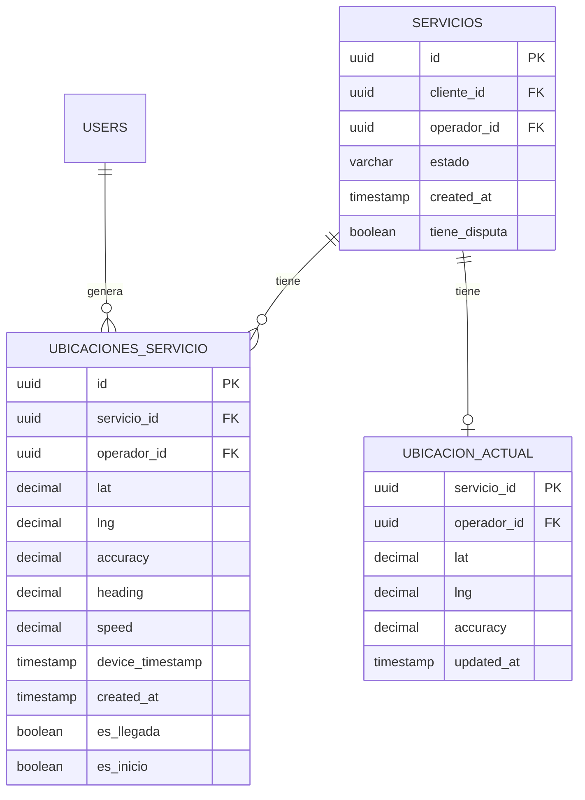

# 5.8.6.5.1 Modelo de Datos

Esquema detallado para almacenamiento de historial de ubicaciones.

---

## Diagrama Entidad-Relación



---

## Tabla Principal: ubicaciones_servicio

### Schema Completo

```sql
CREATE TABLE ubicaciones_servicio (
  -- ═══════════════════════════════════════════════════════════════════
  -- IDENTIFICADORES
  -- ═══════════════════════════════════════════════════════════════════
  id UUID PRIMARY KEY DEFAULT gen_random_uuid(),
  
  -- Relación con servicio
  servicio_id UUID NOT NULL 
    REFERENCES servicios(id) 
    ON DELETE CASCADE,
  
  -- Relación con operador (para auditoría)
  operador_id UUID NOT NULL 
    REFERENCES users(id) 
    ON DELETE SET NULL,
  
  -- ═══════════════════════════════════════════════════════════════════
  -- COORDENADAS GPS
  -- ═══════════════════════════════════════════════════════════════════
  
  -- Latitud: -90 a +90
  -- DECIMAL(10,8) permite 8 decimales = ~1mm de precisión
  lat DECIMAL(10, 8) NOT NULL,
  
  -- Longitud: -180 a +180
  -- DECIMAL(11,8) para el rango extra
  lng DECIMAL(11, 8) NOT NULL,
  
  -- ═══════════════════════════════════════════════════════════════════
  -- METADATA GPS
  -- ═══════════════════════════════════════════════════════════════════
  
  -- Precisión en metros (del sensor GPS)
  -- Típico: 5-50m urbano, 50-100m interior
  accuracy DECIMAL(8, 2),
  
  -- Altitud sobre nivel del mar (metros)
  -- Null si no disponible
  altitude DECIMAL(10, 2),
  
  -- Precisión de altitud (metros)
  altitude_accuracy DECIMAL(8, 2),
  
  -- Dirección de movimiento (0-360 grados, 0=Norte)
  -- Null si estacionario
  heading DECIMAL(5, 2),
  
  -- Velocidad en metros/segundo
  -- Null si estacionario o GPS no reporta
  speed DECIMAL(6, 2),
  
  -- ═══════════════════════════════════════════════════════════════════
  -- TIMESTAMPS
  -- ═══════════════════════════════════════════════════════════════════
  
  -- Timestamp del dispositivo (puede diferir del server)
  device_timestamp TIMESTAMPTZ,
  
  -- Timestamp del servidor (fuente de verdad)
  created_at TIMESTAMPTZ DEFAULT now() NOT NULL,
  
  -- ═══════════════════════════════════════════════════════════════════
  -- FLAGS DE CLASIFICACIÓN
  -- ═══════════════════════════════════════════════════════════════════
  
  -- Indica si esta ubicación fue la confirmación de llegada
  -- Importante: estas NO se borran en limpieza de 30 días
  es_llegada BOOLEAN DEFAULT false,
  
  -- Indica si fue la primera ubicación del servicio
  es_inicio BOOLEAN DEFAULT false,
  
  -- ═══════════════════════════════════════════════════════════════════
  -- VALIDACIONES (CONSTRAINTS)
  -- ═══════════════════════════════════════════════════════════════════
  
  CONSTRAINT lat_valido 
    CHECK (lat BETWEEN -90 AND 90),
  
  CONSTRAINT lng_valido 
    CHECK (lng BETWEEN -180 AND 180),
  
  CONSTRAINT heading_valido 
    CHECK (heading IS NULL OR heading BETWEEN 0 AND 360),
  
  CONSTRAINT speed_valido 
    CHECK (speed IS NULL OR speed >= 0),
  
  CONSTRAINT accuracy_valido 
    CHECK (accuracy IS NULL OR accuracy >= 0)
);

-- ═══════════════════════════════════════════════════════════════════
-- COMENTARIOS DE DOCUMENTACIÓN
-- ═══════════════════════════════════════════════════════════════════

COMMENT ON TABLE ubicaciones_servicio IS 
  'Historial completo de ubicaciones GPS durante servicios. 
   Retención: 30 días general, 1 año para llegadas, indefinido para disputas.';

COMMENT ON COLUMN ubicaciones_servicio.accuracy IS 
  'Precisión GPS en metros. <10m=excelente, 10-50m=bueno, >50m=pobre';

COMMENT ON COLUMN ubicaciones_servicio.es_llegada IS 
  'True para la ubicación que confirmó llegada al destino. 
   NUNCA se elimina en limpieza automática.';

COMMENT ON COLUMN ubicaciones_servicio.heading IS 
  'Dirección de movimiento en grados. 0=Norte, 90=Este, 180=Sur, 270=Oeste';
```

---

## Tabla Cache: ubicacion_actual

```sql
-- Cache de última ubicación para queries rápidos
CREATE TABLE ubicacion_actual (
  servicio_id UUID PRIMARY KEY 
    REFERENCES servicios(id) 
    ON DELETE CASCADE,
  
  operador_id UUID NOT NULL 
    REFERENCES users(id),
  
  lat DECIMAL(10, 8) NOT NULL,
  lng DECIMAL(11, 8) NOT NULL,
  accuracy DECIMAL(8, 2),
  heading DECIMAL(5, 2),
  speed DECIMAL(6, 2),
  
  updated_at TIMESTAMPTZ DEFAULT now(),
  
  CONSTRAINT lat_valido CHECK (lat BETWEEN -90 AND 90),
  CONSTRAINT lng_valido CHECK (lng BETWEEN -180 AND 180)
);

COMMENT ON TABLE ubicacion_actual IS 
  'Cache de última ubicación por servicio activo. 
   Se actualiza con cada insert en ubicaciones_servicio via trigger.
   Se elimina automáticamente cuando servicio termina.';
```

---

## Índices Optimizados

```sql
-- ═══════════════════════════════════════════════════════════════════
-- ÍNDICES PRINCIPALES
-- ═══════════════════════════════════════════════════════════════════

-- Búsqueda por servicio (más común)
CREATE INDEX idx_ubicaciones_servicio_id 
ON ubicaciones_servicio(servicio_id);

-- Historial ordenado por tiempo (para reconstrucción de ruta)
CREATE INDEX idx_ubicaciones_servicio_tiempo 
ON ubicaciones_servicio(servicio_id, created_at DESC);

-- Búsqueda por operador (para métricas de operador)
CREATE INDEX idx_ubicaciones_operador 
ON ubicaciones_servicio(operador_id, created_at DESC);

-- Ubicaciones de llegada (para auditoría)
-- Índice parcial: solo filas donde es_llegada = true
CREATE INDEX idx_ubicaciones_llegada 
ON ubicaciones_servicio(servicio_id, created_at) 
WHERE es_llegada = true;

-- Ubicaciones de inicio (para cálculo de tiempo total)
CREATE INDEX idx_ubicaciones_inicio 
ON ubicaciones_servicio(servicio_id) 
WHERE es_inicio = true;

-- Para limpieza automática (filtrar por fecha)
CREATE INDEX idx_ubicaciones_cleanup 
ON ubicaciones_servicio(created_at) 
WHERE es_llegada = false;

-- ═══════════════════════════════════════════════════════════════════
-- ÍNDICE GEOESPACIAL (OPCIONAL - requiere PostGIS)
-- ═══════════════════════════════════════════════════════════════════

-- Descomentar si necesitas búsquedas por área geográfica
-- CREATE EXTENSION IF NOT EXISTS postgis;

-- CREATE INDEX idx_ubicaciones_geo 
-- ON ubicaciones_servicio USING GIST (
--   ST_SetSRID(ST_MakePoint(lng, lat), 4326)
-- );
```

---

## Tipos de Datos Detallados

| Campo | Tipo | Bytes | Precisión | Ejemplo |
|-------|------|-------|-----------|---------|
| `lat` | DECIMAL(10,8) | 8 | ~1.1mm | 27.47965123 |
| `lng` | DECIMAL(11,8) | 8 | ~1.1mm | -99.50674567 |
| `accuracy` | DECIMAL(8,2) | 4 | 1cm | 10.50 |
| `heading` | DECIMAL(5,2) | 4 | 0.01° | 45.32 |
| `speed` | DECIMAL(6,2) | 4 | 1cm/s | 12.50 |
| `altitude` | DECIMAL(10,2) | 8 | 1cm | 143.27 |

---

## Tamaño por Registro

```
┌─────────────────────────────────────────────────────────────────┐
│  TAMAÑO ESTIMADO POR REGISTRO                                   │
├─────────────────────────────────────────────────────────────────┤
│                                                                 │
│  UUIDs (id, servicio_id, operador_id)  = 48 bytes               │
│  Coordenadas (lat, lng)                = 16 bytes               │
│  Metadata GPS                          = 24 bytes               │
│  Timestamps (2)                        = 16 bytes               │
│  Booleans (2)                          =  2 bytes               │
│  ─────────────────────────────────────────────────              │
│  TOTAL POR FILA                        ≈ 106 bytes              │
│                                                                 │
│  + Índices overhead                    ≈  40 bytes              │
│  ─────────────────────────────────────────────────              │
│  TOTAL REAL                            ≈ 150 bytes/ubicación    │
│                                                                 │
└─────────────────────────────────────────────────────────────────┘
```

---

→ Ver política de retención: [[Proyecto OnlyCarNLD/Datos/5.8.6.5.2 politica_retencion]]

---

## Navegación

| ⬆️ Padre             | [[Proyecto OnlyCarNLD/Datos/5.8.6.5 historial_ubicaciones]]            |
| -------------------- | ---------------------- |
| ➡️ Hermano siguiente | [[Proyecto OnlyCarNLD/Datos/5.8.6.5.2 politica_retencion]]              |
