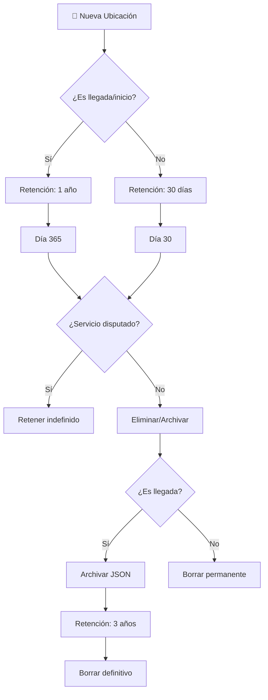

# 5.8.6.5.2 Política de Retención

Reglas de almacenamiento y eliminación de datos de ubicación.

---

## Matriz de Retención

```
┌─────────────────────────────────────────────────────────────────┐
│  POLÍTICA DE RETENCIÓN DE DATOS GPS                             │
├─────────────────────────────────────────────────────────────────┤
│                                                                 │
│  TIPO DE DATO              RETENCIÓN        RAZÓN               │
│  ────────────────────────────────────────────────────────────   │
│  Ubicaciones intermedias   30 días          Balance storage     │
│  Ubicación de inicio       1 año            Auditoría SLA       │
│  Ubicación de llegada      1 año            Prueba de servicio  │
│  Servicios con disputa     Indefinido       Evidencia legal     │
│  Datos archivados          3 años           Regulación fiscal   │
│                                                                 │
└─────────────────────────────────────────────────────────────────┘
```

---

## Justificación por Tipo

### Ubicaciones Intermedias (30 días)

| Aspecto | Detalle |
|---------|---------|
| **Qué son** | Todas las ubicaciones entre inicio y llegada |
| **Cantidad** | ~90-95% del volumen total |
| **Uso** | Reconstrucción de ruta, métricas |
| **Por qué 30 días** | Suficiente para disputas inmediatas |
| **Después de 30 días** | Valor marginal, costo de storage injustificado |

### Ubicaciones de Inicio/Llegada (1 año)

| Aspecto | Detalle |
|---------|---------|
| **Qué son** | Primera y última ubicación de cada servicio |
| **Cantidad** | ~2 registros por servicio |
| **Uso** | Prueba de cumplimiento, auditoría |
| **Por qué 1 año** | Ciclo fiscal/contable, reclamos tardíos |
| **Volumen anual** | ~2KB × 1000 servicios/mes × 12 = 24 MB |

### Servicios con Disputa (Indefinido)

| Aspecto | Detalle |
|---------|---------|
| **Qué son** | Servicios marcados con `tiene_disputa = true` |
| **Cantidad** | <1% de servicios típicamente |
| **Uso** | Evidencia legal, arbitraje |
| **Por qué indefinido** | Procesos legales pueden durar años |
| **Gatillo** | Admin marca servicio como disputado |

### Datos Archivados (3 años)

| Aspecto | Detalle |
|---------|---------|
| **Qué son** | Snapshots comprimidos de servicios antiguos |
| **Formato** | JSON comprimido en tabla de archivo |
| **Uso** | Regulación fiscal, auditorías externas |
| **Por qué 3 años** | Requerimiento SAT México |

---

## Flujo de Ciclo de Vida



---

## Implementación SQL

### Tabla de Metadatos de Retención

```sql
CREATE TABLE retencion_rules (
  id SERIAL PRIMARY KEY,
  tipo VARCHAR(50) NOT NULL,
  dias_retencion INT,  -- NULL = indefinido
  accion VARCHAR(20) NOT NULL,  -- 'delete' | 'archive' | 'retain'
  descripcion TEXT,
  activo BOOLEAN DEFAULT true
);

INSERT INTO retencion_rules (tipo, dias_retencion, accion, descripcion) VALUES
  ('ubicacion_intermedia', 30, 'delete', 'Ubicaciones entre inicio y llegada'),
  ('ubicacion_inicio', 365, 'archive', 'Primera ubicación del servicio'),
  ('ubicacion_llegada', 365, 'archive', 'Ubicación de confirmación de llegada'),
  ('servicio_disputa', NULL, 'retain', 'Servicios con disputa activa'),
  ('archivo_historico', 1095, 'delete', 'Archivos comprimidos (3 años)');
```

### Vista de Ubicaciones por Expirar

```sql
CREATE VIEW v_ubicaciones_por_expirar AS
SELECT 
  u.id,
  u.servicio_id,
  u.created_at,
  u.es_llegada,
  u.es_inicio,
  s.tiene_disputa,
  CASE 
    WHEN s.tiene_disputa THEN 'PROTECTED'
    WHEN u.es_llegada OR u.es_inicio THEN 
      CASE WHEN u.created_at < NOW() - INTERVAL '365 days' 
           THEN 'ARCHIVE' ELSE 'RETAIN' END
    ELSE 
      CASE WHEN u.created_at < NOW() - INTERVAL '30 days' 
           THEN 'DELETE' ELSE 'RETAIN' END
  END as accion_recomendada,
  CASE 
    WHEN s.tiene_disputa THEN NULL
    WHEN u.es_llegada OR u.es_inicio THEN 
      u.created_at + INTERVAL '365 days'
    ELSE 
      u.created_at + INTERVAL '30 days'
  END as fecha_expiracion
FROM ubicaciones_servicio u
JOIN servicios s ON u.servicio_id = s.id;
```

---

## Dashboard de Retención

```sql
-- Vista para monitorear volumen por categoría
CREATE VIEW v_retencion_stats AS
SELECT
  CASE 
    WHEN es_llegada THEN 'Llegadas'
    WHEN es_inicio THEN 'Inicios'
    ELSE 'Intermedias'
  END as categoria,
  COUNT(*) as total_registros,
  pg_size_pretty(COUNT(*) * 150) as tamano_estimado,
  COUNT(*) FILTER (WHERE created_at < NOW() - INTERVAL '30 days') as por_expirar_30d,
  COUNT(*) FILTER (WHERE created_at < NOW() - INTERVAL '365 days') as por_expirar_1y
FROM ubicaciones_servicio
GROUP BY 
  CASE 
    WHEN es_llegada THEN 'Llegadas'
    WHEN es_inicio THEN 'Inicios'
    ELSE 'Intermedias'
  END;
```

---

## Notificaciones de Retención

```typescript
// Alerta cuando un servicio en disputa tiene datos próximos a expirar
// (Esto no debería pasar, pero es una salvaguarda)
const checkDisputeRetention = async () => {
  const { data } = await supabase
    .from('v_ubicaciones_por_expirar')
    .select('servicio_id')
    .eq('accion_recomendada', 'DELETE')
    .eq('tiene_disputa', true);
  
  if (data?.length) {
    notifyAdmin({
      type: 'warning',
      message: `${data.length} ubicaciones de servicios disputados marcadas para eliminar`,
      action: 'Revisar política de retención'
    });
  }
};
```

---

→ Ver limpieza automática: [[Proyecto OnlyCarNLD/Datos/5.8.6.5.3 limpieza_automatica]]

---

## Navegación

| ⬆️ Padre             | [[Proyecto OnlyCarNLD/Datos/5.8.6.5 historial_ubicaciones]] |
| -------------------- | --------------------------------- |
| ⬅️ Hermano anterior  | [[Proyecto OnlyCarNLD/Datos/5.8.6.5.1 modelo_datos]]        |
| ➡️ Hermano siguiente | [[Proyecto OnlyCarNLD/Datos/5.8.6.5.3 limpieza_automatica]] |
