# 5.8.6.5.3 Limpieza Automática

Sistema de purga programada de datos de ubicación.

---

## Arquitectura

```mermaid
flowchart LR
    subgraph TRIGGER[⏰ Trigger]
        A[Cron 3:00 AM UTC-6]
        B[Manual Admin]
        C[Evento: Servicio Cerrado]
    end
    
    subgraph PROCESO[🔄 Proceso]
        D[Identificar Candidatos]
        E[Verificar Disputas]
        F[Archivar si Aplica]
        G[Eliminar]
    end
    
    subgraph LOG[📝 Log]
        H[Registrar Eliminados]
        I[Notificar Admin]
        J[Métricas]
    end
    
    A --> D
    B --> D
    C --> D
    D --> E --> F --> G --> H --> I --> J
```



---

## Función Principal de Limpieza

```sql
-- ═══════════════════════════════════════════════════════════════════
-- FUNCIÓN: limpiar_ubicaciones_antiguas
-- 
-- Ejecutar: Diariamente a las 3:00 AM (baja actividad)
-- Duración esperada: <30 segundos para 100K registros
-- ═══════════════════════════════════════════════════════════════════

CREATE OR REPLACE FUNCTION limpiar_ubicaciones_antiguas()
RETURNS JSONB AS $$
DECLARE
  v_intermedias_eliminadas INTEGER := 0;
  v_llegadas_archivadas INTEGER := 0;
  v_archivos_eliminados INTEGER := 0;
  v_inicio TIMESTAMP := clock_timestamp();
  v_duracion INTERVAL;
BEGIN
  -- ═══════════════════════════════════════════════════════════════
  -- PASO 1: Eliminar ubicaciones intermedias > 30 días
  -- (excepto servicios con disputa)
  -- ═══════════════════════════════════════════════════════════════
  
  DELETE FROM ubicaciones_servicio u
  USING servicios s
  WHERE u.servicio_id = s.id
    AND u.created_at < NOW() - INTERVAL '30 days'
    AND u.es_llegada = false
    AND u.es_inicio = false
    AND COALESCE(s.tiene_disputa, false) = false;
  
  GET DIAGNOSTICS v_intermedias_eliminadas = ROW_COUNT;
  
  -- ═══════════════════════════════════════════════════════════════
  -- PASO 2: Archivar ubicaciones de llegada > 365 días
  -- (mover a tabla de archivo, luego eliminar de principal)
  -- ═══════════════════════════════════════════════════════════════
  
  INSERT INTO ubicaciones_archivo (
    id_original, servicio_id, operador_id,
    lat, lng, tipo, created_at, archived_at
  )
  SELECT 
    u.id, u.servicio_id, u.operador_id,
    u.lat, u.lng, 
    CASE WHEN u.es_llegada THEN 'llegada' ELSE 'inicio' END,
    u.created_at, NOW()
  FROM ubicaciones_servicio u
  JOIN servicios s ON u.servicio_id = s.id
  WHERE u.created_at < NOW() - INTERVAL '365 days'
    AND (u.es_llegada = true OR u.es_inicio = true)
    AND COALESCE(s.tiene_disputa, false) = false
  ON CONFLICT (id_original) DO NOTHING;
  
  GET DIAGNOSTICS v_llegadas_archivadas = ROW_COUNT;
  
  -- Eliminar las que fueron archivadas
  DELETE FROM ubicaciones_servicio u
  WHERE (u.es_llegada = true OR u.es_inicio = true)
    AND u.created_at < NOW() - INTERVAL '365 days'
    AND EXISTS (
      SELECT 1 FROM ubicaciones_archivo a 
      WHERE a.id_original = u.id
    )
    AND NOT EXISTS (
      SELECT 1 FROM servicios s 
      WHERE s.id = u.servicio_id 
      AND s.tiene_disputa = true
    );
  
  -- ═══════════════════════════════════════════════════════════════
  -- PASO 3: Eliminar archivos > 3 años
  -- ═══════════════════════════════════════════════════════════════
  
  DELETE FROM ubicaciones_archivo
  WHERE archived_at < NOW() - INTERVAL '3 years';
  
  GET DIAGNOSTICS v_archivos_eliminados = ROW_COUNT;
  
  -- ═══════════════════════════════════════════════════════════════
  -- PASO 4: Limpiar ubicacion_actual de servicios terminados
  -- ═══════════════════════════════════════════════════════════════
  
  DELETE FROM ubicacion_actual ua
  WHERE NOT EXISTS (
    SELECT 1 FROM servicios s 
    WHERE s.id = ua.servicio_id 
    AND s.estado IN ('en_camino', 'llegado')
  );
  
  -- ═══════════════════════════════════════════════════════════════
  -- RESULTADO
  -- ═══════════════════════════════════════════════════════════════
  
  v_duracion := clock_timestamp() - v_inicio;
  
  -- Registrar en log
  INSERT INTO cleanup_log (
    ejecutado_at, 
    intermedias_eliminadas, 
    llegadas_archivadas,
    archivos_eliminados,
    duracion_ms
  ) VALUES (
    NOW(),
    v_intermedias_eliminadas,
    v_llegadas_archivadas,
    v_archivos_eliminados,
    EXTRACT(MILLISECONDS FROM v_duracion)
  );
  
  RETURN jsonb_build_object(
    'success', true,
    'intermedias_eliminadas', v_intermedias_eliminadas,
    'llegadas_archivadas', v_llegadas_archivadas,
    'archivos_eliminados', v_archivos_eliminados,
    'duracion_ms', EXTRACT(MILLISECONDS FROM v_duracion)
  );
  
EXCEPTION WHEN OTHERS THEN
  -- Log error
  INSERT INTO cleanup_log (ejecutado_at, error) 
  VALUES (NOW(), SQLERRM);
  
  RETURN jsonb_build_object(
    'success', false,
    'error', SQLERRM
  );
END;
$$ LANGUAGE plpgsql;
```

---

## Tabla de Archivo

```sql
-- Tabla ligera para datos históricos comprimidos
CREATE TABLE ubicaciones_archivo (
  id SERIAL PRIMARY KEY,
  id_original UUID UNIQUE NOT NULL,  -- Para evitar duplicados
  servicio_id UUID NOT NULL,
  operador_id UUID,
  lat DECIMAL(10, 8) NOT NULL,
  lng DECIMAL(11, 8) NOT NULL,
  tipo VARCHAR(10) NOT NULL,  -- 'llegada' | 'inicio'
  created_at TIMESTAMPTZ NOT NULL,
  archived_at TIMESTAMPTZ DEFAULT now()
);

CREATE INDEX idx_archivo_servicio ON ubicaciones_archivo(servicio_id);
CREATE INDEX idx_archivo_fecha ON ubicaciones_archivo(archived_at);

COMMENT ON TABLE ubicaciones_archivo IS 
  'Archivo de ubicaciones importantes (inicio/llegada) para retención a largo plazo.
   Datos mínimos, sin metadata GPS completa.
   Retención: 3 años desde archivado.';
```

---

## Tabla de Log

```sql
CREATE TABLE cleanup_log (
  id SERIAL PRIMARY KEY,
  ejecutado_at TIMESTAMPTZ DEFAULT now(),
  intermedias_eliminadas INTEGER DEFAULT 0,
  llegadas_archivadas INTEGER DEFAULT 0,
  archivos_eliminados INTEGER DEFAULT 0,
  duracion_ms NUMERIC,
  error TEXT
);

CREATE INDEX idx_cleanup_log_fecha ON cleanup_log(ejecutado_at DESC);
```

---

## Programación con pg_cron

```sql
-- Instalar extensión (si no existe)
CREATE EXTENSION IF NOT EXISTS pg_cron;

-- Programar ejecución diaria a las 3:00 AM CST (UTC-6)
SELECT cron.schedule(
  'limpieza-ubicaciones-diaria',
  '0 9 * * *',  -- 9:00 UTC = 3:00 AM CST
  $$SELECT limpiar_ubicaciones_antiguas()$$
);

-- Ver jobs programados
SELECT * FROM cron.job;

-- Ver historial de ejecuciones
SELECT * FROM cron.job_run_details ORDER BY start_time DESC LIMIT 10;
```

---

## Alternativa: Edge Function (si pg_cron no disponible)

```typescript
// supabase/functions/cleanup-ubicaciones/index.ts
import { createClient } from '@supabase/supabase-js';

Deno.serve(async (req) => {
  // Verificar API key de admin
  const authHeader = req.headers.get('Authorization');
  if (authHeader !== `Bearer ${Deno.env.get('CLEANUP_SECRET')}`) {
    return new Response('Unauthorized', { status: 401 });
  }
  
  const supabase = createClient(
    Deno.env.get('SUPABASE_URL')!,
    Deno.env.get('SUPABASE_SERVICE_ROLE_KEY')!
  );
  
  const { data, error } = await supabase
    .rpc('limpiar_ubicaciones_antiguas');
  
  if (error) {
    return new Response(JSON.stringify({ error: error.message }), {
      status: 500,
      headers: { 'Content-Type': 'application/json' }
    });
  }
  
  return new Response(JSON.stringify(data), {
    headers: { 'Content-Type': 'application/json' }
  });
});
```

```bash
# Llamar desde Cloudflare Cron Trigger
curl -X POST https://yourproject.supabase.co/functions/v1/cleanup-ubicaciones \
  -H "Authorization: Bearer $CLEANUP_SECRET"
```

---

## Monitoreo

```sql
-- Vista de resumen de limpieza
CREATE VIEW v_cleanup_summary AS
SELECT
  DATE_TRUNC('week', ejecutado_at) as semana,
  SUM(intermedias_eliminadas) as total_intermedias,
  SUM(llegadas_archivadas) as total_archivadas,
  SUM(archivos_eliminados) as total_purged,
  AVG(duracion_ms)::INTEGER as avg_duracion_ms,
  COUNT(*) FILTER (WHERE error IS NOT NULL) as errores
FROM cleanup_log
GROUP BY DATE_TRUNC('week', ejecutado_at)
ORDER BY semana DESC;
```

---

## Alertas

```typescript
// Alertar si limpieza falla o tarda demasiado
const checkCleanupHealth = async () => {
  const { data } = await supabase
    .from('cleanup_log')
    .select('*')
    .order('ejecutado_at', { ascending: false })
    .limit(1)
    .single();
  
  if (data?.error) {
    notifyAdmin({
      type: 'error',
      message: `Limpieza de ubicaciones falló: ${data.error}`
    });
  }
  
  if (data?.duracion_ms > 60000) { // > 1 minuto
    notifyAdmin({
      type: 'warning',
      message: `Limpieza tardó ${(data.duracion_ms/1000).toFixed(1)}s - revisar performance`
    });
  }
};
```

---

→ Ver evidencia para disputas: [[Proyecto OnlyCarNLD/Datos/5.8.6.5.4 evidencia_disputas]]

---

## Navegación

| ⬆️ Padre             | [[Proyecto OnlyCarNLD/Datos/5.8.6.5 historial_ubicaciones]]            |
| -------------------- | ---------------------- |
| ⬅️ Hermano anterior  | [[Proyecto OnlyCarNLD/Datos/5.8.6.5.2 politica_retencion]]              |
| ➡️ Hermano siguiente | [[Proyecto OnlyCarNLD/Datos/5.8.6.5.4 evidencia_disputas]]              |
