# 5.8.6.5.4 Evidencia para Disputas

Sistema de extracción y presentación de evidencia GPS para resolución de disputas.

---

## Casos de Disputa Comunes

| Disputa | Evidencia GPS Requerida |
|---------|------------------------|
| "Operador nunca llegó" | Toda la ruta + ubicación llegada |
| "Llegó tarde" | Tiempo entre inicio y llegada |
| "Estuvo poco tiempo" | Duración en zona de servicio |
| "Fue a otro lugar" | Coordenadas vs destino contratado |
| "Cobró más distancia" | Distancia real recorrida |

---

## Flujo de Disputa

```mermaid
sequenceDiagram
    participant C as 👤 Cliente
    participant A as 🔧 Admin
    participant S as 🗄️ Sistema
    participant E as 📄 Reporte
    
    C->>A: Abre disputa
    A->>S: Marcar servicio como disputado
    S->>S: tiene_disputa = true
    S->>S: Pausar limpieza automática
    A->>S: Solicitar evidencia GPS
    S->>E: Generar reporte completo
    E->>A: Datos + visualización
    A->>C: Presentar evidencia
    C->>A: Acepta/Rechaza
    A->>S: Cerrar disputa
    S->>S: Reanudar limpieza normal
```



---

## Marcar Servicio como Disputado

```sql
-- Función para proteger datos de un servicio disputado
CREATE OR REPLACE FUNCTION marcar_disputa(p_servicio_id UUID, p_motivo TEXT)
RETURNS BOOLEAN AS $$
BEGIN
  UPDATE servicios
  SET 
    tiene_disputa = true,
    motivo_disputa = p_motivo,
    fecha_disputa = NOW()
  WHERE id = p_servicio_id;
  
  -- Log de auditoría
  INSERT INTO audit_log (accion, tabla, registro_id, datos)
  VALUES (
    'DISPUTA_ABIERTA', 
    'servicios', 
    p_servicio_id, 
    jsonb_build_object('motivo', p_motivo)
  );
  
  RETURN FOUND;
END;
$$ LANGUAGE plpgsql;
```

---

## Generar Reporte de Evidencia

```sql
CREATE OR REPLACE FUNCTION generar_evidencia_gps(p_servicio_id UUID)
RETURNS JSONB AS $$
DECLARE
  v_resultado JSONB;
  v_ubicaciones JSONB;
  v_inicio RECORD;
  v_llegada RECORD;
  v_servicio RECORD;
  v_distancia_total NUMERIC;
  v_duracion_minutos NUMERIC;
BEGIN
  -- Obtener datos del servicio
  SELECT * INTO v_servicio FROM servicios WHERE id = p_servicio_id;
  
  IF NOT FOUND THEN
    RETURN jsonb_build_object('error', 'Servicio no encontrado');
  END IF;
  
  -- Ubicación de inicio
  SELECT * INTO v_inicio
  FROM ubicaciones_servicio
  WHERE servicio_id = p_servicio_id AND es_inicio = true
  LIMIT 1;
  
  -- Ubicación de llegada
  SELECT * INTO v_llegada
  FROM ubicaciones_servicio
  WHERE servicio_id = p_servicio_id AND es_llegada = true
  LIMIT 1;
  
  -- Todas las ubicaciones ordenadas
  SELECT jsonb_agg(
    jsonb_build_object(
      'lat', lat,
      'lng', lng,
      'accuracy', accuracy,
      'timestamp', created_at,
      'es_inicio', es_inicio,
      'es_llegada', es_llegada
    ) ORDER BY created_at
  ) INTO v_ubicaciones
  FROM ubicaciones_servicio
  WHERE servicio_id = p_servicio_id;
  
  -- Calcular distancia total recorrida (aproximación)
  SELECT SUM(
    calcular_distancia(
      LAG(lat) OVER (ORDER BY created_at),
      LAG(lng) OVER (ORDER BY created_at),
      lat, lng
    )
  ) INTO v_distancia_total
  FROM ubicaciones_servicio
  WHERE servicio_id = p_servicio_id;
  
  -- Calcular duración
  IF v_inicio IS NOT NULL AND v_llegada IS NOT NULL THEN
    v_duracion_minutos := EXTRACT(EPOCH FROM 
      (v_llegada.created_at - v_inicio.created_at)
    ) / 60;
  END IF;
  
  -- Construir resultado
  v_resultado := jsonb_build_object(
    'servicio', jsonb_build_object(
      'id', v_servicio.id,
      'cliente_id', v_servicio.cliente_id,
      'operador_id', v_servicio.operador_id,
      'estado', v_servicio.estado,
      'fecha_creacion', v_servicio.created_at
    ),
    'inicio', CASE WHEN v_inicio IS NOT NULL THEN jsonb_build_object(
      'lat', v_inicio.lat,
      'lng', v_inicio.lng,
      'timestamp', v_inicio.created_at
    ) ELSE NULL END,
    'llegada', CASE WHEN v_llegada IS NOT NULL THEN jsonb_build_object(
      'lat', v_llegada.lat,
      'lng', v_llegada.lng,
      'timestamp', v_llegada.created_at
    ) ELSE NULL END,
    'metricas', jsonb_build_object(
      'total_ubicaciones', jsonb_array_length(v_ubicaciones),
      'distancia_metros', COALESCE(v_distancia_total, 0),
      'duracion_minutos', COALESCE(v_duracion_minutos, 0)
    ),
    'ruta_completa', v_ubicaciones,
    'generado_at', NOW()
  );
  
  RETURN v_resultado;
END;
$$ LANGUAGE plpgsql;
```

---

## Composable: useDisputeEvidence

```typescript
// composables/useDisputeEvidence.ts
interface EvidenciaGPS {
  servicio: {
    id: string;
    cliente_id: string;
    operador_id: string;
    estado: string;
    fecha_creacion: string;
  };
  inicio: { lat: number; lng: number; timestamp: string } | null;
  llegada: { lat: number; lng: number; timestamp: string } | null;
  metricas: {
    total_ubicaciones: number;
    distancia_metros: number;
    duracion_minutos: number;
  };
  ruta_completa: Array<{
    lat: number;
    lng: number;
    accuracy: number;
    timestamp: string;
    es_inicio: boolean;
    es_llegada: boolean;
  }>;
}

export const useDisputeEvidence = (servicioId: string) => {
  const supabase = useSupabaseClient();
  const evidencia = ref<EvidenciaGPS | null>(null);
  const isLoading = ref(true);
  const error = ref<string | null>(null);
  
  const fetchEvidence = async () => {
    isLoading.value = true;
    error.value = null;
    
    const { data, error: err } = await supabase
      .rpc('generar_evidencia_gps', { p_servicio_id: servicioId });
    
    if (err) {
      error.value = err.message;
    } else {
      evidencia.value = data;
    }
    
    isLoading.value = false;
  };
  
  const marcarDisputa = async (motivo: string) => {
    const { error: err } = await supabase
      .rpc('marcar_disputa', { 
        p_servicio_id: servicioId, 
        p_motivo: motivo 
      });
    
    if (err) throw err;
    
    // Refrescar evidencia
    await fetchEvidence();
  };
  
  const generarPDF = async () => {
    if (!evidencia.value) return;
    
    // Generar PDF con evidencia
    const pdf = await generateEvidencePDF(evidencia.value);
    return pdf;
  };
  
  onMounted(fetchEvidence);
  
  return {
    evidencia: readonly(evidencia),
    isLoading: readonly(isLoading),
    error: readonly(error),
    refetch: fetchEvidence,
    marcarDisputa,
    generarPDF
  };
};
```

---

## Componente: Vista de Evidencia

```vue
<!-- components/admin/EvidenciaDisputa.vue -->
<script setup lang="ts">
const props = defineProps<{ servicioId: string }>();

const { evidencia, isLoading, generarPDF } = useDisputeEvidence(props.servicioId);

const formatDuration = (minutes: number) => {
  if (minutes < 60) return `${Math.round(minutes)} min`;
  return `${Math.floor(minutes / 60)}h ${Math.round(minutes % 60)}min`;
};

const formatDistance = (meters: number) => {
  if (meters < 1000) return `${Math.round(meters)} m`;
  return `${(meters / 1000).toFixed(2)} km`;
};
</script>

<template>
  <div class="evidencia-disputa">
    <h2>📍 Evidencia GPS - Servicio {{ servicioId.slice(0, 8) }}</h2>
    
    <div v-if="isLoading" class="loading">Cargando evidencia...</div>
    
    <template v-else-if="evidencia">
      <!-- Métricas Rápidas -->
      <div class="metricas-grid">
        <div class="metrica">
          <span class="value">{{ evidencia.metricas.total_ubicaciones }}</span>
          <span class="label">Ubicaciones GPS</span>
        </div>
        <div class="metrica">
          <span class="value">{{ formatDistance(evidencia.metricas.distancia_metros) }}</span>
          <span class="label">Distancia Recorrida</span>
        </div>
        <div class="metrica">
          <span class="value">{{ formatDuration(evidencia.metricas.duracion_minutos) }}</span>
          <span class="label">Tiempo Total</span>
        </div>
      </div>
      
      <!-- Timeline -->
      <div class="timeline">
        <div class="event inicio" v-if="evidencia.inicio">
          <span class="icon">🚀</span>
          <div class="details">
            <strong>Inicio de recorrido</strong>
            <span>{{ formatDateTime(evidencia.inicio.timestamp) }}</span>
            <code>{{ evidencia.inicio.lat.toFixed(6) }}, {{ evidencia.inicio.lng.toFixed(6) }}</code>
          </div>
        </div>
        
        <div class="event llegada" v-if="evidencia.llegada">
          <span class="icon">📍</span>
          <div class="details">
            <strong>Llegada confirmada</strong>
            <span>{{ formatDateTime(evidencia.llegada.timestamp) }}</span>
            <code>{{ evidencia.llegada.lat.toFixed(6) }}, {{ evidencia.llegada.lng.toFixed(6) }}</code>
          </div>
        </div>
      </div>
      
      <!-- Mapa con ruta -->
      <MapaRuta 
        :ruta="evidencia.ruta_completa"
        :inicio="evidencia.inicio"
        :llegada="evidencia.llegada"
        height="400px"
      />
      
      <!-- Acciones -->
      <div class="actions">
        <button @click="generarPDF" class="btn-pdf">
          📄 Descargar PDF
        </button>
      </div>
    </template>
  </div>
</template>
```

---

## Reporte PDF

```typescript
// utils/generateEvidencePDF.ts
import jsPDF from 'jspdf';
import autoTable from 'jspdf-autotable';

export const generateEvidencePDF = async (evidencia: EvidenciaGPS) => {
  const doc = new jsPDF();
  
  // Header
  doc.setFontSize(18);
  doc.text('EVIDENCIA GPS - SERVICIO', 14, 22);
  doc.setFontSize(12);
  doc.text(`ID: ${evidencia.servicio.id}`, 14, 32);
  doc.text(`Generado: ${new Date().toLocaleString()}`, 14, 40);
  
  // Métricas
  autoTable(doc, {
    startY: 50,
    head: [['Métrica', 'Valor']],
    body: [
      ['Total ubicaciones GPS', evidencia.metricas.total_ubicaciones],
      ['Distancia recorrida', `${(evidencia.metricas.distancia_metros/1000).toFixed(2)} km`],
      ['Duración', `${Math.round(evidencia.metricas.duracion_minutos)} minutos`],
    ]
  });
  
  // Inicio y llegada
  if (evidencia.inicio) {
    doc.text(`INICIO: ${evidencia.inicio.timestamp}`, 14, doc.lastAutoTable.finalY + 15);
    doc.text(`Coordenadas: ${evidencia.inicio.lat}, ${evidencia.inicio.lng}`, 14, doc.lastAutoTable.finalY + 22);
  }
  
  if (evidencia.llegada) {
    doc.text(`LLEGADA: ${evidencia.llegada.timestamp}`, 14, doc.lastAutoTable.finalY + 35);
    doc.text(`Coordenadas: ${evidencia.llegada.lat}, ${evidencia.llegada.lng}`, 14, doc.lastAutoTable.finalY + 42);
  }
  
  return doc;
};
```

---

→ Ver analytics y métricas: [[Proyecto OnlyCarNLD/Datos/5.8.6.5.5 analytics_metricas]]

---

## Navegación

| ⬆️ Padre             | [[Proyecto OnlyCarNLD/Datos/5.8.6.5 historial_ubicaciones]]            |
| -------------------- | ---------------------- |
| ⬅️ Hermano anterior  | [[Proyecto OnlyCarNLD/Datos/5.8.6.5.3 limpieza_automatica]]              |
| ➡️ Hermano siguiente | [[Proyecto OnlyCarNLD/Datos/5.8.6.5.5 analytics_metricas]]              |
