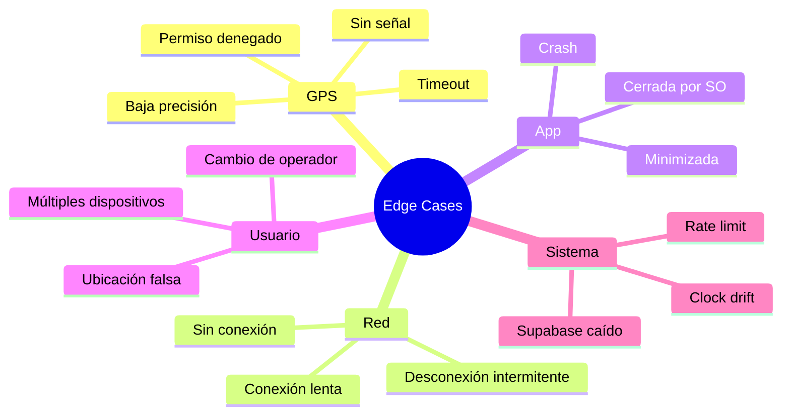

# 5.8.7 Edge Cases y Manejo de Errores

Escenarios problemáticos y sus soluciones.

---

## Mapa de Escenarios



---

## Resumen de Fallbacks

| Escenario | Detección | Fallback | UX |
|-----------|-----------|----------|-----|
| Sin GPS | Error sensor | Última ubicación conocida | ⚠️ Badge "Sin GPS" |
| Offline | Network status | Cola local | ⚠️ "Reconectando..." |
| App killed | N/A | Confirmar manual al reabrir | ⚠️ "Continuar?" |
| Múltiples dispositivos | Auth check | Solo 1 activo | ❌ Alerta |

---

## Principios de Diseño

> [!IMPORTANT]
> 1. **Nunca bloquear al usuario** — Siempre hay un fallback
> 2. **Transparencia** — El usuario sabe el estado del sistema
> 3. **Recuperación automática** — Reintentar sin intervención
> 4. **Confirmación manual** — Siempre disponible como último recurso

---

## Estructura de Hijos

| ID                                    | Nombre           | Descripción            | Estado |
| ------------------------------------- | ---------------- | ---------------------- | ------ |
| [[Proyecto OnlyCarNLD/Datos/5.8.7.1 gps_unavailable\|5.8.7.1]]  | GPS Unavailable  | Sin señal GPS          | ✅      |
| [[Proyecto OnlyCarNLD/Datos/5.8.7.2 network_offline\|5.8.7.2]]  | Network Offline  | Sin conexión           | ✅      |
| [[Proyecto OnlyCarNLD/Datos/5.8.7.3 app_killed\|5.8.7.3]]       | App Killed       | App cerrada por SO     | ✅      |
| [[Proyecto OnlyCarNLD/Datos/5.8.7.4 multiple_devices\|5.8.7.4]] | Multiple Devices | Múltiples dispositivos | ✅      |

---

## Composable de Estado Global

```typescript
// composables/useGeoState.ts
export type GeoStatus = 
  | 'idle'
  | 'tracking'
  | 'error_gps'
  | 'error_network'
  | 'error_permission'
  | 'reconnecting'
  | 'offline_queue';

interface GeoState {
  status: GeoStatus;
  lastKnownPosition: { lat: number; lng: number } | null;
  lastUpdateTime: Date | null;
  errorMessage: string | null;
  offlineQueue: number;
  isRecovering: boolean;
}

export const useGeoState = () => {
  const state = useState<GeoState>('geo-state', () => ({
    status: 'idle',
    lastKnownPosition: null,
    lastUpdateTime: null,
    errorMessage: null,
    offlineQueue: 0,
    isRecovering: false
  }));
  
  const setError = (type: GeoStatus, message: string) => {
    state.value.status = type;
    state.value.errorMessage = message;
  };
  
  const setTracking = () => {
    state.value.status = 'tracking';
    state.value.errorMessage = null;
    state.value.isRecovering = false;
  };
  
  const updatePosition = (lat: number, lng: number) => {
    state.value.lastKnownPosition = { lat, lng };
    state.value.lastUpdateTime = new Date();
  };
  
  const incrementOfflineQueue = () => {
    state.value.offlineQueue++;
    state.value.status = 'offline_queue';
  };
  
  const clearOfflineQueue = () => {
    state.value.offlineQueue = 0;
    state.value.status = 'tracking';
  };
  
  return {
    state: readonly(state),
    setError,
    setTracking,
    updatePosition,
    incrementOfflineQueue,
    clearOfflineQueue
  };
};
```

---

## Componente de Status

```vue
<!-- components/GeoStatusBanner.vue -->
<script setup lang="ts">
const { state } = useGeoState();

const statusConfig = computed(() => {
  const configs: Record<GeoStatus, { icon: string; text: string; color: string }> = {
    idle: { icon: '⚪', text: 'GPS inactivo', color: 'gray' },
    tracking: { icon: '🟢', text: 'Compartiendo ubicación', color: 'green' },
    error_gps: { icon: '📍', text: 'Sin señal GPS', color: 'yellow' },
    error_network: { icon: '🔴', text: 'Sin conexión', color: 'red' },
    error_permission: { icon: '🔒', text: 'Sin permiso GPS', color: 'red' },
    reconnecting: { icon: '🔄', text: 'Reconectando...', color: 'yellow' },
    offline_queue: { icon: '📤', text: `${state.value.offlineQueue} pendientes`, color: 'yellow' }
  };
  return configs[state.value.status];
});
</script>

<template>
  <div 
    v-if="state.status !== 'idle' && state.status !== 'tracking'"
    :class="['geo-status-banner', statusConfig.color]"
  >
    <span>{{ statusConfig.icon }}</span>
    <span>{{ statusConfig.text }}</span>
    <span v-if="state.errorMessage" class="error-detail">
      {{ state.errorMessage }}
    </span>
  </div>
</template>
```

---

## Matriz de Recuperación

```
┌─────────────────────────────────────────────────────────────────┐
│  ESTRATEGIA DE RECUPERACIÓN                                     │
├─────────────────────────────────────────────────────────────────┤
│                                                                 │
│  ERROR           RETRY      FALLBACK           ESCALATE         │
│  ───────────────────────────────────────────────────────────    │
│  GPS timeout     3x 5s      Última conocida    Conf. manual     │
│  GPS denied      1x         Pedir permiso      Instrucciones    │
│  Network fail    5x exp     Cola local         Offline mode     │
│  Supabase down   3x 10s     KV cache           Alerta admin     │
│  App killed      N/A        Detectar al abrir  Continuar?       │
│                                                                 │
│  exp = exponential backoff (1s, 2s, 4s, 8s, 16s)                │
│                                                                 │
└─────────────────────────────────────────────────────────────────┘
```

---

→ Ver GPS unavailable: [[Proyecto OnlyCarNLD/Datos/5.8.7.1 gps_unavailable]]

---

## Navegación

| ⬆️ Padre             | [[Proyecto OnlyCarNLD/Datos/5.8. geolocalizacion]]            |
| -------------------- | ---------------------- |
| ⬅️ Hermano anterior  | [[Proyecto OnlyCarNLD/Datos/5.8.6 backend_ubicaciones]]              |
| ➡️ Hermano siguiente | [[Proyecto OnlyCarNLD/Datos/5.8.8 testing]]              |
