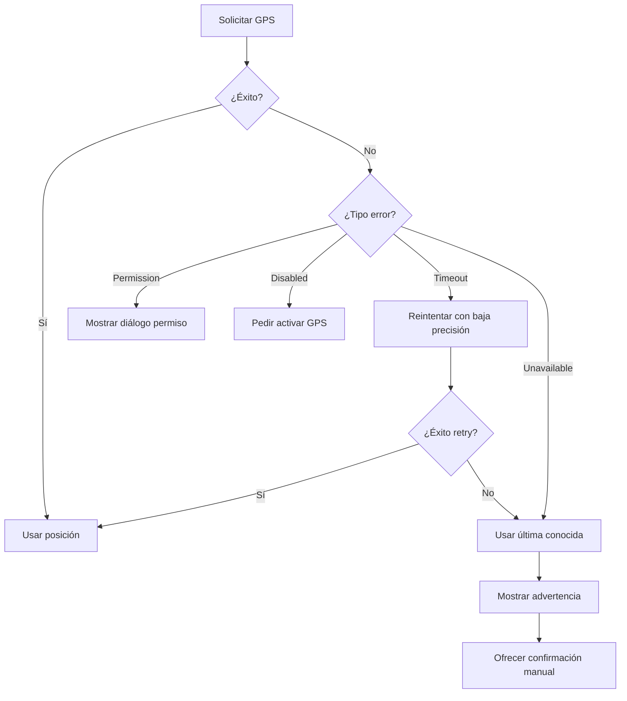

# 5.8.7.1 GPS Unavailable

Manejo cuando el GPS no está disponible o tiene problemas.

---

## Escenarios

| Escenario | Causa | Frecuencia |
|-----------|-------|------------|
| **Sin señal** | Interior, túnel, edificio | Alta |
| **Baja precisión** | Cielo nublado, interferencia | Media |
| **Timeout** | Hardware lento | Baja |
| **Sensor apagado** | Usuario desactivó GPS | Media |
| **Sin permiso** | Usuario denegó | Baja |

---

## Detección

```typescript
// composables/useGpsAvailability.ts
import { Geolocation } from '@capacitor/geolocation';

interface GpsStatus {
  available: boolean;
  enabled: boolean;
  permissionGranted: boolean;
  lastError: string | null;
}

export const useGpsAvailability = () => {
  const status = reactive<GpsStatus>({
    available: true,
    enabled: true,
    permissionGranted: true,
    lastError: null
  });
  
  const checkAvailability = async (): Promise<GpsStatus> => {
    try {
      // Verificar permisos
      const permissions = await Geolocation.checkPermissions();
      status.permissionGranted = permissions.location === 'granted';
      
      if (!status.permissionGranted) {
        status.lastError = 'Permiso no otorgado';
        return status;
      }
      
      // Intentar obtener posición con timeout corto
      const pos = await Geolocation.getCurrentPosition({
        timeout: 5000,
        enableHighAccuracy: false
      });
      
      status.available = true;
      status.enabled = true;
      status.lastError = null;
      
    } catch (error: any) {
      status.available = false;
      
      if (error.code === 1) {
        status.permissionGranted = false;
        status.lastError = 'Permiso denegado';
      } else if (error.code === 2) {
        status.enabled = false;
        status.lastError = 'GPS deshabilitado';
      } else if (error.code === 3) {
        status.lastError = 'Timeout - Sin señal GPS';
      } else {
        status.lastError = error.message;
      }
    }
    
    return status;
  };
  
  return {
    status: readonly(status),
    checkAvailability
  };
};
```

---

## Estrategia de Fallback



---

## Implementación Fallback

```typescript
// composables/useGpsFallback.ts
export const useGpsFallback = () => {
  const { state, updatePosition, setError } = useGeoState();
  const { getCurrentPosition } = useGeolocation();
  
  const MAX_RETRIES = 3;
  const FALLBACK_OPTIONS = [
    { enableHighAccuracy: true, timeout: 10000 },   // Intento 1: Alta precisión
    { enableHighAccuracy: false, timeout: 15000 },  // Intento 2: Baja precisión
    { enableHighAccuracy: false, timeout: 20000, maximumAge: 60000 } // Intento 3: Permitir cache
  ];
  
  const getPositionWithFallback = async () => {
    for (let i = 0; i < MAX_RETRIES; i++) {
      try {
        const pos = await getCurrentPosition(FALLBACK_OPTIONS[i]);
        return pos;
      } catch (error) {
        console.warn(`GPS intento ${i + 1} falló:`, error);
        
        if (i === MAX_RETRIES - 1) {
          // Último intento: usar última conocida
          if (state.value.lastKnownPosition) {
            setError('error_gps', 'Usando última ubicación conocida');
            return {
              ...state.value.lastKnownPosition,
              isStale: true,
              staleTime: state.value.lastUpdateTime
            };
          }
          throw error;
        }
      }
    }
  };
  
  return { getPositionWithFallback };
};
```

---

## UI de Error GPS

```vue
<!-- components/GpsErrorBanner.vue -->
<script setup lang="ts">
const props = defineProps<{
  errorType: 'permission' | 'disabled' | 'unavailable' | 'timeout';
}>();

const emit = defineEmits<{
  (e: 'retry'): void;
  (e: 'openSettings'): void;
  (e: 'manualConfirm'): void;
}>();

const config = computed(() => ({
  permission: {
    icon: '🔒',
    title: 'Permiso de ubicación requerido',
    description: 'Necesitamos acceso a tu GPS para compartir tu ubicación con el cliente.',
    action: 'Dar permiso',
    actionType: 'openSettings' as const
  },
  disabled: {
    icon: '📍',
    title: 'GPS desactivado',
    description: 'Activa el GPS de tu dispositivo para continuar.',
    action: 'Abrir configuración',
    actionType: 'openSettings' as const
  },
  unavailable: {
    icon: '📡',
    title: 'Sin señal GPS',
    description: 'No podemos obtener tu ubicación. ¿Estás en un área cubierta?',
    action: 'Reintentar',
    actionType: 'retry' as const
  },
  timeout: {
    icon: '⏱️',
    title: 'GPS tardando demasiado',
    description: 'El GPS está tardando en responder. Intenta moverte a un área abierta.',
    action: 'Reintentar',
    actionType: 'retry' as const
  }
}[props.errorType]));

const handleAction = () => {
  emit(config.value.actionType);
};
</script>

<template>
  <div class="gps-error-banner">
    <div class="icon">{{ config.icon }}</div>
    <div class="content">
      <h4>{{ config.title }}</h4>
      <p>{{ config.description }}</p>
    </div>
    <div class="actions">
      <button @click="handleAction" class="btn-primary">
        {{ config.action }}
      </button>
      <button @click="emit('manualConfirm')" class="btn-secondary">
        Confirmar llegada manualmente
      </button>
    </div>
  </div>
</template>
```

---

## Indicador de Precisión

```vue
<!-- Mostrar cuando precisión es baja -->
<template>
  <div v-if="accuracy > 50" class="low-accuracy-warning">
    ⚠️ Precisión baja (±{{ Math.round(accuracy) }}m)
  </div>
</template>
```

---

## Persistencia de Última Ubicación

```typescript
// Guardar en localStorage para recuperación
const saveLastKnownPosition = (pos: { lat: number; lng: number }) => {
  localStorage.setItem('lastKnownPosition', JSON.stringify({
    ...pos,
    savedAt: Date.now()
  }));
};

const getLastKnownPosition = () => {
  const saved = localStorage.getItem('lastKnownPosition');
  if (!saved) return null;
  
  const data = JSON.parse(saved);
  
  // Invalidar si es muy viejo (> 24 horas)
  if (Date.now() - data.savedAt > 24 * 60 * 60 * 1000) {
    localStorage.removeItem('lastKnownPosition');
    return null;
  }
  
  return data;
};
```

---

→ Ver network offline: [[Proyecto OnlyCarNLD/Datos/5.8.7.2 network_offline]]

---

## Navegación

| ⬆️ Padre             | [[Proyecto OnlyCarNLD/Datos/5.8.7 edge_cases]]            |
| -------------------- | ---------------------- |
| ➡️ Hermano siguiente | [[Proyecto OnlyCarNLD/Datos/5.8.7.2 network_offline]]              |
