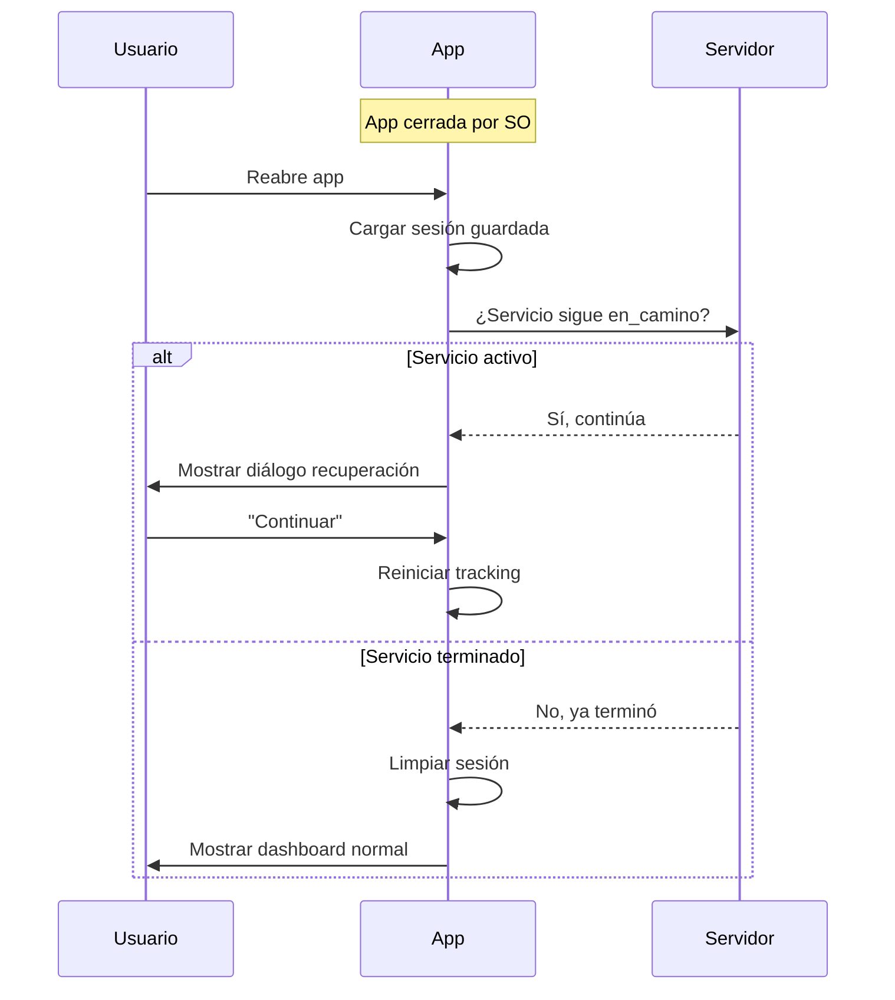

# 5.8.7.3 App Killed

Manejo cuando la app es terminada por el sistema operativo.

---

## Escenarios

| Escenario            | Causa               | Detectable?         |
| -------------------- | ------------------- | ------------------- |
| **Low memory**       | SO necesita RAM     | No directamente     |
| **Battery saver**    | Modo ahorro batería | Parcialmente        |
| **User force close** | Usuario cierra app  | No                  |
| **Crash**            | Error en código     | Sí (crash reporter) |
| **Background limit** | iOS/Android limits  | Parcialmente        |

---

## Limitaciones por Plataforma

### iOS

```
┌─────────────────────────────────────────────────────────────────┐
│  iOS BACKGROUND EXECUTION                                       │
├─────────────────────────────────────────────────────────────────┤
│                                                                 │
│  SIN Background Location Entitlement:                           │
│  • App suspendida después de ~3 minutos en background           │
│  • GPS se detiene completamente                                 │
│  • No hay forma de continuar tracking                           │
│                                                                 │
│  CON Background Location Entitlement (requiere Apple approval): │
│  • Puede continuar tracking en background                       │
│  • Requiere justificación a Apple                               │
│  • Badge azul en status bar                                     │
│                                                                 │
│  RECOMENDACIÓN PARA OnlyCar:                                 │
│  → NO usar background location (no es navigation app)           │
│  → Detectar cuando app reabre y ofrecer continuar               │
│                                                                 │
└─────────────────────────────────────────────────────────────────┘
```

### Android

```
┌─────────────────────────────────────────────────────────────────┐
│  ANDROID BACKGROUND EXECUTION                                   │
├─────────────────────────────────────────────────────────────────┤
│                                                                 │
│  Android 8+ (Oreo):                                             │
│  • Location updates limitados en background                     │
│  • Puede usar Foreground Service con notificación               │
│                                                                 │
│  Android 10+ (Q):                                               │
│  • Requiere ACCESS_BACKGROUND_LOCATION explícito                │
│  • Usuario debe aprobar manualmente                             │
│                                                                 │
│  Android 12+ (S):                                               │
│  • Restricciones aún más estrictas                              │
│  • SO puede matar app en cualquier momento                      │
│                                                                 │
│  RECOMENDACIÓN PARA OnlyCar:                                 │
│  → Usar Foreground Service solo si es crítico                   │
│  → Preferir detección al reabrir app                            │
│                                                                 │
└─────────────────────────────────────────────────────────────────┘
```

---

## Estrategia: Recuperación al Reabrir

```typescript
// composables/useAppRecovery.ts
import { App } from '@capacitor/app';

interface TrackingSession {
  servicioId: string;
  estado: 'en_camino' | 'llegado';
  startedAt: number;
  lastPosition: { lat: number; lng: number } | null;
  lastUpdateAt: number | null;
}

const SESSION_KEY = 'active_tracking_session';

export const useAppRecovery = () => {
  const pendingSession = ref<TrackingSession | null>(null);
  const showRecoveryDialog = ref(false);
  
  // Guardar sesión activa
  const saveSession = (session: TrackingSession) => {
    localStorage.setItem(SESSION_KEY, JSON.stringify(session));
  };
  
  // Limpiar sesión
  const clearSession = () => {
    localStorage.removeItem(SESSION_KEY);
    pendingSession.value = null;
  };
  
  // Verificar sesión pendiente al abrir app
  const checkPendingSession = async () => {
    const saved = localStorage.getItem(SESSION_KEY);
    if (!saved) return null;
    
    const session: TrackingSession = JSON.parse(saved);
    
    // Verificar si el servicio sigue activo en el backend
    const { data: servicio } = await useFetch(`/api/servicios/${session.servicioId}`);
    
    if (!servicio.value || servicio.value.estado !== 'en_camino') {
      // Servicio ya no está en camino, limpiar
      clearSession();
      return null;
    }
    
    // Hay sesión pendiente válida
    pendingSession.value = session;
    showRecoveryDialog.value = true;
    return session;
  };
  
  // Continuar sesión
  const resumeSession = async () => {
    if (!pendingSession.value) return;
    
    showRecoveryDialog.value = false;
    
    // Re-iniciar tracking
    const { startTracking } = useGeolocation();
    await startTracking();
    
    // No limpiar sesión hasta que termine el servicio
  };
  
  // Descartar sesión
  const discardSession = async () => {
    showRecoveryDialog.value = false;
    clearSession();
  };
  
  // Escuchar cuando app vuelve a primer plano
  onMounted(() => {
    App.addListener('appStateChange', async ({ isActive }) => {
      if (isActive) {
        await checkPendingSession();
      }
    });
    
    // También verificar al montar
    checkPendingSession();
  });
  
  return {
    pendingSession: readonly(pendingSession),
    showRecoveryDialog,
    saveSession,
    clearSession,
    resumeSession,
    discardSession
  };
};
```

---

## Diálogo de Recuperación

```vue
<!-- components/TrackingRecoveryDialog.vue -->
<script setup lang="ts">
const { 
  pendingSession, 
  showRecoveryDialog, 
  resumeSession, 
  discardSession 
} = useAppRecovery();

const timeAgo = computed(() => {
  if (!pendingSession.value?.lastUpdateAt) return 'hace un momento';
  const diff = Date.now() - pendingSession.value.lastUpdateAt;
  const minutes = Math.floor(diff / 60000);
  if (minutes < 1) return 'hace menos de un minuto';
  if (minutes < 60) return `hace ${minutes} minutos`;
  const hours = Math.floor(minutes / 60);
  return `hace ${hours} hora${hours > 1 ? 's' : ''}`;
};
</script>

<template>
  <Modal 
    v-model="showRecoveryDialog"
    :closeable="false"
  >
    <template #header>
      📍 Servicio en progreso
    </template>
    
    <template #body>
      <div class="recovery-content">
        <p>
          Tenías un servicio activo que se interrumpió.
        </p>
        
        <div class="session-info">
          <div class="info-row">
            <span class="label">Estado:</span>
            <span class="value">En camino</span>
          </div>
          <div class="info-row">
            <span class="label">Última actualización:** 2026-01-01
            <span class="value">{{ timeAgo }}</span>
          </div>
        </div>
        
        <p class="question">
          ¿Deseas continuar compartiendo tu ubicación?
        </p>
      </div>
    </template>
    
    <template #footer>
      <button @click="resumeSession" class="btn-primary">
        ✅ Continuar
      </button>
      <button @click="discardSession" class="btn-secondary">
        ❌ Ya llegué / Terminar
      </button>
    </template>
  </Modal>
</template>
```

---

## Notificación Persistente (Android)

```typescript
// plugins/foreground-service.ts
// Solo para Android si se decide usar Foreground Service

import { LocalNotifications } from '@capacitor/local-notifications';

export const startForegroundService = async () => {
  // Crear notificación persistente
  await LocalNotifications.schedule({
    notifications: [{
      id: 1,
      title: 'OnlyCar',
      body: 'Compartiendo ubicación con el cliente',
      ongoing: true,
      autoCancel: false,
      smallIcon: 'ic_stat_location',
      channelId: 'tracking'
    }]
  });
};

export const stopForegroundService = async () => {
  await LocalNotifications.cancel({ notifications: [{ id: 1 }] });
};
```

---

## Flujo de Recuperación



---

→ Ver múltiples dispositivos: [[Proyecto OnlyCarNLD/Datos/5.8.7.4 multiple_devices]]

---

## Navegación

| ⬆️ Padre             | [[Proyecto OnlyCarNLD/Datos/5.8.7 edge_cases]]            |
| -------------------- | ---------------------- |
| ⬅️ Hermano anterior  | [[Proyecto OnlyCarNLD/Datos/5.8.7.2 network_offline]]              |
| ➡️ Hermano siguiente | [[Proyecto OnlyCarNLD/Datos/5.8.7.4 multiple_devices]]              |
