# 5.8.7.4 Multiple Devices

Manejo cuando un operador tiene múltiples dispositivos activos.

---

## Problema

```
┌─────────────────────────────────────────────────────────────────┐
│  ESCENARIO PROBLEMÁTICO                                         │
├─────────────────────────────────────────────────────────────────┤
│                                                                 │
│  Operador Carlos tiene:                                         │
│  📱 Teléfono personal (tracking activo)                         │
│  📱 Tablet de trabajo (también intenta tracking)                │
│                                                                 │
│  PROBLEMAS:                                                     │
│  • Ubicaciones conflictivas                                     │
│  • Doble broadcast                                              │
│  • Cliente ve "saltos" extraños                                 │
│  • Consumo doble de recursos                                    │
│                                                                 │
└─────────────────────────────────────────────────────────────────┘
```

---

## Solución: Device Lock

```typescript
// Solo un dispositivo puede trackear a la vez

// composables/useDeviceLock.ts
import { v4 as uuidv4 } from 'uuid';

const DEVICE_ID_KEY = 'device_id';
const LOCK_CHANNEL_PREFIX = 'device_lock:';

export const useDeviceLock = () => {
  const supabase = useSupabaseClient();
  const user = useSupabaseUser();
  
  // Obtener o crear ID único del dispositivo
  const getDeviceId = (): string => {
    let deviceId = localStorage.getItem(DEVICE_ID_KEY);
    if (!deviceId) {
      deviceId = uuidv4();
      localStorage.setItem(DEVICE_ID_KEY, deviceId);
    }
    return deviceId;
  };
  
  const deviceId = getDeviceId();
  const isLockHolder = ref(false);
  const otherDeviceActive = ref(false);
  
  /**
   * Intentar adquirir lock para tracking
   */
  const acquireLock = async (servicioId: string): Promise<boolean> => {
    // Verificar si hay otro dispositivo activo
    const { data: existingLock } = await supabase
      .from('device_locks')
      .select('device_id, created_at')
      .eq('user_id', user.value?.id)
      .eq('servicio_id', servicioId)
      .single();
    
    if (existingLock && existingLock.device_id !== deviceId) {
      // Otro dispositivo tiene el lock
      const lockAge = Date.now() - new Date(existingLock.created_at).getTime();
      
      // Si el lock tiene más de 2 minutos, considerarlo stale
      if (lockAge < 120000) {
        otherDeviceActive.value = true;
        return false;
      }
    }
    
    // Adquirir o renovar lock
    const { error } = await supabase
      .from('device_locks')
      .upsert({
        user_id: user.value?.id,
        servicio_id: servicioId,
        device_id: deviceId,
        created_at: new Date().toISOString()
      }, {
        onConflict: 'user_id,servicio_id'
      });
    
    if (!error) {
      isLockHolder.value = true;
      return true;
    }
    
    return false;
  };
  
  /**
   * Renovar lock periódicamente
   */
  const renewLock = async (servicioId: string) => {
    if (!isLockHolder.value) return;
    
    await supabase
      .from('device_locks')
      .update({ created_at: new Date().toISOString() })
      .eq('user_id', user.value?.id)
      .eq('servicio_id', servicioId)
      .eq('device_id', deviceId);
  };
  
  /**
   * Liberar lock
   */
  const releaseLock = async (servicioId: string) => {
    await supabase
      .from('device_locks')
      .delete()
      .eq('user_id', user.value?.id)
      .eq('servicio_id', servicioId)
      .eq('device_id', deviceId);
    
    isLockHolder.value = false;
  };
  
  /**
   * Forzar tomar lock (desde este dispositivo)
   */
  const forceTakeLock = async (servicioId: string) => {
    await supabase
      .from('device_locks')
      .upsert({
        user_id: user.value?.id,
        servicio_id: servicioId,
        device_id: deviceId,
        created_at: new Date().toISOString()
      }, {
        onConflict: 'user_id,servicio_id'
      });
    
    isLockHolder.value = true;
    otherDeviceActive.value = false;
  };
  
  return {
    deviceId,
    isLockHolder: readonly(isLockHolder),
    otherDeviceActive: readonly(otherDeviceActive),
    acquireLock,
    renewLock,
    releaseLock,
    forceTakeLock
  };
};
```

---

## Schema para Device Locks

```sql
CREATE TABLE device_locks (
  id UUID PRIMARY KEY DEFAULT gen_random_uuid(),
  user_id UUID NOT NULL REFERENCES users(id) ON DELETE CASCADE,
  servicio_id UUID NOT NULL REFERENCES servicios(id) ON DELETE CASCADE,
  device_id TEXT NOT NULL,
  created_at TIMESTAMPTZ DEFAULT now(),
  
  UNIQUE(user_id, servicio_id)
);

-- Limpiar locks antiguos automáticamente
CREATE OR REPLACE FUNCTION cleanup_stale_locks()
RETURNS void AS $$
BEGIN
  DELETE FROM device_locks
  WHERE created_at < NOW() - INTERVAL '5 minutes';
END;
$$ LANGUAGE plpgsql;

-- RLS
ALTER TABLE device_locks ENABLE ROW LEVEL SECURITY;

CREATE POLICY "user_manages_own_locks"
ON device_locks
FOR ALL
TO authenticated
USING (user_id = auth.uid())
WITH CHECK (user_id = auth.uid());
```

---

## Integración con Tracking

```typescript
// Al iniciar tracking
const startTrackingWithLock = async (servicioId: string) => {
  const { acquireLock, renewLock, releaseLock } = useDeviceLock();
  
  const hasLock = await acquireLock(servicioId);
  
  if (!hasLock) {
    // Mostrar diálogo de dispositivo activo
    return false;
  }
  
  // Iniciar tracking
  await startTracking();
  
  // Renovar lock cada minuto
  const renewInterval = setInterval(() => {
    renewLock(servicioId);
  }, 60000);
  
  // Cleanup al detener
  onUnmounted(() => {
    clearInterval(renewInterval);
    releaseLock(servicioId);
  });
  
  return true;
};
```

---

## UI: Dispositivo Activo en Otro Lugar

```vue
<!-- components/OtherDeviceActiveDialog.vue -->
<script setup lang="ts">
const { otherDeviceActive, forceTakeLock, deviceId } = useDeviceLock();

const props = defineProps<{
  servicioId: string;
}>();

const handleTakeOver = async () => {
  await forceTakeLock(props.servicioId);
  // Re-iniciar tracking
};

const handleCancel = () => {
  // Volver al dashboard
  navigateTo('/operador');
};
</script>

<template>
  <Modal v-if="otherDeviceActive" :closeable="false">
    <template #header>
      📱 Otro dispositivo activo
    </template>
    
    <template #body>
      <div class="other-device-content">
        <p>
          Ya estás compartiendo tu ubicación desde otro dispositivo.
        </p>
        
        <div class="options">
          <p><strong>¿Qué deseas hacer?</strong></p>
          <ul>
            <li>Continuar en el otro dispositivo</li>
            <li>Usar este dispositivo en su lugar</li>
          </ul>
        </div>
      </div>
    </template>
    
    <template #footer>
      <button @click="handleTakeOver" class="btn-primary">
        📱 Usar este dispositivo
      </button>
      <button @click="handleCancel" class="btn-secondary">
        Cancelar
      </button>
    </template>
  </Modal>
</template>
```

---

## Notificación Push al Otro Dispositivo

```typescript
// Cuando se fuerza el takeover, notificar al otro dispositivo
const notifyOtherDevice = async (userId: string, servicioId: string) => {
  await supabase
    .channel(`device_notification:${userId}`)
    .send({
      type: 'broadcast',
      event: 'session_taken_over',
      payload: {
        servicioId,
        message: 'Tu sesión de tracking fue tomada por otro dispositivo'
      }
    });
};

// En el otro dispositivo, escuchar
channel.on('broadcast', { event: 'session_taken_over' }, ({ payload }) => {
  toast.warning(payload.message);
  stopTracking();
});
```

---

## Diagrama de Flujo

```mermaid
flowchart TD
    A[Operador intenta iniciar tracking] --> B{¿Existe lock?}
    B -->|No| C[Crear lock]
    B -->|Sí| D{¿Lock es mío?}
    
    D -->|Sí| E[Renovar lock]
    D -->|No| F{¿Lock stale >2min?}
    
    F -->|Sí| C
    F -->|No| G[Mostrar diálogo]
    
    G --> H{Usuario decide}
    H -->|Forzar| I[Tomar lock + Notificar otro]
    H -->|Cancelar| J[No trackear]
    
    C --> K[Iniciar tracking]
    E --> K
    I --> K
```



---

→ Ver Testing: [[Proyecto OnlyCarNLD/Datos/5.8.8 testing]]

---

## Navegación

| ⬆️ Padre             | [[Proyecto OnlyCarNLD/Datos/5.8.7 edge_cases]]            |
| -------------------- | ---------------------- |
| ⬅️ Hermano anterior  | [[Proyecto OnlyCarNLD/Datos/5.8.7.3 app_killed]]              |
