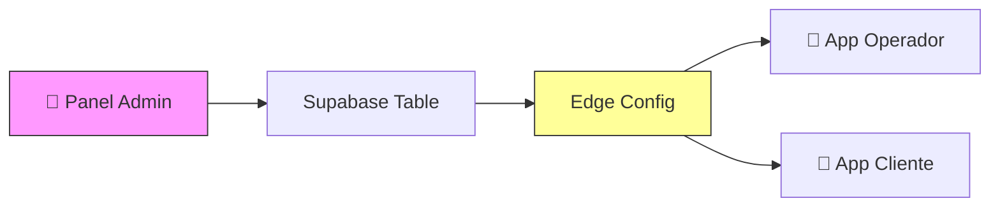

# 5.8.9 Configuración Remota

Sistema de configuración dinámica desde panel de administración.

---

## Arquitectura



---

## Configuración: Throttle GPS

| Parámetro | Valor Default | Recomendado | Rango |
|-----------|---------------|-------------|-------|
| `gps_throttle_ms` | 5000 | **10000** ⭐ | 5000-30000 |

> [!TIP]
> **10 segundos es el valor recomendado** — Balance óptimo entre UX y batería.

---

## Schema Supabase

```sql
-- Tabla de configuraciones globales
CREATE TABLE config_global (
  key TEXT PRIMARY KEY,
  value JSONB NOT NULL,
  description TEXT,
  min_value NUMERIC,
  max_value NUMERIC,
  recommended_value NUMERIC,
  updated_at TIMESTAMPTZ DEFAULT now(),
  updated_by UUID REFERENCES users(id)
);

-- Insertar configuración de throttle
INSERT INTO config_global (key, value, description, min_value, max_value, recommended_value)
VALUES (
  'gps_throttle_ms',
  '5000',
  'Intervalo de actualización GPS en milisegundos',
  5000,
  30000,
  10000
);

-- RLS: Solo admin puede escribir, todos pueden leer
ALTER TABLE config_global ENABLE ROW LEVEL SECURITY;

CREATE POLICY "anyone_can_read_config"
ON config_global FOR SELECT TO authenticated USING (true);

CREATE POLICY "only_admin_can_update_config"
ON config_global FOR UPDATE TO authenticated
USING (
  EXISTS (SELECT 1 FROM users WHERE id = auth.uid() AND rol = 'admin')
);
```

---

## Composable: useRemoteConfig

```typescript
// composables/useRemoteConfig.ts
interface RemoteConfig {
  gps_throttle_ms: number;
  arrival_threshold_meters: number;
  // Extensible...
}

const DEFAULT_CONFIG: RemoteConfig = {
  gps_throttle_ms: 5000,
  arrival_threshold_meters: 100
};

export const useRemoteConfig = () => {
  const supabase = useSupabaseClient();
  const config = useState<RemoteConfig>('remote-config', () => DEFAULT_CONFIG);
  const isLoaded = ref(false);
  
  /**
   * Cargar configuración desde Supabase
   */
  const loadConfig = async () => {
    const { data, error } = await supabase
      .from('config_global')
      .select('key, value');
    
    if (data) {
      data.forEach(({ key, value }) => {
        if (key in config.value) {
          (config.value as any)[key] = typeof value === 'string' 
            ? JSON.parse(value) 
            : value;
        }
      });
    }
    
    isLoaded.value = true;
  };
  
  /**
   * Suscribirse a cambios en tiempo real
   */
  const subscribeToChanges = () => {
    supabase
      .channel('config_changes')
      .on('postgres_changes', {
        event: 'UPDATE',
        schema: 'public',
        table: 'config_global'
      }, (payload) => {
        const { key, value } = payload.new;
        if (key in config.value) {
          (config.value as any)[key] = typeof value === 'string'
            ? JSON.parse(value)
            : value;
          
          console.log(`Config actualizada: ${key} = ${value}`);
          toast.info(`Configuración actualizada: ${key}`);
        }
      })
      .subscribe();
  };
  
  // Auto-cargar y suscribirse
  onMounted(async () => {
    await loadConfig();
    subscribeToChanges();
  });
  
  return {
    config: readonly(config),
    isLoaded: readonly(isLoaded),
    refreshConfig: loadConfig,
    
    // Getter específico para throttle
    gpsThrottleMs: computed(() => config.value.gps_throttle_ms)
  };
};
```

---

## Integración con Tracking

```typescript
// composables/useWatchPosition.ts (actualizado)
export const useWatchPosition = () => {
  const { gpsThrottleMs } = useRemoteConfig();
  
  // Usar config remota en lugar de constante local
  let lastBroadcast = 0;
  
  const shouldBroadcast = (): boolean => {
    const now = Date.now();
    const throttle = gpsThrottleMs.value; // ← Dinámico
    
    if (now - lastBroadcast < throttle) return false;
    lastBroadcast = now;
    return true;
  };
  
  // ... resto del composable
};
```

---

## Panel Admin: UI de Configuración

```vue
<!-- pages/admin/configuracion/gps.vue -->
<script setup lang="ts">
const supabase = useSupabaseClient();

const throttleValue = ref(5000);
const isLoading = ref(true);
const isSaving = ref(false);

// Cargar valor actual
onMounted(async () => {
  const { data } = await supabase
    .from('config_global')
    .select('value, recommended_value')
    .eq('key', 'gps_throttle_ms')
    .single();
  
  if (data) {
    throttleValue.value = parseInt(data.value);
  }
  isLoading.value = false;
});

// Guardar nuevo valor
const saveConfig = async () => {
  isSaving.value = true;
  
  const { error } = await supabase
    .from('config_global')
    .update({ 
      value: throttleValue.value,
      updated_at: new Date().toISOString()
    })
    .eq('key', 'gps_throttle_ms');
  
  if (error) {
    toast.error('Error al guardar');
  } else {
    toast.success('Configuración guardada. Se actualizará en todos los dispositivos.');
  }
  
  isSaving.value = false;
};

const presets = [
  { label: '5s (Fluido)', value: 5000 },
  { label: '10s ⭐ Recomendado', value: 10000 },
  { label: '15s (Ahorro batería)', value: 15000 },
  { label: '20s (Máximo ahorro)', value: 20000 }
];
</script>

<template>
  <div class="config-page">
    <h1>Configuración GPS</h1>
    
    <div class="config-card">
      <h3>Intervalo de Actualización (Throttle)</h3>
      <p class="description">
        Cada cuántos segundos se envía la ubicación del operador.
        Un valor mayor ahorra batería pero reduce la fluidez del mapa.
      </p>
      
      <div class="input-group">
        <input 
          type="range" 
          v-model.number="throttleValue"
          min="5000" 
          max="30000" 
          step="1000"
        />
        <span class="value">{{ throttleValue / 1000 }}s</span>
      </div>
      
      <div class="presets">
        <button 
          v-for="preset in presets"
          :key="preset.value"
          :class="['preset-btn', { active: throttleValue === preset.value }]"
          @click="throttleValue = preset.value"
        >
          {{ preset.label }}
        </button>
      </div>
      
      <div class="recommendation">
        <span class="badge">⭐ Recomendado: 10 segundos</span>
        <p>Balance óptimo entre experiencia de usuario y consumo de batería.</p>
      </div>
      
      <button 
        @click="saveConfig" 
        :disabled="isSaving"
        class="btn-save"
      >
        {{ isSaving ? 'Guardando...' : 'Guardar y aplicar a todos los dispositivos' }}
      </button>
    </div>
  </div>
</template>
```

---

## Sincronización Automática

```
┌─────────────────────────────────────────────────────────────────┐
│  FLUJO DE SINCRONIZACIÓN                                        │
├─────────────────────────────────────────────────────────────────┤
│                                                                 │
│  1. Admin cambia valor en panel web                             │
│     └─→ UPDATE config_global SET value = 10000                  │
│                                                                 │
│  2. Supabase Realtime detecta cambio                            │
│     └─→ postgres_changes event                                  │
│                                                                 │
│  3. Todos los dispositivos suscritos reciben update             │
│     └─→ ~50-200ms de latencia                                   │
│                                                                 │
│  4. useRemoteConfig actualiza config local                      │
│     └─→ gpsThrottleMs.value = 10000                             │
│                                                                 │
│  5. Próximo GPS update usa nuevo intervalo                      │
│     └─→ Efecto inmediato sin reiniciar app                      │
│                                                                 │
└─────────────────────────────────────────────────────────────────┘
```

---

## Configuraciones Adicionales Sugeridas

```sql
-- Otras configuraciones que podrían ser dinámicas
INSERT INTO config_global (key, value, description, min_value, max_value, recommended_value)
VALUES 
  ('arrival_threshold_meters', '100', 'Distancia para auto-confirmar llegada', 50, 200, 100),
  ('arrival_confirm_count', '2', 'Lecturas GPS consecutivas para confirmar', 1, 5, 2),
  ('map_default_zoom', '15', 'Zoom inicial del mapa', 10, 18, 15);
```

---

→ Ver módulo principal: [[Proyecto OnlyCarNLD/Datos/5.8. geolocalizacion]]

---

## Navegación

| ⬆️ Padre             | [[Proyecto OnlyCarNLD/Datos/5.8. geolocalizacion]]            |
| -------------------- | ---------------------- |
| ⬅️ Hermano anterior  | [[Proyecto OnlyCarNLD/Datos/5.8.8 testing]]              |
