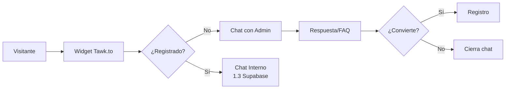

# 5.9.1 Tawk.to Live Chat

> Sistema de live chat gratuito para visitantes del sitio web y landing pages.

---

## ¿Por qué Tawk.to?

| Característica | Valor |
|----------------|-------|
| **Costo** | 100% gratuito |
| **Agentes** | Ilimitados |
| **Chats** | Ilimitados |
| **Historial** | Ilimitado |
| **Plugin Vue 3** | Oficial `@tawk.to/tawk-messenger-vue-3` |
| **Capacitor** | Direct Chat Link |

---

## Flujo de Atención



---

## Casos de Uso

| Usuario | Pregunta Típica | Respuesta |
|---------|-----------------|-----------|
| Visitante | "¿Cuánto cuesta?" | FAQ + link a precios |
| Prospecto B2B | "Flotilla de 20 autos" | Derivar a ventas |
| Aspirante operador | "Quiero trabajar" | Link registro operador |
| Cliente sin cuenta | "Cobertura en mi zona" | Verificar ciudad |

---

## Configuración Básica

### Credenciales Necesarias

| Campo | Dónde obtenerlo |
|-------|-----------------|
| `propertyId` | Dashboard Tawk.to → Administration → Channels → Chat Widget |
| `widgetId` | Mismo lugar, después de `default` en la URL |

### Dashboard URL

```
https://dashboard.tawk.to/
```

---

## Estructura de Hijos

| ID | Nombre | Descripción | Estado |
|----|--------|-------------|--------|
| [[Proyecto OnlyCarNLD/Datos/5.9.1.1 configuracion_widget\|5.9.1.1]] | Configuración Widget | Propiedades, colores, posición | ✅ |
| [[Proyecto OnlyCarNLD/Datos/5.9.1.2 integracion_nuxt\|5.9.1.2]] | Integración Nuxt | Plugin Vue 3, nuxt.config | ✅ |
| [[Proyecto OnlyCarNLD/Datos/5.9.1.3 capacitor_mobile\|5.9.1.3]] | Capacitor Mobile | Direct Link, WebView | ✅ |

---

## Navegación

| ⬆️ Padre             | [[Proyecto OnlyCarNLD/Datos/5.9 soporte_externo]]      |
| -------------------- | ---------------------------- |
| ➡️ Hermano siguiente | [[Proyecto OnlyCarNLD/Datos/5.9.2 chatwoot_omnicanal]] |

---
