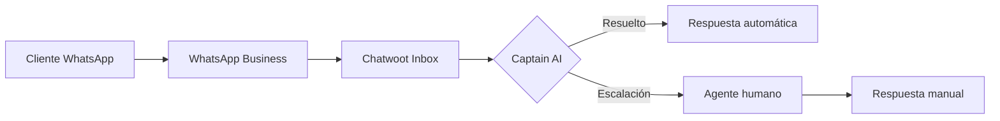

# 5.9.2.3 WhatsApp Business

> 📦 **Estado: Futuro** — Implementar cuando OnlyCar escale.

---

## ¿Por qué WhatsApp?

| Estadística México | Valor |
|--------------------|-------|
| Usuarios activos | 77+ millones |
| Penetración | ~90% smartphones |
| Preferencia B2B | Canal #1 |

---

## Opciones de Integración

| Proveedor | Costo | Complejidad |
|-----------|-------|-------------|
| **WhatsApp Cloud API** | Pago por mensaje | Media |
| **Twilio** | $0.005-0.05/msg | Baja |
| **360dialog** | €50+/mes | Baja |

---

## Flujo de Conversación

---

## Casos de Uso OnlyCar

| Escenario | Uso WhatsApp |
|-----------|--------------|
| **Cliente B2B** | Cotizaciones flotilla |
| **Seguimiento servicio** | "¿A qué hora llega el operador?" |
| **Confirmaciones** | Notificaciones de cita |
| **Soporte post-venta** | Quejas, feedback |

---

## Requisitos

| Requisito | Detalle |
|-----------|---------|
| Número verificado | +52 XXX XXX XXXX |
| Facebook Business | Cuenta verificada |
| Plantillas aprobadas | Mensajes proactivos |
| Horario de respuesta | <24 horas |

---

## Navegación

| ⬆️ Padre             | [[Proyecto OnlyCarNLD/Datos/5.9.2 chatwoot_omnicanal]]      |
| -------------------- | --------------------------------- |
| ⬅️ Hermano anterior  | [[Proyecto OnlyCarNLD/Datos/5.9.2.2 captain_ai]]            |
| ➡️ Hermano siguiente | [[Proyecto OnlyCarNLD/Datos/5.9.2.4 knowledge_base]]        |

---
