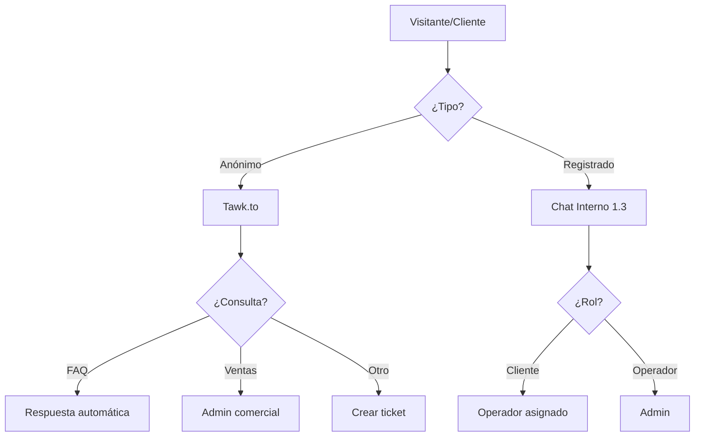

# 5.9.3 Flujos de Soporte

> Definición de flujos de atención según tipo de usuario y consulta.

---

## Matriz de Escalación

| Origen | Tipo Consulta | Canal | Destino |
|--------|---------------|-------|---------|
| Visitante web | Pre-venta | Tawk.to | Admin ventas |
| Visitante web | FAQ | Tawk.to | Respuesta automática |
| Prospecto B2B | Cotización | Tawk.to → Email | Admin comercial |
| Cliente registrado | Servicio | Chat interno | Operador/Admin |
| Operador | Caja/Pagos | Chat interno | Admin finanzas |
| Cualquiera | Queja | Todos | Admin calidad |

---

## Flujo Principal

---

## Prioridades

| Prioridad | Tiempo Respuesta | Ejemplos |
|-----------|------------------|----------|
| 🔴 **Crítica** | <15 min | Servicio en curso con problema |
| 🟠 **Alta** | <1 hora | Operador bloqueado, pago fallido |
| 🟡 **Media** | <4 horas | Consultas B2B, cotizaciones |
| 🟢 **Baja** | <24 horas | FAQ, información general |

---

## Horarios de Atención

| Canal | Horario | Fuera de Horario |
|-------|---------|------------------|
| **Tawk.to** | Lun-Vie 9-21, Sáb 9-18 | Mensaje offline |
| **Chat interno** | 24/7 (notificaciones) | Respuesta al día siguiente |
| **WhatsApp** (futuro) | Lun-Vie 9-21 | Bot automático |

---

## Navegación

| ⬆️ Padre             | [[Proyecto OnlyCarNLD/Datos/5.9 soporte_externo]]           |
| -------------------- | --------------------------------- |
| ⬅️ Hermano anterior  | [[Proyecto OnlyCarNLD/Datos/5.9.2 chatwoot_omnicanal]]      |
| ➡️ Hermano siguiente | [[Proyecto OnlyCarNLD/Datos/5.9.4 metricas_atencion]]       |

---
