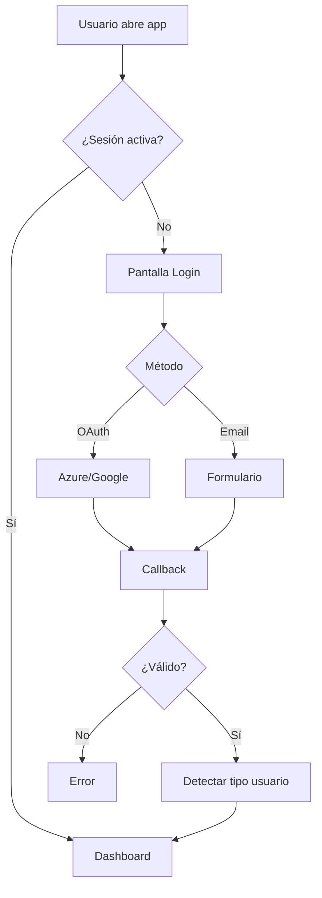
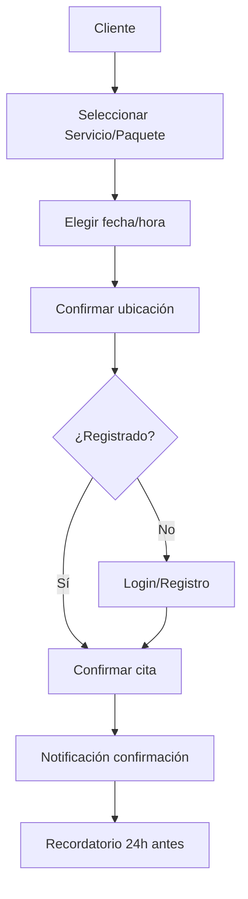
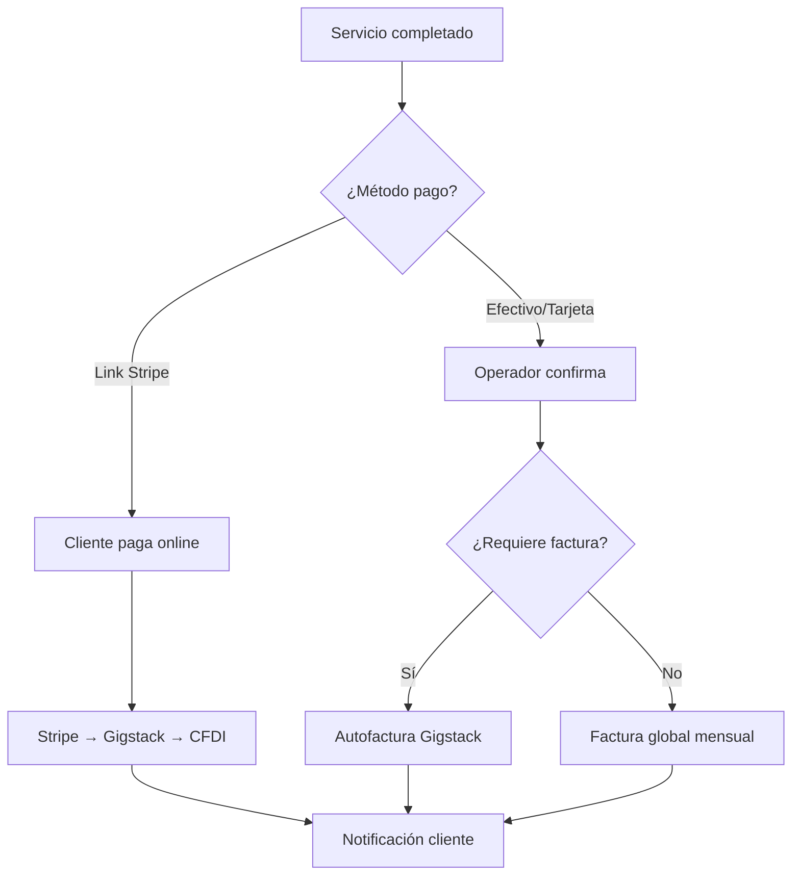

# 6.2 Flujos de Usuario

> Diagramas paso a paso.

---

## Flujo: Login

---

## Flujo: Agendar Cita

---

## Flujo: Pago Post-Servicio

---

## Navegación

| ⬆️ Padre             | [[Proyecto OnlyCarNLD/Datos/6.0. UI-UX]]                   |
| -------------------- | -------------------------------- |
| ⬅️ Hermano anterior  | [[Proyecto OnlyCarNLD/Datos/6.1. Design_System]]           |
| ➡️ Hermano siguiente | [[Proyecto OnlyCarNLD/Datos/6.3. Biblioteca_Componentes]]  |

---
