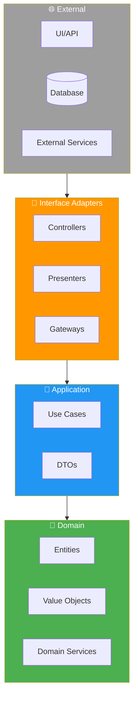

# 7.0 Arquitectura de Software

> Sistema arquitectónico empresarial que garantiza mantenibilidad,
> testabilidad y escalabilidad del proyecto OnlyCar.

---

## Visión General

| Patrón | Capa | Propósito |
|--------|------|-----------|
| **Hexagonal** | Core | Desacoplar negocio de infraestructura |
| **Clean Architecture** | Domain | Flujo de dependencias hacia adentro |
| **DDD** | Business | Modelado del dominio OnlyCar |
| **Atomic Design** | Presentation | Componentes UI escalables |
| **Repository** | Infrastructure | Abstracción de persistencia |
| **Strategy** | Application | Algoritmos intercambiables |
| **TDD** | Quality | Calidad desde diseño |
| **Git Flow** | DevOps | Control de versiones estructurado |

---

## Principios Arquitectónicos

1. **Separación de Concerns**: Cada capa tiene responsabilidad única
2. **Dependency Inversion**: Dependencias apuntan hacia el núcleo
3. **Interface Segregation**: Interfaces pequeñas y específicas
4. **Single Responsibility**: Una razón para cambiar por clase/módulo
5. **Open/Closed**: Abierto a extensión, cerrado a modificación

---

## Diagrama de Capas

---

## Estructura de Hijos

| ID | Nombre | Descripción | Hijos | Estado |
|----|--------|-------------|-------|--------|
| [[Proyecto OnlyCarNLD/Datos/7.1 Hexagonal_Architecture\|7.1]] | Arquitectura Hexagonal | Puertos y Adaptadores | 4 | ✅ |
| [[Proyecto OnlyCarNLD/Datos/7.2 Clean_Architecture_DDD\|7.2]] | Clean Architecture + DDD | Capas y Bounded Contexts | 4 | ✅ |
| [[Proyecto OnlyCarNLD/Datos/7.3 Atomic_Design_System\|7.3]] | Atomic Design System | Tokens, Atoms, Molecules, Organisms | 4 | ✅ |
| [[Proyecto OnlyCarNLD/Datos/7.4 Patterns_Repository_Strategy\|7.4]] | Patrones de Diseño | Repository y Strategy | 2 | ✅ |
| [[Proyecto OnlyCarNLD/Datos/7.5 TDD_Testing_Strategy\|7.5]] | TDD y Testing | Unit, Integration, E2E | 3 | ✅ |
| [[Proyecto OnlyCarNLD/Datos/7.6 Git_Flow_DevOps\|7.6]] | Git Flow | Branches, Commits, CI/CD | 3 | ✅ |
| [[Proyecto OnlyCarNLD/Datos/7.7 Docs_as_Code\|7.7]] | Docs-as-Code | DTD y RD | 2 | ✅ |

---

## Referencias Cruzadas

- [[Proyecto OnlyCarNLD/Datos/2.0. tecnologia|Stack Tecnológico]] - Implementación técnica
- [[Proyecto OnlyCarNLD/Datos/4.0. necesidades_del_sistema|Requisitos]] - Especificaciones
- [[Proyecto OnlyCarNLD/Datos/6.0. UI-UX|UI/UX]] - Design System aplicado

---

## Navegación

| ⬆️ Padre | [[Proyecto OnlyCarNLD/Datos/0. Contexualizador]] |
|----------|------------------------|
| ⬅️ Hermano anterior | [[Proyecto OnlyCarNLD/Datos/6.0. UI-UX]] |
| ➡️ Hermano siguiente | [[Proyecto OnlyCarNLD/Datos/8.0. legal_cumplimiento]] |

---

**Versión:** 1.0 (Arquitectura Empresarial)
**Basado en:** Architecture Blueprint OnlyCar
