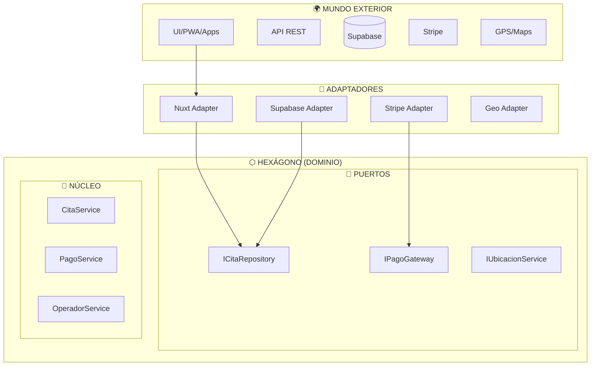

# 7.1 Arquitectura Hexagonal (Ports & Adapters)

> El corazón del sistema está protegido del mundo exterior mediante
> interfaces (puertos) e implementaciones (adaptadores).

---

## Concepto Nuclear



---

## Regla de Oro

> **El dominio NUNCA conoce la infraestructura.**
> La infraestructura implementa las interfaces del dominio.

---

## Estructura de Carpetas OnlyCar

```
src/
├── domain/                    # 🧠 NÚCLEO PURO
│   ├── entities/
│   │   ├── Cita.ts
│   │   ├── Servicio.ts
│   │   └── Operador.ts
│   ├── value-objects/
│   │   ├── Ubicacion.ts
│   │   └── Precio.ts
│   ├── ports/
│   │   ├── inbound/
│   │   │   └── IAgendarCita.ts
│   │   └── outbound/
│   │       └── ICitaRepository.ts
│   └── services/
│       └── CitaPricingService.ts
│
├── infrastructure/            # 🔌 ADAPTADORES
│   └── adapters/
│       ├── persistence/
│       │   └── SupabaseCitaRepository.ts
│       ├── payment/
│       │   └── StripePaymentGateway.ts
│       └── geolocation/
│           └── CapacitorGeoService.ts
```

---

## Estructura de Hijos

| ID | Nombre | Descripción | Estado |
|----|--------|-------------|--------|
| [[Proyecto OnlyCarNLD/Datos/7.1.1 Ports_Inbound\|7.1.1]] | Puertos Inbound | Casos de uso expuestos | ✅ |
| [[Proyecto OnlyCarNLD/Datos/7.1.2 Ports_Outbound\|7.1.2]] | Puertos Outbound | Interfaces de infraestructura | ✅ |
| [[Proyecto OnlyCarNLD/Datos/7.1.3 Adapters_Primary\|7.1.3]] | Adaptadores Primarios | Controllers, APIs | ✅ |
| [[Proyecto OnlyCarNLD/Datos/7.1.4 Adapters_Secondary\|7.1.4]] | Adaptadores Secundarios | Repositories, Gateways | ✅ |

---

## Navegación

| ⬆️ Padre | [[Proyecto OnlyCarNLD/Datos/7.0. arquitectura]] |
|----------|----------------------|
| ➡️ Siguiente | [[Proyecto OnlyCarNLD/Datos/7.2 Clean_Architecture_DDD]] |

---
