# 7.2 Clean Architecture + Domain-Driven Design

> Capas de cebolla con flujo de dependencias hacia adentro.
> Bounded Contexts para modelar el dominio OnlyCar.

---

## Capas de Clean Architecture

| Capa | Contenido | Dependencias |
|------|-----------|--------------|
| **Entities** (centro) | Cita, Operador, Cliente | Ninguna |
| **Use Cases** | AgendarCita, ProcesarPago | Entities |
| **Interface Adapters** | Controllers, Presenters | Use Cases |
| **External** | Supabase, Stripe, GPS | Interface Adapters |

---

## Regla de Dependencia

> **"Las dependencias SIEMPRE apuntan hacia ADENTRO"**

- ❌ Domain NO conoce Infrastructure
- ❌ Application NO conoce Presentation
- ✅ Infrastructure conoce Domain (implementa interfaces)
- ✅ Presentation conoce Application (llama use cases)

---

## Bounded Contexts OnlyCar

```mermaid
graph LR
    subgraph AGENDAMIENTO["📅 Agendamiento"]
        Cita[Cita]
        Servicio[Servicio]
        Horario[Horario]
    end
    
    subgraph OPERACIONES["🔧 Operaciones"]
        Operador[Operador]
        Ruta[Ruta]
        Asignacion[Asignación]
    end
    
    subgraph PAGOS["💳 Pagos"]
        Pago[Pago]
        Factura[Factura]
        Liquidacion[Liquidación]
    end
    
    subgraph CLIENTES["👤 Clientes"]
        Cliente[Cliente]
        Empresa[Empresa B2B]
        Flotilla[Flotilla]
    end
    
    AGENDAMIENTO --> OPERACIONES
    AGENDAMIENTO --> PAGOS
    CLIENTES --> AGENDAMIENTO
```

---

## Agregados y Entidades

| Agregado Root | Entidades | Value Objects |
|---------------|-----------|---------------|
| **Cita** | CitaDetalle, ServicioAplicado | Ubicacion, Precio, FechaHora |
| **Operador** | Perfil, Vehiculo, Calificacion | Coordenadas, ComisionRate |
| **Cliente** | Perfil, Vehiculos[] | Direccion, MetodoPago |
| **Pago** | Transaccion, Factura | Monto, TipoPago |

---

## Estructura de Hijos

| ID | Nombre | Descripción | Estado |
|----|--------|-------------|--------|
| [[Proyecto OnlyCarNLD/Datos/7.2.1 Domain_Layer\|7.2.1]] | Capa de Dominio | Entities, Value Objects | ✅ |
| [[Proyecto OnlyCarNLD/Datos/7.2.2 Application_Layer\|7.2.2]] | Capa de Aplicación | Use Cases, DTOs | ✅ |
| [[Proyecto OnlyCarNLD/Datos/7.2.3 Infrastructure_Layer\|7.2.3]] | Capa de Infraestructura | Adapters, Config | ✅ |
| [[Proyecto OnlyCarNLD/Datos/7.2.4 Bounded_Contexts\|7.2.4]] | Bounded Contexts | Agendamiento, Pagos, etc. | ✅ |

---

## Navegación

| ⬆️ Padre | [[Proyecto OnlyCarNLD/Datos/7.0. arquitectura]] |
|----------|----------------------|
| ⬅️ Anterior | [[Proyecto OnlyCarNLD/Datos/7.1 Hexagonal_Architecture]] |
| ➡️ Siguiente | [[Proyecto OnlyCarNLD/Datos/7.3 Atomic_Design_System]] |

---
