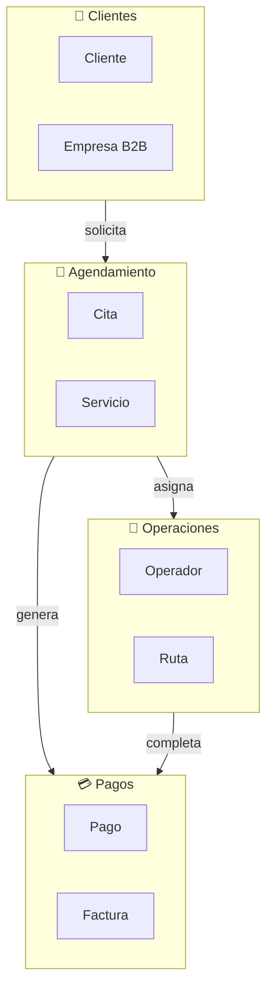

# 7.2.4 Bounded Contexts

> Límites claros entre diferentes subdominios del negocio.

---

## Contextos Identificados

| Context | Responsabilidad | Agregados |
|---------|-----------------|-----------|
| **Agendamiento** | Programación de servicios | Cita, Servicio |
| **Operaciones** | Ejecución de servicios | Operador, Ruta |
| **Pagos** | Procesamiento financiero | Pago, Factura |
| **Clientes** | Gestión de usuarios | Cliente, Empresa |
| **Chat** | Comunicación en tiempo real | Conversacion, Mensaje |

---

## Mapa de Contextos

---

## Relaciones entre Contextos

| Relación | Tipo | Descripción |
|----------|------|-------------|
| Clientes → Agendamiento | Customer/Supplier | Cliente solicita citas |
| Agendamiento → Operaciones | Partnership | Asignación bidireccional |
| Agendamiento → Pagos | Upstream/Downstream | Cita genera pago |
| Operaciones → Pagos | Published Language | Evento de completado |

---

## Navegación

| ⬆️ Padre | [[Proyecto OnlyCarNLD/Datos/7.2 Clean_Architecture_DDD]] |
|----------|-------------------------------|
| ⬅️ Anterior | [[Proyecto OnlyCarNLD/Datos/7.2.3 Infrastructure_Layer]] |

---
