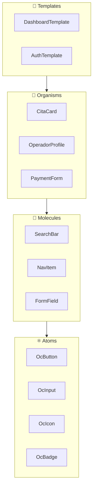

# 7.3 Atomic Design System

> Metodología para crear sistemas de diseño escalables y consistentes.

---

## Jerarquía de Componentes



---

## Estructura de Carpetas

```
components/
├── atoms/                     # ⚛️ Elementos básicos
│   ├── OcButton.vue
│   ├── OcInput.vue
│   ├── OcIcon.vue
│   └── OcBadge.vue
│
├── molecules/                 # 🔬 Combinaciones simples
│   ├── OcSearchBar.vue
│   ├── OcFormField.vue
│   └── OcNavItem.vue
│
├── organisms/                 # 🧬 Componentes complejos
│   ├── OcCitaCard.vue
│   ├── OcOperadorCard.vue
│   └── OcPaymentMethod.vue
│
├── templates/                 # 📄 Layouts de página
│   ├── DashboardLayout.vue
│   └── AuthLayout.vue
│
└── tokens/                    # 🎨 Design Tokens
    ├── colors.ts
    ├── typography.ts
    └── spacing.ts
```

---

## Design Tokens (CSS Variables)

```css
:root {
  /* Colors - Definidos en 6.1.1 */
  --oc-primary: #3B82F6;
  --oc-secondary: #10B981;
  --oc-error: #EF4444;
  --oc-success: #22C55E;
  
  /* Spacing */
  --oc-space-xs: 4px;
  --oc-space-sm: 8px;
  --oc-space-md: 16px;
  --oc-space-lg: 24px;
  
  /* Border Radius */
  --oc-radius-sm: 4px;
  --oc-radius-md: 8px;
  --oc-radius-lg: 16px;
}
```

---

## Estructura de Hijos

| ID | Nombre | Descripción | Estado |
|----|--------|-------------|--------|
| [[Proyecto OnlyCarNLD/Datos/7.3.1 Design_Tokens\|7.3.1]] | Design Tokens | Variables CSS, colores, spacing | ✅ |
| [[Proyecto OnlyCarNLD/Datos/7.3.2 Atoms\|7.3.2]] | Atoms | Botones, inputs, iconos | ✅ |
| [[Proyecto OnlyCarNLD/Datos/7.3.3 Molecules\|7.3.3]] | Molecules | SearchBar, FormField, NavItem | ✅ |
| [[Proyecto OnlyCarNLD/Datos/7.3.4 Organisms\|7.3.4]] | Organisms | CitaCard, PaymentForm | ✅ |

---

## Navegación

| ⬆️ Padre | [[Proyecto OnlyCarNLD/Datos/7.0. arquitectura]] |
|----------|----------------------|
| ⬅️ Anterior | [[Proyecto OnlyCarNLD/Datos/7.2 Clean_Architecture_DDD]] |
| ➡️ Siguiente | [[Proyecto OnlyCarNLD/Datos/7.4 Patterns_Repository_Strategy]] |

---
