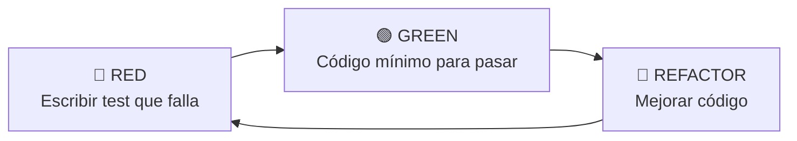

# 7.5 TDD y Testing Strategy

> Test-Driven Development: escribir tests antes del código.

> [!NOTE]
> Para **configuración técnica** (Vitest, Playwright), ver [[Proyecto OnlyCarNLD/Datos/2.18. Testing_Infrastructure]].

---

## Ciclo TDD (Red-Green-Refactor)



---

## Pirámide de Tests

```
        /\
       /  \  E2E (Pocos, lentos, costosos)
      /----\
     /      \ Integration (Moderados)
    /--------\
   /          \ Unit (Muchos, rápidos, baratos)
  /____________\
```

| Nivel | Cantidad | Velocidad | Costo |
|-------|----------|-----------|-------|
| **Unit** | Muchos | Rápido | Bajo |
| **Integration** | Moderados | Medio | Medio |
| **E2E** | Pocos | Lento | Alto |

---

## Estructura de Tests

```
tests/
├── unit/                      # Vitest
│   ├── domain/
│   │   └── entities/
│   │       └── Cita.spec.ts
│   └── application/
│       └── use-cases/
│           └── AgendarCitaUseCase.spec.ts
│
├── integration/               # Vitest + Nitro
│   ├── api/
│   │   └── citas.api.spec.ts
│   └── database/
│       └── citas.db.spec.ts
│
└── e2e/                       # Playwright
    ├── flows/
    │   └── agendar-cita.spec.ts
    └── visual/
        └── screenshots/
```

---

## Ejemplo TDD

```typescript
// 🔴 RED: Test escrito primero
describe('AgendarCitaUseCase', () => {
  it('debería crear una cita cuando hay disponibilidad', async () => {
    // Arrange
    const input = {
      clienteId: 'cliente-123',
      servicioId: 'lavado-express',
      ubicacion: { lat: 27.4863, lng: -99.5075 },
      fechaHora: new Date('2026-01-21T10:00:00')
    };
    
    // Act
    const result = await useCase.execute(input);
    
    // Assert
    expect(result.success).toBe(true);
    expect(result.cita.estado).toBe('pendiente');
  });
});
```

---

## Estructura de Hijos

| ID | Nombre | Descripción | Estado |
|----|--------|-------------|--------|
| [[Proyecto OnlyCarNLD/Datos/7.5.1 Unit_Tests\|7.5.1]] | Unit Tests | Tests de funciones individuales | ✅ |
| [[Proyecto OnlyCarNLD/Datos/7.5.2 Integration_Tests\|7.5.2]] | Integration Tests | Tests de componentes + API | ✅ |
| [[Proyecto OnlyCarNLD/Datos/7.5.3 E2E_Tests\|7.5.3]] | E2E Tests | Tests de flujos completos | ✅ |

---

## Navegación

| ⬆️ Padre | [[Proyecto OnlyCarNLD/Datos/7.0. arquitectura]] |
|----------|----------------------|
| ⬅️ Anterior | [[Proyecto OnlyCarNLD/Datos/7.4 Patterns_Repository_Strategy]] |
| ➡️ Siguiente | [[Proyecto OnlyCarNLD/Datos/7.6 Git_Flow_DevOps]] |

---
