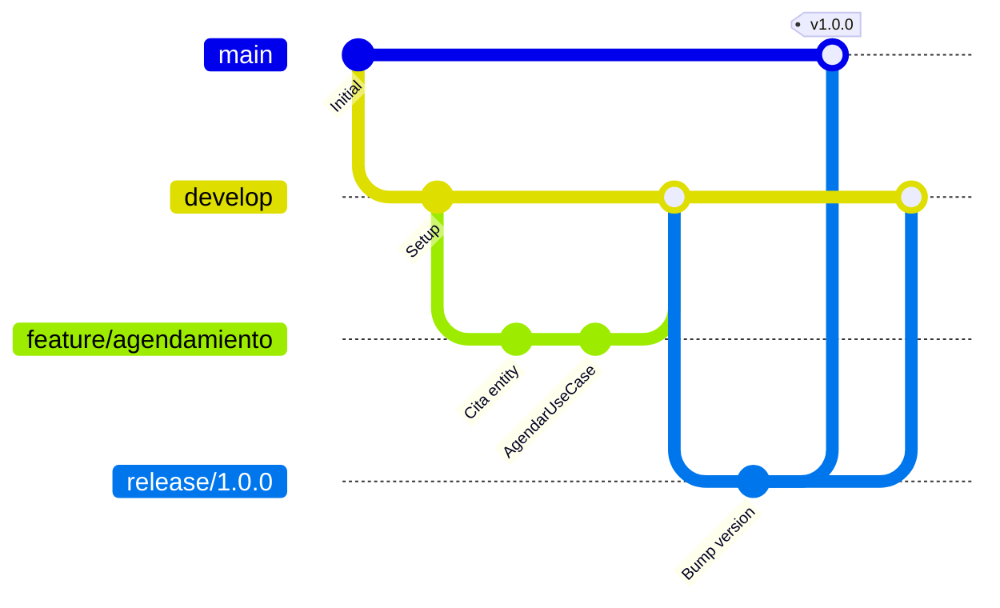
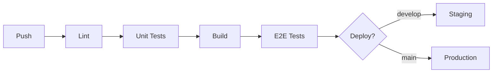

# 7.6 Git Flow y DevOps

> Control de versiones estructurado y deployment automatizado.

> [!NOTE]
> Para **implementación técnica** (GitHub Actions YAML), ver [[Proyecto OnlyCarNLD/Datos/2.7. Estandares_Desarrollo]].

---

## Estructura de Ramas



---

## Convenciones de Branches

| Tipo | Formato | Origen | Destino |
|------|---------|--------|---------|
| Feature | `feature/[ticket]-[desc]` | develop | develop |
| Bugfix | `bugfix/[ticket]-[desc]` | develop | develop |
| Release | `release/[version]` | develop | main + develop |
| Hotfix | `hotfix/[ticket]-[desc]` | main | main + develop |

---

## Conventional Commits

```
<type>(<scope>): <description>

feat(citas): add cancelation policy validation
fix(pagos): resolve Stripe webhook race condition
docs(api): update OpenAPI spec for v2
refactor(domain): extract pricing strategies
test(e2e): add visual regression for dark mode
chore(deps): upgrade Nuxt to 4.1
```

| Type | Descripción |
|------|-------------|
| `feat` | Nueva funcionalidad |
| `fix` | Corrección de bug |
| `docs` | Documentación |
| `refactor` | Refactorización |
| `test` | Tests |
| `chore` | Mantenimiento |

---

## Pipeline CI/CD



---

## Estructura de Hijos

| ID | Nombre | Descripción | Estado |
|----|--------|-------------|--------|
| [[Proyecto OnlyCarNLD/Datos/7.6.1 Branch_Strategy\|7.6.1]] | Branch Strategy | Estrategia de ramas | ✅ |
| [[Proyecto OnlyCarNLD/Datos/7.6.2 Conventional_Commits\|7.6.2]] | Conventional Commits | Formato de commits | ✅ |
| [[Proyecto OnlyCarNLD/Datos/7.6.3 CI_CD_Pipeline\|7.6.3]] | CI/CD Pipeline | GitHub Actions workflow | ✅ |

---

## Navegación

| ⬆️ Padre | [[Proyecto OnlyCarNLD/Datos/7.0. arquitectura]] |
|----------|----------------------|
| ⬅️ Anterior | [[Proyecto OnlyCarNLD/Datos/7.5 TDD_Testing_Strategy]] |
| ➡️ Siguiente | [[Proyecto OnlyCarNLD/Datos/7.7 Docs_as_Code]] |

---
