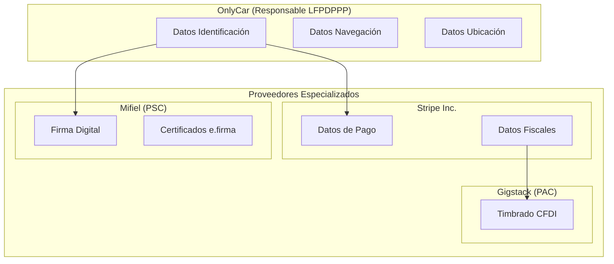

# 8.0 Legal y Cumplimiento

> Marco legal integral de OnlyCar - Centralización de toda la documentación legal del proyecto.

---

## Propósito

Este módulo centraliza todas las políticas legales, privacidad, términos de servicio, cumplimiento regulatorio y contractual de OnlyCar.

> [!IMPORTANT]
> **Principios Rectores**
> 1. **Transparencia** - Lenguaje claro para todos los documentos
> 2. **Delegación** - Datos sensibles a proveedores certificados
> 3. **Cumplimiento** - Adhesión estricta a normativa mexicana

---

## I. AUTORIDADES COMPETENTES

| Materia | Autoridad | Regulación |
|---------|-----------|------------|
| Protección de Datos | Secretaría Anticorrupción y Buen Gobierno | LFPDPPP 2025 |
| Fiscal | SAT | CFF, LISR, LIVA |
| Laboral | STPS | LFT |
| Comercio Electrónico | Secretaría de Economía | Ley de Firma Electrónica |
| Consumidor | PROFECO | LFPC |

---

## II. MARCOS REGULATORIOS APLICABLES

### Matriz de Cumplimiento

| Marco | Aplicación | Estado | Documento |
|-------|------------|--------|-----------|
| LFPDPPP 2025 | Datos personales | ✅ Activo | [[Proyecto OnlyCarNLD/Datos/8.3.1 lfpdppp]] |
| CFF | Facturación, retenciones | ✅ Activo | [[Proyecto OnlyCarNLD/Datos/8.3.2 cumplimiento_cff]] |
| LFT | Relación con operadores | ✅ Activo | [[Proyecto OnlyCarNLD/Datos/8.3.3 cumplimiento_lft]] |
| GDPR | Expansión europea (futuro) | 🔮 Futuro | [[Proyecto OnlyCarNLD/Datos/8.3.4 gdpr]] |

---

## III. MODELO DE DELEGACIÓN DE DATOS

### Diagrama de Responsabilidades

### Responsabilidades por Actor

| Actor | Datos que Maneja | Responsabilidad |
|-------|------------------|-----------------|
| **OnlyCar** | Identificación, navegación, ubicación | Responsable LFPDPPP |
| **Stripe** | Pagos, datos bancarios, datos fiscales | Procesador PCI-DSS |
| **Gigstack** | Datos fiscales para CFDI | Encargado + PAC SAT |
| **Mifiel** | Certificados digitales, e.firma | PSC acreditado |
| **Cloudflare** | Documentos almacenados | Encargado |
| **Supabase** | Base de datos operativa | Encargado |

---

## IV. ESTADO DE CUMPLIMIENTO

### Dashboard de Documentación

| Documento                    | Obligatorio | Estado        | Ubicación                    |
| ---------------------------- | ----------- | ------------- | ---------------------------- |
| Aviso de Privacidad Integral | ✅           | ✅ Listo       | [[Proyecto OnlyCarNLD/Datos/8.1.1 aviso_privacidad]]   |
| Términos B2C                 | ✅           | 🔮 Desarrollo | [[Proyecto OnlyCarNLD/Datos/8.2.1 tos_b2c]]            |
| Términos B2B                 | ✅           | 🔮 Desarrollo | [[Proyecto OnlyCarNLD/Datos/8.2.2 tos_b2b]]            |
| Contrato Operadores          | ✅           | ✅ Listo       | [[Proyecto OnlyCarNLD/Datos/8.2.3 tos_operadores]]     |
| Política de Cookies          | ⚠️          | 🔮 Desarrollo | [[Proyecto OnlyCarNLD/Datos/8.1.2 politica_cookies]]   |
| Procedimiento ARCO           | ✅           | 🔮 Desarrollo | [[Proyecto OnlyCarNLD/Datos/8.1.3 derechos_arco]]      |
| Política de Retención        | ✅           | ✅ Listo       | [[Proyecto OnlyCarNLD/Datos/8.5.1 politica_retencion]] |

### Estado de Contratos DPA

| Proveedor | Tipo | Estado | Prioridad |
|-----------|------|--------|-----------|
| Stripe | DPA Enterprise | ⏳ Solicitar | P0 |
| Gigstack | Contrato Encargado | ⏳ Firmar | P0 |
| Mifiel | PSC Acreditado | ✅ Equivalente | - |
| Cloudflare | DPA | ⚠️ Req. plan Pro | P1 |
| Supabase | DPA | ⏳ Solicitar | P1 |

---

## V. ESTRUCTURA DE HIJOS

| ID | Nombre | Descripción | Nietos | Estado |
|----|--------|-------------|--------|--------|
| [[Proyecto OnlyCarNLD/Datos/8.1 privacidad\|8.1]] | Privacidad | Políticas de datos | 0 | ✅ Activo |
| [[Proyecto OnlyCarNLD/Datos/8.2 terminos_condiciones\|8.2]] | Términos y Condiciones | ToS por audiencia | 0 | ✅ Activo |
| [[Proyecto OnlyCarNLD/Datos/8.3 cumplimiento_regulatorio\|8.3]] | Cumplimiento Regulatorio | LFPDPPP, CFF, LFT | 0 | ✅ Activo |
| [[Proyecto OnlyCarNLD/Datos/8.4 contratos_firmas\|8.4]] | Contratos y Firmas | Plantillas, Mifiel | 0 | ✅ Activo |
| [[Proyecto OnlyCarNLD/Datos/8.5 retencion_datos\|8.5]] | Retención de Datos | Políticas, ciclos | 0 | ✅ Activo |

---

## VI. CHECKLIST PRE-PRODUCCIÓN

### Documentos Obligatorios

- [x] Aviso de privacidad integral (LFPDPPP 2025)
- [x] Contrato operadores (modelo gig)
- [x] Política de retención
- [x] Cumplimiento LFPDPPP documentado
- [x] Cumplimiento CFF documentado
- [x] Cumplimiento LFT documentado
- [ ] Términos B2C completos
- [ ] Términos B2B completos
- [ ] Política de cookies completa
- [ ] Procedimiento ARCO completo

### Contratos con Proveedores

- [ ] DPA con Stripe
- [ ] Contrato Encargado con Gigstack
- [ ] Verificar acreditación Mifiel
- [ ] DPA con Supabase

### Infraestructura Legal

- [ ] Email arco@onlycar.mx configurado
- [ ] Email privacidad@onlycar.mx configurado
- [ ] Formato ARCO publicado
- [ ] Aviso en web publicado
- [ ] Checkbox registro implementado

---

## VII. CONTACTOS LEGALES

| Tipo | Contacto | Propósito |
|------|----------|-----------|
| ARCO | arco@onlycar.mx | Ejercicio de derechos |
| Privacidad | privacidad@onlycar.mx | Consultas generales |
| Seguridad | seguridad@onlycar.mx | Incidentes |
| Legal | legal@onlycar.mx | Consultas contractuales |

---

## VIII. VERSIONADO DE DOCUMENTOS

### Política de Versiones

| Tipo de Cambio | Acción |
|----------------|--------|
| Corrección menor | Incrementar versión menor (3.0 → 3.1) |
| Cambio sustancial | Incrementar versión mayor (3.x → 4.0) + Notificar usuarios |
| Cambio legal | Incrementar versión mayor + Solicitar re-consentimiento |

### Historial de Versiones

| Documento | Versión | Fecha | Cambio |
|-----------|---------|-------|--------|
| Aviso Privacidad | 3.0 | 2026-01-26 | LFPDPPP 2025, nueva autoridad |
| ToS Operadores | 3.0 | 2026-01-26 | Modelo gig actualizado |
| Política Retención | 2.0 | 2026-01-26 | Centralización en 8.x |

---

## Navegación

| ⬆️ Padre | [[Proyecto OnlyCarNLD/Datos/0. Contexualizador]] |
|----------|------------------------|
| ⬅️ Hermano anterior | [[Proyecto OnlyCarNLD/Datos/7.0. arquitectura]] |
| ➡️ Hermano siguiente | [[Proyecto OnlyCarNLD/Datos/9.0. planificacion]] |

---
