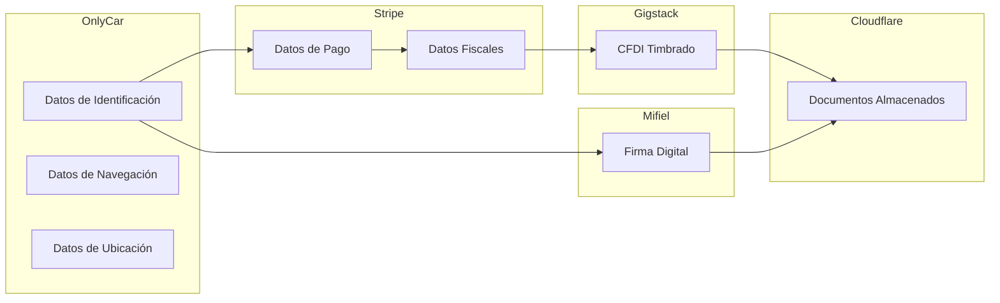

# 8.1 Privacidad

> Centro de documentación de privacidad y protección de datos personales.

---

## Propósito

Este módulo centraliza todas las políticas, procedimientos y documentos relacionados con la protección de datos personales en OnlyCar, en cumplimiento de la **LFPDPPP 2025**.

---

## I. CLASIFICACIÓN DE DATOS TRATADOS

### Datos que OnlyCar SÍ Trata

#### Datos de Identificación

| Dato | Obligatorio | Fuente | Retención |
|------|-------------|--------|-----------|
| Nombre completo | ✅ Sí | Registro | Mientras cuenta activa |
| Correo electrónico | ✅ Sí | Registro | Mientras cuenta activa |
| Número telefónico | ✅ Sí | Registro | Mientras cuenta activa |
| Dirección física | ❌ Opcional | Servicio | Por servicio |

#### Datos de Navegación

| Dato | Captura | Fuente | Retención |
|------|---------|--------|-----------|
| Dirección IP | Automática | Servidor | 12 meses |
| User Agent | Automática | Servidor | 12 meses |
| Timestamps | Automática | Servidor | Indefinido |
| Cookies técnicas | Automática | Navegador | Sesión / 1 año |

#### Datos de Ubicación

| Dato | Cuándo | Quién | Retención |
|------|--------|-------|-----------|
| Coordenadas GPS | Durante servicio | Clientes | Por servicio |
| Coordenadas GPS | Durante servicio | Operadores | Por servicio |

### Datos que OnlyCar NO Trata (Delegados)

| Tipo de Dato | Proveedor Responsable | Base Legal |
|--------------|----------------------|------------|
| RFC, Razón Social | Stripe → Gigstack | CFF |
| Datos bancarios | Stripe | PCI-DSS |
| e.firma / FIEL | Mifiel | PSC Acreditado |
| Certificados digitales | Mifiel | Ley Firma Electrónica |

### Datos Sensibles

> [!IMPORTANT]
> **OnlyCar NO recaba datos sensibles**
> - Sin datos de salud
> - Sin datos religiosos
> - Sin datos de orientación sexual
> - Sin datos de origen étnico
> - Sin datos de opiniones políticas

---

## II. PRINCIPIOS LFPDPPP IMPLEMENTADOS

| # | Principio | Implementación | Estado |
|---|-----------|----------------|--------|
| 1 | Licitud | Solo tratamientos con base legal | ✅ |
| 2 | Consentimiento | Checkbox explícito + evidencia | ✅ |
| 3 | Información | Aviso de privacidad integral | ✅ |
| 4 | Calidad | Validación + perfil editable | ✅ |
| 5 | Finalidad | 8 finalidades declaradas | ✅ |
| 6 | Lealtad | Lenguaje claro, sin engaño | ✅ |
| 7 | Proporcionalidad | Solo datos necesarios | ✅ |
| 8 | Responsabilidad | Medidas de seguridad activas | ✅ |

---

## III. TRANSFERENCIAS DE DATOS AUTORIZADAS

### Mapa de Flujo de Datos

### Detalle de Transferencias

| Proveedor | Datos | Finalidad | Base Legal | DPA |
|-----------|-------|-----------|------------|-----|
| **Stripe** | Pago + Fiscal | Cobros y captura RFC | Contractual | ⏳ Pendiente |
| **Gigstack** | Fiscales (vía Stripe) | Timbrado CFDI | Legal (CFF) | ⏳ Pendiente |
| **Mifiel** | Identificación | Firma contratos | Contractual | PSC ✅ |
| **Cloudflare** | Documentos procesados | Almacenamiento | Contractual | ⚠️ Req. Pro |
| **Supabase** | Identificación + Metadata | Base de datos | Contractual | ⏳ Pendiente |

---

## IV. CONSENTIMIENTOS REQUERIDOS

### Matriz de Consentimientos

| Momento | Consentimiento | Tipo | Evidencia |
|---------|----------------|------|-----------|
| Registro | Aviso de privacidad | Expreso | Checkbox + timestamp + IP |
| Pago | Uso de Stripe | Expreso | Al completar pago |
| Facturación | Uso de Gigstack | Implícito | Solicitar factura |
| Contrato B2B | Uso de Mifiel | Expreso | Firma digital |
| Marketing | Comunicaciones | Opcional | Toggle en perfil |

### Evidencia de Consentimiento

Para cada consentimiento se registra:

| Campo | Ejemplo |
|-------|---------|
| Timestamp | 2026-01-26T18:25:00-06:00 |
| IP | 187.xxx.xxx.xxx |
| User Agent | Chrome/120 iOS |
| Versión Aviso | v3.0 |
| Duración lectura | 45 segundos |
| Geolocalización | Nuevo Laredo, MX |

---

## V. ESTRUCTURA DE HIJOS

| ID | Nombre | Descripción | Estado |
|----|--------|-------------|--------|
| [[Proyecto OnlyCarNLD/Datos/8.1.1 aviso_privacidad\|8.1.1]] | Aviso de Privacidad | Documento legal integral LFPDPPP 2025 | ✅ Activo |
| [[Proyecto OnlyCarNLD/Datos/8.1.2 politica_cookies\|8.1.2]] | Política de Cookies | Cookies técnicas, sin tracking | ✅ Activo |
| [[Proyecto OnlyCarNLD/Datos/8.1.3 derechos_arco\|8.1.3]] | Derechos ARCO | Procedimiento de ejercicio | ✅ Activo |

---

## VI. MEDIDAS DE SEGURIDAD

### Resumen Ejecutivo

| Categoría | Medidas | Estado |
|-----------|---------|--------|
| Encriptación | TLS 1.3 + AES-256 | ✅ |
| Acceso | RBAC + RLS + MFA | ✅ |
| Infraestructura | WAF + DDoS + Zero Trust | ✅ |
| Administrativa | Políticas + Auditorías + Capacitación | ⏳ |

> Ver detalle completo en [[Proyecto OnlyCarNLD/Datos/8.3.1 lfpdppp]]

---

## VII. CONTACTOS DE PRIVACIDAD

| Tipo | Contacto |
|------|----------|
| Ejercicio ARCO | arco@onlycar.mx |
| Consultas generales | privacidad@onlycar.mx |
| Incidentes de seguridad | seguridad@onlycar.mx |
| Autoridad competente | Sec. Anticorrupción y Buen Gobierno |

---

## Navegación

| ⬆️ Padre | [[Proyecto OnlyCarNLD/Datos/8.0. legal_cumplimiento]] |
|----------|------------------------------|
| ➡️ Hermano siguiente | [[Proyecto OnlyCarNLD/Datos/8.2 terminos_condiciones]] |

---
