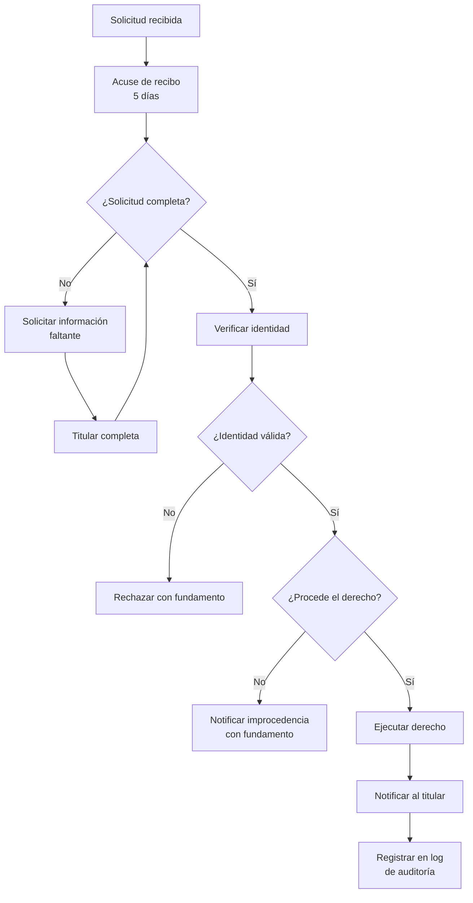
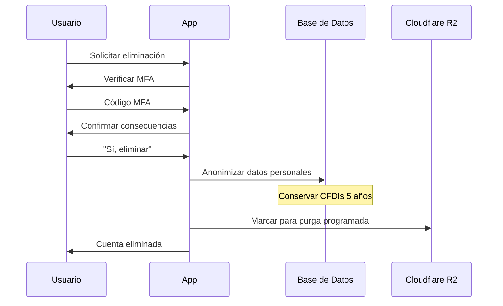

# 8.1.3 Derechos ARCO

> Acceso, Rectificación, Cancelación, Oposición

---

## I. DERECHOS DEL TITULAR

### Resumen de Derechos

| Derecho | Descripción | Ejemplo |
|---------|-------------|---------|
| **A**cceso | Conocer qué datos tenemos | "¿Qué datos míos tienen almacenados?" |
| **R**ectificación | Corregir datos inexactos | "Mi número de teléfono cambió" |
| **C**ancelación | Solicitar eliminación | "Quiero borrar mi cuenta y datos" |
| **O**posición | Negarse a tratamiento específico | "No quiero recibir promociones" |

---

## II. CANALES DE SOLICITUD

### Canal Principal: Email

| Aspecto | Detalle |
|---------|---------|
| Email | **arco@onlycar.mx** |
| Horario | 24/7 (respuesta en horario hábil) |
| Idioma | Español |

### Canal Secundario: Panel de Usuario

| URL | https://app.onlycar.mx/mi-cuenta |
|-----|--------------------------------------|
| Operaciones self-service | Acceso, Rectificación parcial, Oposición a marketing |

### Formato de Solicitud

Descargar en: https://onlycar.mx/formato-arco

---

## III. REQUISITOS DE SOLICITUD

### Información Obligatoria

| Requisito | Descripción | Validación |
|-----------|-------------|------------|
| Nombre completo | Nombre del titular | Debe coincidir con cuenta |
| Email registrado | Correo de la cuenta | Se valida en BD |
| Derecho a ejercer | A, R, C u O | Selección obligatoria |
| Descripción clara | Qué solicita específicamente | Texto libre |
| Identificación | INE/Pasaporte vigente | Adjunto obligatorio |

### Información Adicional (según derecho)

| Derecho | Información Extra |
|---------|-------------------|
| Rectificación | Dato actual + Dato correcto |
| Cancelación | Confirmación de entendimiento de consecuencias |
| Oposición | Finalidad específica a la que se opone |

---

## IV. PLAZOS DE RESPUESTA

### Plazos Legales (LFPDPPP)

| Etapa | Plazo | Conteo |
|-------|-------|--------|
| Acuse de recibo | 5 días hábiles | Desde recepción |
| Respuesta a solicitud | 20 días hábiles | Desde solicitud completa |
| Ejecución del derecho | 15 días hábiles | Desde notificación de procedencia |

### Extensiones

| Caso | Extensión Máxima | Condición |
|------|------------------|-----------|
| Complejidad alta | +20 días hábiles | Justificación al titular |
| Volumen de datos | +10 días hábiles | Justificación al titular |

---

## V. PROCESO INTERNO

### Diagrama de Flujo



### Estados de Solicitud

| Estado | Descripción |
|--------|-------------|
| `recibida` | Solicitud ingresada al sistema |
| `en_validacion` | Verificando identidad y requisitos |
| `pendiente_info` | Esperando información del titular |
| `en_proceso` | Evaluando procedencia |
| `aprobada` | Derecho procedente, en ejecución |
| `rechazada` | Derecho no procedente |
| `completada` | Derecho ejecutado |

---

## VI. OPERACIONES EN PANEL DE USUARIO

### Self-Service Disponible

| Operación | Derecho | Requiere Verificación |
|-----------|---------|----------------------|
| Ver mis datos | Acceso | ✅ Login |
| Editar teléfono | Rectificación | ✅ MFA |
| Editar email | Rectificación | ✅ MFA + Confirmación |
| Desactivar marketing | Oposición | ✅ Login |
| Eliminar cuenta | Cancelación | ✅ MFA + Confirmación |

### Flujo de Eliminación de Cuenta



---

## VII. EXCEPCIONES

### Casos donde NO procede la Cancelación

| Caso | Fundamento | Período |
|------|------------|---------|
| Facturas CFDI | CFF Art. 30 | 5 años |
| Contratos firmados | Código Civil | 10 años |
| Litigio pendiente | LFPDPPP Art. 34 | Hasta resolución |
| Obligaciones legales | LFPDPPP Art. 34 | Según ley aplicable |

### Casos donde NO procede la Oposición

| Caso | Fundamento |
|------|------------|
| Tratamiento esencial para el servicio | LFPDPPP Art. 34 |
| Obligación legal | LFPDPPP Art. 34 |

---

## VIII. DATOS EN TERCEROS

### Stripe

| Aspecto | Detalle |
|---------|---------|
| Datos | Pagos, bancarios |
| Cómo ejercer ARCO | Contactar a Stripe directamente |
| URL | https://stripe.com/privacy |

### Gigstack

| Aspecto | Detalle |
|---------|---------|
| Datos | Fiscales (RFC, Razón Social) |
| Cómo ejercer ARCO | Contactar a Gigstack |
| Email | privacidad@gigstack.com |

### Mifiel

| Aspecto | Detalle |
|---------|---------|
| Datos | Certificados digitales |
| Cómo ejercer ARCO | Contactar a Mifiel |
| URL | https://mifiel.com/privacidad |

---

## IX. PLANTILLA DE RESPUESTAS

### Respuesta Positiva

```
Estimado/a [Nombre]:

En respuesta a su solicitud ARCO de fecha [Fecha], le comunicamos que:

Su solicitud de [Acceso/Rectificación/Cancelación/Oposición] ha sido 
APROBADA.

[Detalles de la acción realizada]

La ejecución se completará en un plazo máximo de 15 días hábiles.

Atentamente,
Área de Privacidad
OnlyCar
```

### Respuesta Negativa

```
Estimado/a [Nombre]:

En respuesta a su solicitud ARCO de fecha [Fecha], le comunicamos que:

Su solicitud de [Derecho] NO puede ser ejecutada debido a:

[Fundamento legal específico]

Si no está de acuerdo con esta resolución, puede:
1. Presentar nuevos elementos
2. Acudir ante la Secretaría Anticorrupción y Buen Gobierno

Atentamente,
Área de Privacidad
OnlyCar
```

---

## Navegación

| ⬆️ Padre | [[Proyecto OnlyCarNLD/Datos/8.1 privacidad]] |
|----------|---------------------|
| ⬅️ Hermano anterior | [[Proyecto OnlyCarNLD/Datos/8.1.2 politica_cookies]] |

---
