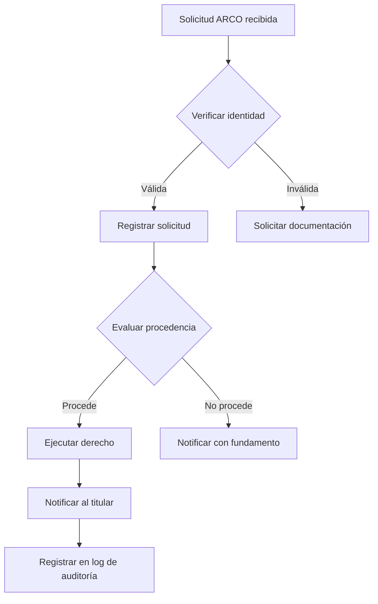

# 8.3.1 Cumplimiento LFPDPPP

> Ley Federal de Protección de Datos Personales en Posesión de los Particulares (2025)

> [!IMPORTANT]
> **Cambio Normativo 2025**
> La LFPDPPP fue actualizada y publicada el **20 de marzo de 2025**, reemplazando al INAI por la Secretaría Anticorrupción y Buen Gobierno.

---

## I. AUTORIDAD COMPETENTE

### Cambio de Autoridad (2025)

| Antes (Pre-2025) | Después (2025+) |
|------------------|-----------------|
| INAI (Instituto Nacional de Transparencia) | Secretaría Anticorrupción y Buen Gobierno |

> Toda documentación legal de OnlyCar debe reflejar este cambio.

### Funciones de la Autoridad

| Función | Descripción |
|---------|-------------|
| Vigilancia | Supervisar cumplimiento de la ley |
| Sanciones | Imponer multas por incumplimiento |
| Orientación | Publicar lineamientos y criterios |
| Quejas | Recibir quejas de titulares |

---

## II. PRINCIPIOS DE LA LFPDPPP

OnlyCar implementa los 8 principios rectores:

### 2.1 Licitud

| Principio | Implementación OnlyCar |
|-----------|------------------------|
| Tratamiento conforme a ley | ✅ Solo tratamientos con base legal |
| No actividades ilícitas | ✅ Sin uso para fines ilegales |

### 2.2 Consentimiento

| Principio | Implementación OnlyCar |
|-----------|------------------------|
| Autorización del titular | ✅ Checkbox explícito en registro |
| Evidencia de consentimiento | ✅ Timestamp, IP, versión del aviso |
| Revocable | ✅ Opción en panel de usuario |

### 2.3 Información

| Principio | Implementación OnlyCar |
|-----------|------------------------|
| Aviso de privacidad | ✅ [[Proyecto OnlyCarNLD/Datos/8.1.1 aviso_privacidad]] |
| Finalidades claras | ✅ Listadas en el aviso |
| Transferencias informadas | ✅ Stripe, Gigstack, Mifiel declarados |

### 2.4 Calidad

| Principio | Implementación OnlyCar |
|-----------|------------------------|
| Datos exactos | ✅ Validación en registro |
| Datos actualizados | ✅ Perfil editable por usuario |
| Datos completos | ✅ Campos obligatorios marcados |

### 2.5 Finalidad

| Principio | Implementación OnlyCar |
|-----------|------------------------|
| Propósitos declarados | ✅ 8 finalidades en aviso |
| No uso para otros fines | ✅ Arquitectura RLS lo impide |
| Eliminación post-finalidad | ✅ Política de retención |

### 2.6 Lealtad

| Principio | Implementación OnlyCar |
|-----------|------------------------|
| Sin engaño o dolo | ✅ Lenguaje claro en documentos |
| Expectativas razonables | ✅ Tratamiento esperado por usuario |

### 2.7 Proporcionalidad

| Principio | Implementación OnlyCar |
|-----------|------------------------|
| Solo datos necesarios | ✅ Campos mínimos requeridos |
| No datos excesivos | ✅ Sin recolección innecesaria |

### 2.8 Responsabilidad

| Principio | Implementación OnlyCar |
|-----------|------------------------|
| Medidas de seguridad | ✅ Técnicas y administrativas |
| Responder por tratamiento | ✅ Contacto de privacidad activo |
| Encargados controlados | ✅ Contratos DPA |

---

## III. OBLIGACIONES DEL RESPONSABLE

### 3.1 Documentación Obligatoria

| Documento | Estado | Ubicación |
|-----------|--------|-----------|
| Aviso de Privacidad Integral | ✅ Implementado | [[Proyecto OnlyCarNLD/Datos/8.1.1 aviso_privacidad]] |
| Aviso de Privacidad Simplificado | ⏳ Pendiente | Para QR/físico |
| Política de Cookies | ✅ Implementado | [[Proyecto OnlyCarNLD/Datos/8.1.2 politica_cookies]] |
| Política de Retención | ✅ Implementado | [[Proyecto OnlyCarNLD/Datos/8.5.1 politica_retencion]] |
| Procedimiento ARCO | ✅ Implementado | [[Proyecto OnlyCarNLD/Datos/8.1.3 derechos_arco]] |

### 3.2 Medidas de Seguridad (Art. 19)

#### Medidas Técnicas

| Medida | Estado | Detalle |
|--------|--------|---------|
| Encriptación en tránsito | ✅ | TLS 1.3 |
| Encriptación en reposo | ✅ | AES-256 (Supabase) |
| Control de acceso | ✅ | RBAC + RLS |
| Autenticación fuerte | ✅ | MFA habilitado |
| Respaldos | ✅ | Diarios, encriptados |
| Firewall | ✅ | Cloudflare WAF |
| Monitoreo | ✅ | Logs de auditoría |

#### Medidas Administrativas

| Medida | Estado | Detalle |
|--------|--------|---------|
| Política de seguridad | ✅ | Documentada |
| Capacitación | ⏳ | Anual, programada |
| Auditorías | ⏳ | Trimestrales, programadas |
| Plan de respuesta | ✅ | Incidentes documentado |
| Acceso restringido | ✅ | Solo personal autorizado |

### 3.3 Logs de Auditoría (Art. 61)

| Requisito | Implementación |
|-----------|----------------|
| Registrar operaciones con datos | ✅ Supabase audit logs |
| Conservación mínima | 12 meses |
| Protección contra alteración | ✅ Write-once storage |
| Timestamps criptográficos | ✅ Implementados |

---

## IV. TRANSFERENCIAS Y ENCARGADOS

### 4.1 Transferencias Autorizadas

| Proveedor | Tipo | Base Legal | DPA |
|-----------|------|------------|-----|
| Stripe Inc. | Procesador | Contractual | ⏳ Pendiente |
| Gigstack | Encargado | Legal (CFF) | ⏳ Pendiente |
| Mifiel | Procesador | Contractual | PSC Acreditado |
| Cloudflare | Encargado | Contractual | ⏳ Requiere Pro |
| Supabase | Encargado | Contractual | ✅ Disponible Free |

### 4.2 Contratos DPA Requeridos

```
Estado de Contratos DPA:

┌─────────────┬────────────────────────────────────────────┐
│ Stripe      │ ⏳ Solicitar antes de producción           │
├─────────────┼────────────────────────────────────────────┤
│ Gigstack    │ ⏳ Firmar Contrato de Encargado            │
├─────────────┼────────────────────────────────────────────┤
│ Mifiel      │ ✅ PSC Acreditado (equivalente)            │
├─────────────┼────────────────────────────────────────────┤
│ Cloudflare  │ ⚠️ Requiere plan Pro ($20 USD/mes)        │
├─────────────┼────────────────────────────────────────────┤
│ Supabase    │ ⏳ Solicitar DPA (disponible en Free)      │
└─────────────┴────────────────────────────────────────────┘
```

---

## V. DERECHOS ARCO

### 5.1 Implementación

| Derecho | Canal | Plazo | Panel Usuario |
|---------|-------|-------|---------------|
| Acceso | arco@onlycar.mx | 20 días | ✅ Sí |
| Rectificación | arco@onlycar.mx | 20 días | ✅ Sí |
| Cancelación | arco@onlycar.mx | 20 días | ✅ Sí |
| Oposición | arco@onlycar.mx | 20 días | ✅ Sí |

### 5.2 Proceso Interno



### 5.3 Excepciones a Cancelación

| Caso | Base Legal |
|------|------------|
| CFDIs por 5 años | CFF Art. 30 |
| Contratos firmados | Código Civil |
| Obligaciones legales pendientes | LFPDPPP Art. 34 |
| Disputas activas | Evidencia procesal |

---

## VI. SANCIONES POR INCUMPLIMIENTO

### 6.1 Tipos de Infracciones

| Tipo | Descripción | Multa (UMAS) |
|------|-------------|--------------|
| Leves | No dar trámite ARCO | 100 - 160,000 |
| Graves | Tratar datos sin aviso | 200 - 320,000 |
| Muy graves | Transferencias no autorizadas | 200 - 320,000 |

### 6.2 Valor de Referencia

| Año | Valor UMA | Multa Máxima |
|-----|-----------|--------------|
| 2025 | $108.57 MXN | ~$34.7M MXN |
| 2026 | ~$115 MXN | ~$36.8M MXN |

> [!WARNING]
> Las multas pueden duplicarse en caso de reincidencia.

---

## VII. CHECKLIST DE CUMPLIMIENTO

### Pre-Producción

- [x] Aviso de privacidad integral redactado
- [x] Aviso ajustado a LFPDPPP 2025 (nueva autoridad)
- [x] Finalidades claramente definidas
- [x] Transferencias declaradas (Stripe, Gigstack, Mifiel)
- [x] Proceso ARCO definido
- [x] Panel de usuario con opciones de privacidad
- [ ] DPA con Stripe solicitado
- [ ] DPA con Gigstack firmado
- [ ] DPA con Supabase solicitado

### Post-Lanzamiento

- [ ] Auditoría trimestral programada
- [ ] Capacitación anual programada
- [ ] Logs de auditoría verificados
- [ ] Prueba de proceso ARCO realizada
- [ ] Monitoreo de actualizaciones normativas activo

---

## VIII. MONITOREO NORMATIVO

### Fuentes a Vigilar

| Fuente | Frecuencia | Responsable |
|--------|------------|-------------|
| DOF (Diario Oficial de la Federación) | Diario | Automatizado |
| Secretaría Anticorrupción | Semanal | Manual |
| Comunicados SAT | Semanal | Manual |
| Actualizaciones proveedores | Mensual | Manual |

### Alertas Configuradas

- Cambios en LFPDPPP
- Nuevos lineamientos de la autoridad
- Actualizaciones de catálogos SAT
- Cambios en términos de proveedores

---

## Navegación

| ⬆️ Padre | [[Proyecto OnlyCarNLD/Datos/8.3 cumplimiento_regulatorio]] |
|----------|-----------------------------------|
| ➡️ Hermano siguiente | [[Proyecto OnlyCarNLD/Datos/8.3.2 cumplimiento_cff]] |

---

## Referencias

| Documento | Relación |
|-----------|----------|
| [[Proyecto OnlyCarNLD/Datos/5.4. cumplimiento_legal_fiscal]] | Fuente original del aviso |
| [[Proyecto OnlyCarNLD/Datos/8.1.1 aviso_privacidad]] | Aviso implementado |
| [[Proyecto OnlyCarNLD/Datos/8.1.3 derechos_arco]] | Proceso ARCO |
| [[Proyecto OnlyCarNLD/Datos/8.5.1 politica_retencion]] | Tiempos de conservación |

---
