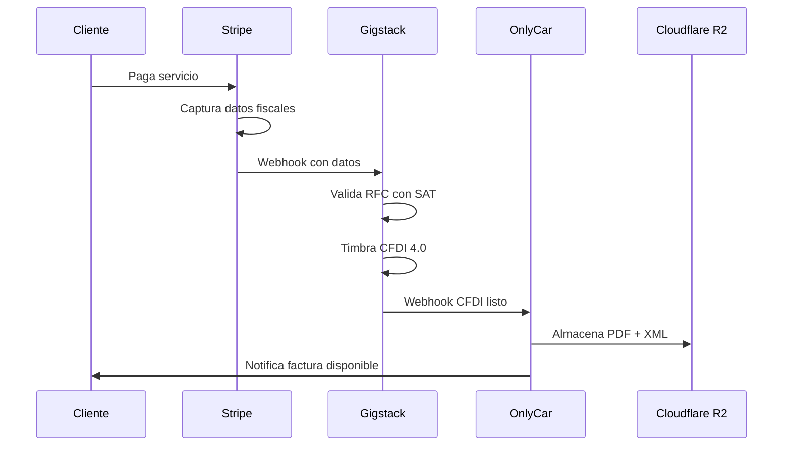

# 8.3.2 Cumplimiento CFF

> Código Fiscal de la Federación - Obligaciones Fiscales

---

## I. MODELO DE FACTURACIÓN ONLYCAR

### Flujo de Facturación Automatizada



### Roles y Responsabilidades

| Actor | Función | Responsabilidad Fiscal |
|-------|---------|----------------------|
| **Stripe** | Captura datos fiscales del cliente | Procesador de pagos (no fiscal) |
| **Gigstack** | Timbra CFDIs como PAC autorizado | Responsable ante SAT |
| **OnlyCar** | Almacena y conserva CFDIs | Conservación 5 años |
| **Cliente** | Proporciona datos fiscales | Veracidad de datos |

---

## II. CFDI 4.0

### Datos Requeridos del Cliente

| Campo | Capturado Por | Obligatorio |
|-------|---------------|-------------|
| RFC | Stripe | ✅ Sí |
| Razón Social | Stripe | ✅ Sí |
| Régimen Fiscal | Stripe | ✅ Sí |
| Código Postal Fiscal | Stripe | ✅ Sí |
| Uso de CFDI | Stripe | ✅ Sí |

### Uso de CFDI Aplicable

| Tipo de Cliente | Uso CFDI |
|-----------------|----------|
| Persona Física (consumo personal) | G03 - Gastos en general |
| Persona Moral (empresa) | G03 - Gastos en general |
| Flotilla corporativa | G03 - Gastos en general |

### Catálogo de Productos/Servicios

| Clave SAT | Descripción | Aplicación |
|-----------|-------------|------------|
| 81161700 | Servicios de limpieza vehicular | Servicio de lavado |

---

## III. RÉGIMEN DE PLATAFORMAS TECNOLÓGICAS

### Obligaciones de OnlyCar como Plataforma

| Obligación | Fundamento | Frecuencia |
|------------|------------|------------|
| Retener ISR a operadores | Art. 113-A LISR | Por transacción |
| Retener IVA a operadores | Art. 18-J LIVA | Por transacción |
| Enterar retenciones | Art. 113-A LISR | Mensual (día 17) |
| Emitir constancias | Art. 113-B LISR | Anual |
| Reportar operaciones | Regla 12.2.8 RMF | Mensual |

### Tasas de Retención

#### ISR (Según ingresos mensuales del operador)

| Ingreso Mensual | Tasa ISR |
|-----------------|----------|
| Hasta $25,000 | 1.0% |
| $25,001 - $40,000 | 1.1% |
| $40,001 - $50,000 | 1.4% |
| Más de $50,000 | 2.1% |

#### IVA

| Concepto | Tasa |
|----------|------|
| Retención IVA servicios | 8% |

### Cálculo de Retenciones (Ejemplo)

> Ejemplo con operador nivel **Esmeralda** (58% comisión según [[Proyecto OnlyCarNLD/Datos/3.1.8.1.2 escala_experiencia]])

```
Servicio de lavado: $350 MXN

Distribución según escala de comisiones:
Comisión operador (58%):       $203.00
Comisión OnlyCar (42%):        $147.00

Sobre el pago al operador ($203.00):
Retención ISR (1%):            -$2.03
Retención IVA (8%):            -$16.24
────────────────────────────────────────
Ingreso neto operador:         $184.73
```

> [!NOTE]
> La comisión del operador varía de **43% a 73%** según su nivel de experiencia.
> Ver [[Proyecto OnlyCarNLD/Datos/3.1.8.1.1 comision_hibrida]] para el modelo híbrido garantía + variable.

---

## IV. CONSERVACIÓN DE DOCUMENTOS

### Obligación Legal (Art. 30 CFF)

> Los contribuyentes deberán conservar en su domicilio fiscal la contabilidad y documentación comprobatoria por un plazo de **5 años**, contados a partir de la fecha en que se presentaron o debieron haberse presentado las declaraciones con ellas relacionadas.

### Implementación OnlyCar

| Documento | Período | Ubicación | Formato |
|-----------|---------|-----------|---------|
| CFDIs emitidos | 5 años | Cloudflare R2 | PDF + XML |
| CFDIs recibidos | 5 años | Cloudflare R2 | PDF + XML |
| Acuses de declaraciones | 5 años | Drive seguro | PDF |
| Constancias de retención | 5 años | Cloudflare R2 | PDF |

### Estructura de Almacenamiento

```
r2://onlycar-documentos/
├── cfdi/
│   ├── 2026/
│   │   ├── 01/
│   │   │   ├── CFDI-UUID-12345.pdf
│   │   │   └── CFDI-UUID-12345.xml
│   │   └── 02/
│   └── 2027/
├── constancias/
│   └── 2026/
│       └── operador_RFC_anual.pdf
└── acuses/
    └── declaraciones/
```

### Encriptación y Seguridad

| Medida | Implementación |
|--------|----------------|
| Encriptación en reposo | AES-256 (Cloudflare R2) |
| Encriptación en tránsito | TLS 1.3 |
| Acceso | URLs firmadas con expiración |
| Respaldos | Redundancia geográfica |

---

## V. DECLARACIONES OBLIGATORIAS

### Calendario Fiscal OnlyCar

| Declaración | Fundamento | Periodicidad | Día Límite |
|-------------|------------|--------------|------------|
| ISR retenciones | Art. 113-A | Mensual | 17 |
| IVA retenciones | Art. 18-J | Mensual | 17 |
| Informativa plataformas | RMF 12.2.8 | Mensual | 17 |
| Constancias retención | Art. 113-B | Anual | Febrero |
| Declaración anual | Art. 152 | Anual | Marzo 31 |

### Información a Reportar (Mensual)

| Campo | Descripción |
|-------|-------------|
| RFC operador | Identificación |
| Ingresos brutos | Total pagado al operador |
| Retención ISR | Monto retenido |
| Retención IVA | Monto retenido |
| Comisiones cobradas | Ingreso de OnlyCar |

---

## VI. OBLIGACIONES DEL OPERADOR

### Alta en SAT

| Requisito | Obligatorio |
|-----------|-------------|
| RFC activo | ✅ Sí |
| Régimen plataformas tecnológicas | ✅ Recomendado |
| e.firma activa | ⚠️ Recomendado |
| Buzón tributario activo | ✅ Sí |

### Opciones de Régimen

| Régimen | Aplicabilidad | Ventajas |
|---------|--------------|----------|
| **Plataformas Tecnológicas** | Ingresos < $300K anuales | Tasas reducidas, sin declaración |
| **RESICO** | Ingresos < $3.5M anuales | ISR 1-2.5%, simplificado |
| **Actividad Empresarial** | Sin límite | Deducciones posibles |

### Comprobación ante SAT

OnlyCar puede verificar la situación fiscal del operador mediante:

| Servicio SAT | Uso |
|--------------|-----|
| Verificación de RFC | Confirmar que RFC es válido |
| Estatus contribuyente | Verificar que no esté cancelado |
| Lista negra 69-B | Verificar que no esté en lista negra |

---

## VII. FACTURACIÓN DE COMISIONES

### Diagrama de Facturación

```
┌─────────────────────────────────────────────────────────────────┐
│                    FLUJO DE FACTURACIÓN                         │
├─────────────────────────────────────────────────────────────────┤
│                                                                 │
│  Cliente paga $350 → Stripe                                     │
│                          │                                      │
│                          ▼                                      │
│  Gigstack emite CFDI $350 → Cliente                            │
│  (Lavado vehicular, IVA incluido)                              │
│                          │                                      │
│                          ▼                                      │
│  OnlyCar factura comisión $70 + IVA → Operador                 │
│  (Servicios de intermediación)                                  │
│                          │                                      │
│                          ▼                                      │
│  OnlyCar retiene ISR e IVA del pago al operador                │
│                                                                 │
└─────────────────────────────────────────────────────────────────┘
```

### CFDI de Comisión

| Campo | Valor |
|-------|-------|
| Emisor | OnlyCar |
| Receptor | Operador (RFC) |
| Concepto | Servicios de intermediación tecnológica |
| Clave SAT | 80141600 - Servicios de agencias |
| Monto | Comisión + IVA |

---

## VIII. CHECKLIST DE CUMPLIMIENTO

### Pre-Lanzamiento

- [x] PAC autorizado contratado (Gigstack)
- [x] CSD del emisor configurado
- [x] Catálogo SAT de productos configurado
- [x] Webhooks de facturación probados
- [x] Almacenamiento R2 configurado
- [ ] Proceso de declaraciones definido
- [ ] Contador contratado/asignado

### Operación Continua

- [ ] Declaraciones mensuales al día
- [ ] Constancias anuales emitidas
- [ ] Verificación de RFCs de operadores
- [ ] Monitoreo de cambios en RMF

---

## IX. RIESGOS Y MITIGACIONES

| Riesgo | Probabilidad | Impacto | Mitigación |
|--------|--------------|---------|------------|
| No timbrar CFDI | Media | Alto | Automatización con Gigstack |
| RFC inválido del cliente | Alta | Medio | Validación con SAT antes de timbrar |
| Pérdida de CFDIs | Baja | Crítico | Respaldos redundantes en R2 |
| Declaración tardía | Media | Alto | Calendario con alertas |
| Operador sin RFC | Media | Medio | Validación obligatoria en registro |

---

## Navegación

| ⬆️ Padre | [[Proyecto OnlyCarNLD/Datos/8.3 cumplimiento_regulatorio]] |
|----------|-----------------------------------|
| ⬅️ Hermano anterior | [[Proyecto OnlyCarNLD/Datos/8.3.1 lfpdppp]] |
| ➡️ Hermano siguiente | [[Proyecto OnlyCarNLD/Datos/8.3.3 cumplimiento_lft]] |

---

## Referencias

| Documento | Relación |
|-----------|----------|
| [[Proyecto OnlyCarNLD/Datos/5.4. cumplimiento_legal_fiscal]] | Aviso de privacidad fiscal |
| [[Proyecto OnlyCarNLD/Datos/5.2. gigstack_facturacion]] | Integración técnica |
| [[Proyecto OnlyCarNLD/Datos/3.1.8.1 modelo_comision]] | Cálculo de comisiones |

---
