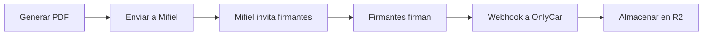

# 8.4 Contratos y Firmas

> Gestión de documentos contractuales con firma electrónica.

---

## I. TIPOS DE CONTRATOS

| Tipo | Audiencia | Firma | Frecuencia |
|------|-----------|-------|------------|
| Contrato Operador | Operadores | Mifiel | Registro |
| Contrato B2B | Empresas | Mifiel | Por cliente |
| NDA | Empleados/Socios | Mifiel | Según necesidad |
| DPA Encargado | Proveedores | Mifiel | Por proveedor |

---

## II. PROVEEDOR DE FIRMA

| Aspecto | Detalle |
|---------|---------|
| Proveedor | Mifiel |
| Tipo | PSC Acreditado |
| Acreditación | Secretaría de Economía |
| Validez | Equivalente a firma autógrafa |
| Certificados | e.firma / FIEL del SAT |

---

## III. FLUJO DE FIRMA

---

## IV. ALMACENAMIENTO

| Aspecto | Detalle |
|---------|---------|
| Ubicación | Cloudflare R2 |
| Formato | PDF con firmas embebidas |
| Encriptación | AES-256 server-side |
| Retención | Permanente |

---

## V. ESTRUCTURA DE HIJOS

| ID | Nombre | Descripción | Estado |
|----|--------|-------------|--------|
| [[Proyecto OnlyCarNLD/Datos/8.4.1 plantillas_contratos\|8.4.1]] | Plantillas | Catálogo de plantillas | ✅ Activo |
| [[Proyecto OnlyCarNLD/Datos/8.4.2 firma_digital_mifiel\|8.4.2]] | Mifiel | Integración técnica | ✅ Activo |

---

## Navegación

| ⬆️ Padre | [[Proyecto OnlyCarNLD/Datos/8.0. legal_cumplimiento]] |
|----------|------------------------------|
| ⬅️ Hermano anterior | [[Proyecto OnlyCarNLD/Datos/8.3 cumplimiento_regulatorio]] |
| ➡️ Hermano siguiente | [[Proyecto OnlyCarNLD/Datos/8.5 retencion_datos]] |

---
