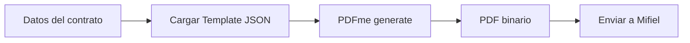

# 8.4.1 Plantillas de Contratos

> Catálogo de documentos tipo para firma digital.

---

## I. CATÁLOGO DE PLANTILLAS

| ID | Nombre | Audiencia | Variables |
|----|--------|-----------|-----------|
| TPL-001 | Contrato Operador | Operadores | Datos fiscales, comisión |
| TPL-002 | Contrato B2B | Empresas | RFC, condiciones pago |
| TPL-003 | NDA | Empleados/Socios | Partes, período |
| TPL-004 | DPA Encargado | Proveedores | Datos, finalidades |

---

## II. SISTEMA DE VARIABLES

### Sintaxis (Handlebars)

```handlebars
Nombre: {{operatorName}}
RFC: {{operatorRfc}}
Fecha: {{formatDate signDate "DD/MM/YYYY"}}
```

### Variables Globales

| Variable | Descripción | Ejemplo |
|----------|-------------|---------|
| `{{currentDate}}` | Fecha actual | 26/01/2026 |
| `{{companyName}}` | OnlyServices MX S.A. de C.V. | - |
| `{{companyRfc}}` | RFC de OnlyCar | XXXX000000XXX |
| `{{companyAddress}}` | Domicilio fiscal | Nuevo Laredo, Tam. |

---

## III. PLANTILLA: CONTRATO OPERADOR (TPL-001)

### Variables Específicas

| Variable | Tipo | Obligatorio |
|----------|------|-------------|
| `{{operatorName}}` | String | ✅ |
| `{{operatorRfc}}` | String | ✅ |
| `{{operatorAddress}}` | String | ✅ |
| `{{operatorEmail}}` | String | ✅ |
| `{{commissionRate}}` | Number | ✅ |
| `{{signDate}}` | Date | ✅ |

### Extracto del Template

```handlebars
CONTRATO DE PRESTACIÓN DE SERVICIOS PROFESIONALES

En la Ciudad de Nuevo Laredo, Tamaulipas, a {{formatDate signDate}}, 
comparecen:

Por una parte, {{companyName}}, representada por su representante legal,
con domicilio en {{companyAddress}} y RFC {{companyRfc}}, en adelante
"OnlyCar".

Por otra parte, {{operatorName}}, con domicilio en {{operatorAddress}},
RFC {{operatorRfc}}, en adelante "El Operador".

...

QUINTA. COMISIONES

El Operador recibirá el {{subtract 100 commissionRate}}% del valor de 
cada servicio completado, siendo la comisión de OnlyCar del 
{{commissionRate}}%.
```

---

## IV. PLANTILLA: CONTRATO B2B (TPL-002)

### Variables Específicas

| Variable | Tipo | Obligatorio |
|----------|------|-------------|
| `{{clientName}}` | String | ✅ |
| `{{clientRfc}}` | String | ✅ |
| `{{clientAddress}}` | String | ✅ |
| `{{paymentTerms}}` | Number (días) | ✅ |
| `{{pricePerVehicle}}` | Number | ✅ |
| `{{fleetSize}}` | Number | ❌ |

---

## V. PLANTILLA: NDA (TPL-003)

### Variables Específicas

| Variable | Tipo | Obligatorio |
|----------|------|-------------|
| `{{partyName}}` | String | ✅ |
| `{{partyRole}}` | String | ✅ |
| `{{confidentialityPeriod}}` | Number (años) | ✅ |

---

## VI. PLANTILLA: DPA ENCARGADO (TPL-004)

### Variables Específicas

| Variable | Tipo | Obligatorio |
|----------|------|-------------|
| `{{processorName}}` | String | ✅ |
| `{{dataTypes}}` | Array | ✅ |
| `{{purposes}}` | Array | ✅ |
| `{{retentionPeriod}}` | String | ✅ |

---

## VII. GENERACIÓN DE PDF CON PDFme

> Ver integración completa en [[Proyecto OnlyCarNLD/Datos/5.7. pdfme_generacion]]

### Flujo



### Por qué PDFme

| Alternativa | Problema | PDFme |
|-------------|----------|-------|
| Puppeteer | Pesado, HTML→PDF | ✅ Nativo PDF |
| PDF-lib | Bajo nivel, complejo | ✅ Plantillas JSON |
| DocuSign | Costo por documento | ✅ Open source (MIT) |

### Código de Generación

```typescript
// lib/contracts/generator.ts
// Usando PDFme según [[5.7. pdfme_generacion]]

import { generate } from '@pdfme/generator';
import { loadTemplate } from '@/lib/templates';

interface ContractData {
  operatorName: string;
  operatorRfc: string;
  operatorAddress: string;
  operatorEmail: string;
  commissionRate: number;
  signDate: string;
}

export async function generateContract(
  templateId: string, 
  data: ContractData
): Promise<Buffer> {
  // Cargar template JSON (NO HTML)
  const template = await loadTemplate(templateId);
  
  // Preparar inputs para PDFme
  const inputs = [{
    numero_contrato: generarNumeroContrato(),
    fecha_generacion: formatDate(new Date()),
    operador_nombre: data.operatorName,
    operador_rfc: data.operatorRfc,
    operador_direccion: data.operatorAddress,
    operador_email: data.operatorEmail,
    comision_porcentaje: data.commissionRate.toString(),
    fecha_firma: data.signDate,
    // Variables globales
    empresa_nombre: 'OnlyServices MX S.A. de C.V.',
    empresa_rfc: process.env.EMISOR_RFC,
    empresa_direccion: process.env.EMISOR_DIRECCION,
  }];
  
  // Generar PDF con PDFme (nativo, sin HTML intermedio)
  const pdfBuffer = await generate({ template, inputs });
  
  return Buffer.from(pdfBuffer);
}

function generarNumeroContrato(): string {
  const now = new Date();
  const year = now.getFullYear();
  const month = String(now.getMonth() + 1).padStart(2, '0');
  const random = Math.random().toString(36).substring(2, 8).toUpperCase();
  return `CONT-OP-${year}-${month}-${random}`;
}

function formatDate(date: Date): string {
  return date.toLocaleDateString('es-MX', {
    day: 'numeric',
    month: 'long',
    year: 'numeric'
  });
}
```

### Template JSON (Ejemplo)

```json
{
  "basePdf": "contrato_operador_base.pdf",
  "schemas": [
    {
      "numero_contrato": {
        "type": "text",
        "position": { "x": 450, "y": 40 },
        "width": 120,
        "height": 12,
        "fontSize": 10
      },
      "operador_nombre": {
        "type": "text",
        "position": { "x": 100, "y": 180 },
        "width": 300,
        "height": 15,
        "fontSize": 12,
        "fontWeight": "bold"
      }
    }
  ]
}
```

---

## Navegación

| ⬆️ Padre | [[Proyecto OnlyCarNLD/Datos/8.4 contratos_firmas]] |
|----------|---------------------------|
| ➡️ Hermano siguiente | [[Proyecto OnlyCarNLD/Datos/8.4.2 firma_digital_mifiel]] |

---
