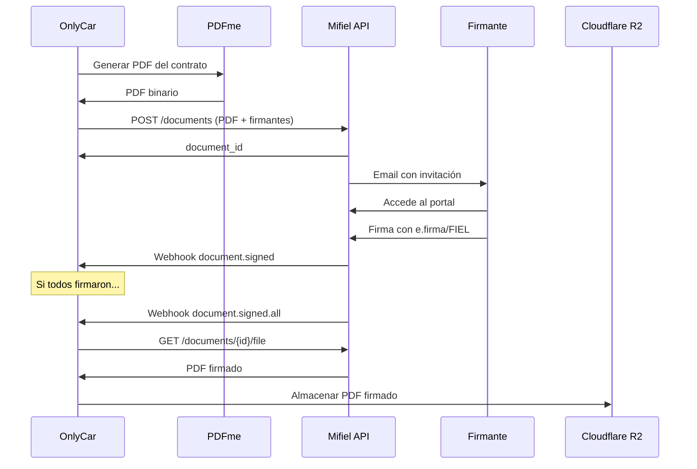

# 8.4.2 Firma Digital (Mifiel)

> Integración con Mifiel para firma electrónica avanzada con validez legal.

---

## I. SOBRE MIFIEL

### Acreditación

| Aspecto | Detalle |
|---------|---------|
| Tipo | Prestador de Servicios de Certificación (PSC) |
| Acreditación | Secretaría de Economía |
| Validez | Firmas con plena validez jurídica |
| Marco Legal | Código de Comercio, Ley de Firma Electrónica Avanzada |

### Características

| Característica | Valor |
|----------------|-------|
| Tipo de firma | Electrónica Avanzada (equivalente a autógrafa) |
| Certificados | e.firma / FIEL del SAT |
| Custodia | Mifiel gestiona completamente |
| Integración | API REST |
| Webhook | Notificaciones en tiempo real |

---

## II. FLUJO DE FIRMA

### Diagrama de Secuencia



---

## III. CONFIGURACIÓN API

### Variables de Entorno

> Conforme a [[Proyecto OnlyCarNLD/Datos/5.3. mifiel_firmas]]

```bash
# .env
MIFIEL_APP_ID=your_app_id_here
MIFIEL_APP_SECRET=your_app_secret_here
MIFIEL_ENV=sandbox  # production en producción
MIFIEL_WEBHOOK_URL=https://onlycar.mx/api/webhooks/mifiel
```

### Cliente de Mifiel (TypeScript)

```typescript
// lib/mifiel/client.ts

import crypto from 'crypto';

interface MifielConfig {
  apiKey: string;
  secret: string;
  sandbox: boolean;
}

interface Signer {
  email: string;
  name: string;
  tax_id?: string; // RFC
}

interface CreateDocumentParams {
  file: Buffer;
  signers: Signer[];
  name: string;
  callback_url?: string;
  send_invites?: boolean;
}

export class MifielClient {
  private baseUrl: string;
  private apiKey: string;
  private secret: string;

  constructor(config: MifielConfig) {
    this.baseUrl = config.sandbox 
      ? 'https://sandbox.mifiel.com/api/v1'
      : 'https://app.mifiel.com/api/v1';
    this.apiKey = config.apiKey;
    this.secret = config.secret;
  }

  private sign(method: string, path: string, body: string = ''): string {
    const timestamp = new Date().toISOString();
    const contentMd5 = crypto.createHash('md5').update(body).digest('hex');
    const stringToSign = [method, contentMd5, 'application/json', timestamp, path].join('\n');
    return crypto.createHmac('sha1', this.secret).update(stringToSign).digest('base64');
  }

  async createDocument(params: CreateDocumentParams): Promise<{ id: string }> {
    const formData = new FormData();
    formData.append('file', new Blob([params.file]), params.name + '.pdf');
    formData.append('signatories', JSON.stringify(params.signers));
    formData.append('callback_url', params.callback_url || '');
    formData.append('send_invites', params.send_invites !== false ? 'true' : 'false');

    const response = await fetch(`${this.baseUrl}/documents`, {
      method: 'POST',
      headers: {
        'Authorization': `APIAuth ${this.apiKey}:${this.sign('POST', '/api/v1/documents')}`,
      },
      body: formData,
    });

    if (!response.ok) {
      throw new Error(`Mifiel error: ${response.status}`);
    }

    return response.json();
  }

  async getDocument(id: string): Promise<any> {
    const response = await fetch(`${this.baseUrl}/documents/${id}`, {
      headers: {
        'Authorization': `APIAuth ${this.apiKey}:${this.sign('GET', `/api/v1/documents/${id}`)}`,
      },
    });

    return response.json();
  }

  async downloadSignedDocument(id: string): Promise<Buffer> {
    const response = await fetch(`${this.baseUrl}/documents/${id}/file`, {
      headers: {
        'Authorization': `APIAuth ${this.apiKey}:${this.sign('GET', `/api/v1/documents/${id}/file`)}`,
      },
    });

    return Buffer.from(await response.arrayBuffer());
  }
}

// Singleton (usando variables según [[5.3. mifiel_firmas]])
export const mifiel = new MifielClient({
  apiKey: process.env.MIFIEL_APP_ID!,
  secret: process.env.MIFIEL_APP_SECRET!,
  sandbox: process.env.MIFIEL_ENV === 'sandbox',
});
```

---

## IV. GENERACIÓN DE CONTRATOS

> Ver [[Proyecto OnlyCarNLD/Datos/5.7. pdfme_generacion]] para integración completa de PDFme

### Generación de PDF con PDFme

```typescript
// lib/contracts/generator.ts
// Usando PDFme según [[5.7. pdfme_generacion]]

import { generate } from '@pdfme/generator';
import { loadTemplate } from '@/lib/templates';

interface ContractData {
  operatorName: string;
  operatorRfc: string;
  operatorAddress: string;
  commissionRate: number;
  signDate: string;
}

export async function generateContractPdf(
  templateId: string,
  data: ContractData
): Promise<Buffer> {
  // Cargar template JSON (NO HTML)
  const template = await loadTemplate(templateId);
  
  // Preparar inputs para PDFme
  const inputs = [{
    numero_contrato: generarNumeroContrato(),
    fecha_generacion: formatDate(new Date()),
    operador_nombre: data.operatorName,
    operador_rfc: data.operatorRfc,
    comision_porcentaje: data.commissionRate.toString(),
    fecha_firma: data.signDate,
  }];
  
  // Generar PDF con PDFme (nativo, sin HTML intermedio)
  const pdfBuffer = await generate({ template, inputs });
  
  return Buffer.from(pdfBuffer);
}
```

---

## V. WEBHOOKS

### Configuración de Endpoint

```typescript
// app/api/webhooks/mifiel/route.ts

import { NextRequest, NextResponse } from 'next/server';
import crypto from 'crypto';
import { db } from '@/lib/db';
import { mifiel } from '@/lib/mifiel/client';
import { uploadToR2 } from '@/lib/storage/r2';

export async function POST(request: NextRequest) {
  const body = await request.text();
  const signature = request.headers.get('X-Mifiel-Signature');

  // Verificar firma
  const expectedSignature = crypto
    .createHmac('sha256', process.env.MIFIEL_WEBHOOK_SECRET!)
    .update(body)
    .digest('hex');

  if (signature !== expectedSignature) {
    return NextResponse.json({ error: 'Invalid signature' }, { status: 401 });
  }

  const event = JSON.parse(body);

  switch (event.event) {
    case 'document.signed':
      // Un firmante firmó
      await db.contractSignatures.create({
        data: {
          contractId: event.document.id,
          signerEmail: event.signer.email,
          signedAt: new Date(event.signed_at),
        },
      });
      break;

    case 'document.signed.all':
      // Todos firmaron - descargar y almacenar
      const signedPdf = await mifiel.downloadSignedDocument(event.document.id);
      
      const r2Key = `contracts/${event.document.id}/signed.pdf`;
      await uploadToR2(r2Key, signedPdf, 'application/pdf');

      await db.contracts.update({
        where: { mifielId: event.document.id },
        data: { 
          status: 'signed',
          signedPdfUrl: r2Key,
          completedAt: new Date(),
        },
      });
      break;

    case 'document.declined':
      await db.contracts.update({
        where: { mifielId: event.document.id },
        data: { status: 'declined' },
      });
      break;
  }

  return NextResponse.json({ received: true });
}
```

### Eventos Disponibles

| Evento | Cuándo | Acción |
|--------|--------|--------|
| `document.signed` | Un firmante completa | Registrar firma parcial |
| `document.signed.all` | Todos los firmantes completan | Descargar PDF, almacenar en R2 |
| `document.declined` | Firmante rechaza | Marcar como rechazado |
| `document.expired` | Expiró sin firmas | Notificar, reintentar |

---

## VI. RATE LIMITING

### Límites por Endpoint

| Endpoint | Límite | Recuperación |
|----------|--------|--------------|
| POST /documents | 10/hora | 6 minutos |
| GET /documents | 100/hora | 36 segundos |
| GET /documents/{id}/file | 50/hora | 72 segundos |

### Implementación

```typescript
// lib/rate-limit/mifiel.ts

import { Ratelimit } from '@upstash/ratelimit';
import { Redis } from '@upstash/redis';

export const mifielRateLimit = new Ratelimit({
  redis: Redis.fromEnv(),
  limiter: Ratelimit.slidingWindow(10, '1 h'),
  analytics: true,
  prefix: 'mifiel',
});

// Uso antes de llamar a Mifiel
export async function checkMifielLimit(userId: string): Promise<boolean> {
  const { success, limit, remaining, reset } = await mifielRateLimit.limit(userId);
  
  if (!success) {
    throw new Error(`Rate limit exceeded. Try again in ${reset - Date.now()}ms`);
  }
  
  return true;
}
```

---

## VII. ALMACENAMIENTO DE CONTRATOS

### Estructura en R2

```
r2://onlycar-documentos/
├── contracts/
│   ├── {contract-id}/
│   │   ├── original.pdf      # PDF sin firmar
│   │   └── signed.pdf        # PDF con firmas
```

### Metadatos

```typescript
interface ContractMetadata {
  id: string;
  type: 'operator' | 'b2b' | 'nda';
  mifielId: string;
  createdAt: Date;
  signers: {
    email: string;
    name: string;
    signedAt?: Date;
  }[];
  status: 'pending' | 'signed' | 'declined' | 'expired';
  originalPdfUrl: string;
  signedPdfUrl?: string;
}
```

---

## VIII. VALIDEZ LEGAL

### Marco Legal

| Regulación | Artículo | Aplicación |
|------------|----------|------------|
| Código de Comercio | Art. 89-114 | Firma electrónica en actos mercantiles |
| Ley de Firma Electrónica Avanzada | Art. 3, 7 | Requisitos de firma avanzada |
| Código Civil Federal | Art. 1803 | Consentimiento expreso |

### Elementos de Validez

| Elemento | Cumplimiento |
|----------|--------------|
| Identificación del firmante | ✅ e.firma/FIEL del SAT |
| Integridad del documento | ✅ Hash SHA-256 |
| No repudio | ✅ Certificado vinculado |
| Timestamp | ✅ Sello de tiempo confiable |
| Custodia | ✅ Mifiel como PSC |

---

## IX. CHECKLIST DE IMPLEMENTACIÓN

### Pre-Producción

- [ ] API key de producción obtenida
- [ ] Webhook URL registrada en Mifiel
- [ ] Plantillas de contratos diseñadas
- [ ] Flujo de generación de PDF probado
- [ ] Almacenamiento R2 configurado
- [ ] Rate limiting configurado

### Pruebas

- [ ] Crear documento en sandbox
- [ ] Firmar con e.firma de prueba
- [ ] Verificar webhook de firma
- [ ] Descargar PDF firmado
- [ ] Verificar almacenamiento en R2

---

## Navegación

| ⬆️ Padre | [[Proyecto OnlyCarNLD/Datos/8.4 contratos_firmas]] |
|----------|---------------------------|
| ⬅️ Hermano anterior | [[Proyecto OnlyCarNLD/Datos/8.4.1 plantillas_contratos]] |

---

## Referencias

| Documento | Relación |
|-----------|----------|
| [[Proyecto OnlyCarNLD/Datos/5.3. mifiel_firmas]] | Especificación técnica original |
| [[Proyecto OnlyCarNLD/Datos/8.2.3 tos_operadores]] | Contrato que se firma |
| [[Proyecto OnlyCarNLD/Datos/8.4.1 plantillas_contratos]] | Plantillas de documentos |

---
