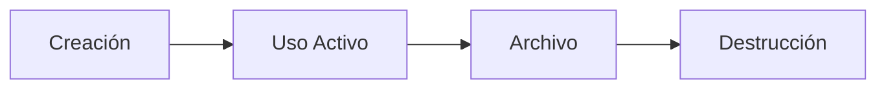

# 8.5 Retención de Datos

> Cuánto tiempo conservamos la información y por qué.

---

## I. PRINCIPIO FUNDAMENTAL

> Los datos personales deben conservarse **solo durante el tiempo necesario** para cumplir con las finalidades declaradas, salvo obligaciones legales.

---

## II. RESUMEN DE PLAZOS

| Categoría | Plazo | Base Legal |
|-----------|-------|------------|
| Mensajes chat | 6 años | LFPDPPP Art. 37 |
| Fotos servicio | 2.5 años | Evidencia |
| CFDIs | 5 años | CFF Art. 30 |
| Contratos | Permanente | Código Civil |
| Logs auditoría | 4 años | LFPDPPP Art. 61 |
| Cuenta usuario | 3 años post-baja | Reclamaciones |

---

## III. FASES DEL CICLO

| Fase | Almacenamiento | Acceso |
|------|----------------|--------|
| Activo | PostgreSQL | Full |
| Archivo | R2 Cold | Limitado |
| Destrucción | Eliminación | Ninguno |

---

## IV. ESTRUCTURA DE HIJOS

| ID | Nombre | Descripción | Estado |
|----|--------|-------------|--------|
| [[Proyecto OnlyCarNLD/Datos/8.5.1 politica_retencion\|8.5.1]] | Política de Retención | Matriz completa de plazos | ✅ Activo |
| [[Proyecto OnlyCarNLD/Datos/8.5.2 ciclos_vida_datos\|8.5.2]] | Ciclos de Vida | Flujo de información | ✅ Activo |

---

## V. EXCEPCIONES

| Caso | Retención |
|------|-----------|
| Disputa activa | Hasta resolución + 1 año |
| Solicitud legal | Según requerimiento |
| Cancelación ARCO | Inmediata (salvo obligaciones) |

---

## Navegación

| ⬆️ Padre | [[Proyecto OnlyCarNLD/Datos/8.0. legal_cumplimiento]] |
|----------|------------------------------|
| ⬅️ Hermano anterior | [[Proyecto OnlyCarNLD/Datos/8.4 contratos_firmas]] |

---
