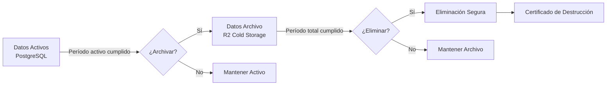

# 8.5.1 Política de Retención de Datos

> Cuánto tiempo guardamos cada tipo de dato y por qué.

---

## I. PRINCIPIOS DE RETENCIÓN

### Principio General

> Los datos personales deben conservarse **solo durante el tiempo necesario** para cumplir con las finalidades para las cuales fueron recabados.

### Bases Legales

| Regulación | Artículo | Obligación |
|------------|----------|------------|
| LFPDPPP | Art. 37 | Cancelar datos cuando dejen de ser necesarios |
| CFF | Art. 30 | Conservar documentos fiscales 5 años |
| Código Civil Federal | Art. 1159 | Prescripción de obligaciones contractuales |

---

## II. MATRIZ DE RETENCIÓN COMPLETA

### Datos de Chat y Comunicaciones

| Categoría | Tipo de Dato | Período Activo | Período Archivo | Total | Justificación |
|-----------|--------------|----------------|-----------------|-------|---------------|
| Mensajes | Texto plano | 1 año | 5 años | **6 años** | LFPDPPP Art. 37 + evidencia |
| Mensajes | CARDs interactivos | 1 año | 5 años | **6 años** | Auditoría |
| Metadatos | Timestamps, IDs | ∞ | - | **Indefinido** | Integridad referencial |

### Datos Multimedia

| Categoría | Tipo de Dato | Período Activo | Período Archivo | Total | Justificación |
|-----------|--------------|----------------|-----------------|-------|---------------|
| Fotos | Servicio (antes/después) | 6 meses | 2 años | **2.5 años** | Evidencia |
| Audio | Notas de voz | 6 meses | 2 años | **2.5 años** | Evidencia |
| Documentos | PDFs adjuntos | 1 año | 5 años | **6 años** | Contratos/facturas |

### Datos Fiscales y Financieros

| Categoría | Tipo de Dato | Período Activo | Período Archivo | Total | Justificación |
|-----------|--------------|----------------|-----------------|-------|---------------|
| CFDIs | Facturas (PDF+XML) | 5 años | - | **5 años** | CFF Art. 30 |
| Retenciones | Constancias | 5 años | - | **5 años** | CFF Art. 30 |
| Pagos | Historial transacciones | 5 años | - | **5 años** | CFF Art. 30 |

### Datos Contractuales

| Categoría | Tipo de Dato | Período Activo | Período Archivo | Total | Justificación |
|-----------|--------------|----------------|-----------------|-------|---------------|
| Contratos | PDF firmados digitalmente | ∞ | - | **Permanente** | Evidencia legal |
| Términos | Versiones aceptadas | ∞ | - | **Permanente** | Evidencia consentimiento |

### Datos de Auditoría

| Categoría | Tipo de Dato | Período Activo | Período Archivo | Total | Justificación |
|-----------|--------------|----------------|-----------------|-------|---------------|
| Logs | Acceso a datos | 1 año | 3 años | **4 años** | LFPDPPP Art. 61 |
| Logs | Operaciones ARCO | 3 años | 2 años | **5 años** | Evidencia cumplimiento |
| Logs | Cambios configuración | 1 año | 4 años | **5 años** | Seguridad |

### Datos de Cuenta

| Categoría | Tipo de Dato | Período Activo | Período Archivo | Total | Justificación |
|-----------|--------------|----------------|-----------------|-------|---------------|
| Perfil | Datos de identificación | Mientras activa | 3 años post-baja | **3 años post** | Reclamaciones |
| Auth | Credenciales | Mientras activa | Eliminación inmediata | **0 post** | Seguridad |

---

## III. CONFIGURACIÓN TÉCNICA

### Constantes de Retención (TypeScript)

```typescript
// config/retention-policy.ts

export const RETENTION_POLICY = {
  // Días totales de retención por categoría
  messages: {
    text: { active: 365, archive: 1825, total: 2190 },      // 6 años
    cards: { active: 365, archive: 1825, total: 2190 },     // 6 años
  },
  
  multimedia: {
    photos: { active: 180, archive: 730, total: 910 },      // 2.5 años
    audio: { active: 180, archive: 730, total: 910 },       // 2.5 años
    documents: { active: 365, archive: 1825, total: 2190 }, // 6 años
  },
  
  fiscal: {
    cfdi: { active: 1825, archive: 0, total: 1825 },        // 5 años
    retentions: { active: 1825, archive: 0, total: 1825 },  // 5 años
  },
  
  contracts: {
    signed: { active: Infinity, archive: 0, total: Infinity }, // Permanente
    terms: { active: Infinity, archive: 0, total: Infinity },  // Permanente
  },
  
  logs: {
    access: { active: 365, archive: 1095, total: 1460 },    // 4 años
    arco: { active: 1095, archive: 730, total: 1825 },      // 5 años
    config: { active: 365, archive: 1460, total: 1825 },    // 5 años
  },
  
  account: {
    profile: { postDeletion: 1095 },  // 3 años después de baja
    credentials: { postDeletion: 0 }, // Eliminación inmediata
  },
} as const;

// Helper para calcular fecha de eliminación
export function getDeletionDate(
  createdAt: Date, 
  category: string, 
  type: string
): Date | null {
  const policy = RETENTION_POLICY[category]?.[type];
  
  if (!policy || policy.total === Infinity) {
    return null; // No se elimina
  }
  
  const deletionDate = new Date(createdAt);
  deletionDate.setDate(deletionDate.getDate() + policy.total);
  return deletionDate;
}

// Helper para determinar si debe archivarse
export function shouldArchive(
  createdAt: Date, 
  category: string, 
  type: string
): boolean {
  const policy = RETENTION_POLICY[category]?.[type];
  
  if (!policy) return false;
  
  const now = new Date();
  const daysSinceCreation = Math.floor(
    (now.getTime() - createdAt.getTime()) / (1000 * 60 * 60 * 24)
  );
  
  return daysSinceCreation > policy.active;
}
```

---

## IV. PROCESO DE ARCHIVADO

### Flujo de Migración



### Job de Archivado (Cron)

| Job | Frecuencia | Acción |
|-----|------------|--------|
| `archive-messages` | Diario 3:00 AM | Mover mensajes > 1 año a R2 |
| `archive-multimedia` | Semanal (Dom) | Mover multimedia > 6 meses a R2 |
| `purge-expired` | Mensual (1ro) | Eliminar datos que superan retención |
| `audit-retention` | Trimestral | Verificar cumplimiento de política |

---

## V. EXCEPCIONES A LA RETENCIÓN

### Casos de Retención Extendida

| Caso | Retención Extendida | Razón |
|------|---------------------|-------|
| Disputa activa | Hasta resolución + 1 año | Evidencia procesal |
| Solicitud legal | Según requerimiento | Obligación legal |
| Litigio pendiente | Hasta sentencia firme | Evidencia procesal |
| Investigación interna | Hasta conclusión | Auditoría |

### Casos de Eliminación Anticipada

| Caso | Retención Reducida | Razón |
|------|-------------------|-------|
| Solicitud ARCO de cancelación | Inmediato* | Derecho del titular |
| Revocación de consentimiento | Inmediato* | LFPDPPP |

> *Excepto cuando apliquen obligaciones legales de conservación (ej: CFDIs)

---

## VI. TEXTO PARA AVISO DE PRIVACIDAD

### Cláusula de Retención (Incluir en Aviso)

```markdown
## Retención de Datos

Conservamos sus datos de la siguiente manera:

| Tipo de Dato | Tiempo de Conservación |
|--------------|------------------------|
| Mensajes de chat | Hasta 6 años desde el servicio |
| Fotos y multimedia | Hasta 2.5 años desde el servicio |
| Datos de cuenta | Mientras su cuenta esté activa + 3 años |
| Facturas (CFDI) | 5 años (obligación legal) |
| Contratos firmados | Permanente (evidencia legal) |

Puede solicitar la eliminación de sus datos en cualquier momento 
enviando un correo a privacidad@onlycar.mx, sujeto a las 
obligaciones legales de conservación aplicables.
```

---

## VII. ELIMINACIÓN SEGURA

### Proceso de Destrucción

1. **Verificar** que el plazo legal se ha cumplido
2. **Generar** certificado de destrucción
3. **Ejecutar** borrado seguro (overwrite + delete)
4. **Registrar** en log de auditoría
5. **Almacenar** certificado por 5 años adicionales

### Certificado de Destrucción

| Campo | Contenido |
|-------|-----------|
| ID del certificado | UUID único |
| Fecha de destrucción | Timestamp |
| Tipo de datos | Categoría destruida |
| Cantidad | Número de registros |
| Método | Sobrescritura + eliminación |
| Responsable | Sistema automatizado |
| Hash de verificación | SHA-256 |

---

## Navegación

| ⬆️ Padre | [[Proyecto OnlyCarNLD/Datos/8.5 retencion_datos]] |
|----------|--------------------------|
| ➡️ Hermano siguiente | [[Proyecto OnlyCarNLD/Datos/8.5.2 ciclos_vida_datos]] |

---

## Referencias

| Documento | Relación |
|-----------|----------|
| [[Proyecto OnlyCarNLD/Datos/1.3.14.1 politica_retencion]] | Documento original |
| [[Proyecto OnlyCarNLD/Datos/1.3.14.4 purga_programada]] | Proceso técnico |
| [[Proyecto OnlyCarNLD/Datos/8.1.1 aviso_privacidad]] | Cláusula de retención |

---
