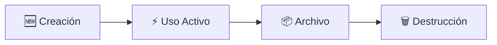
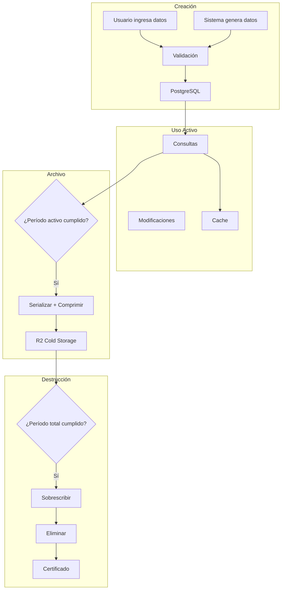

# 8.5.2 Ciclos de Vida de Datos

> De la creación a la destrucción segura.

---

## I. FASES DEL CICLO



---

## II. DETALLE POR FASE

### Fase 1: Creación

| Aspecto | Detalle |
|---------|---------|
| Trigger | Usuario ingresa datos / Sistema genera |
| Validación | Esquema + Sanitización |
| Almacenamiento | PostgreSQL (Supabase) |
| Acceso | Full (CRUD) |
| Encriptación | En tránsito (TLS) + En reposo (AES) |

### Fase 2: Uso Activo

| Aspecto | Detalle |
|---------|---------|
| Duración | Según tipo (ver [[Proyecto OnlyCarNLD/Datos/8.5.1 politica_retencion]]) |
| Almacenamiento | PostgreSQL + Cache (Redis) |
| Acceso | Full (según RLS) |
| Respaldos | Diarios |
| Monitoreo | Logs de acceso |

### Fase 3: Archivo

| Aspecto | Detalle |
|---------|---------|
| Trigger | Período activo cumplido |
| Almacenamiento | Cloudflare R2 (Cold Storage) |
| Acceso | Solo lectura, con autorización |
| Formato | JSON comprimido + encriptado |
| Respaldos | Redundancia geográfica |

### Fase 4: Destrucción

| Aspecto | Detalle |
|---------|---------|
| Trigger | Período total cumplido |
| Método | Overwrite + Delete |
| Certificación | Certificado de destrucción |
| Registro | Log de auditoría permanente |
| Irreversibilidad | Garantizada |

---

## III. AUTOMATIZACIÓN

### Jobs Programados

| Job | Cron | Acción |
|-----|------|--------|
| `daily-archive` | 0 3 * * * | Mover datos a archivo |
| `monthly-purge` | 0 4 1 * * | Eliminar datos expirados |
| `quarterly-audit` | 0 5 1 */3 * | Verificar cumplimiento |

### Código del Job de Archivo

```typescript
// jobs/archive-expired.ts

import { db } from '@/lib/db';
import { uploadToR2 } from '@/lib/storage/r2';
import { RETENTION_POLICY, shouldArchive } from '@/config/retention-policy';

export async function archiveExpiredMessages() {
  // Obtener mensajes que deben archivarse
  const messages = await db.messages.findMany({
    where: {
      status: 'active',
      createdAt: {
        lt: new Date(Date.now() - RETENTION_POLICY.messages.text.active * 86400000)
      }
    },
    take: 1000
  });

  for (const message of messages) {
    // Serializar y comprimir
    const archived = JSON.stringify(message);
    const compressed = await compress(archived);
    
    // Subir a R2
    const key = `archive/messages/${message.id}.json.gz`;
    await uploadToR2(key, compressed);
    
    // Marcar como archivado
    await db.messages.update({
      where: { id: message.id },
      data: { status: 'archived', archivedAt: new Date() }
    });
  }
  
  return messages.length;
}
```

---

## IV. DESTRUCCIÓN SEGURA

### Proceso

1. **Verificar** plazo legal cumplido
2. **Generar** lista de IDs a eliminar
3. **Sobrescribir** datos con zeros
4. **Ejecutar** DELETE en base de datos
5. **Eliminar** archivos en R2
6. **Generar** certificado de destrucción
7. **Registrar** en log de auditoría

### Certificado de Destrucción

```json
{
  "certificateId": "CERT-2026-01-001",
  "timestamp": "2026-01-26T19:00:00Z",
  "dataType": "messages",
  "recordsDestroyed": 1523,
  "method": "overwrite-delete",
  "verificationHash": "sha256:abc123...",
  "retentionPeriodMet": true,
  "authorizedBy": "system-cron"
}
```

---

## V. DIAGRAMA COMPLETO



---

## Navegación

| ⬆️ Padre | [[Proyecto OnlyCarNLD/Datos/8.5 retencion_datos]] |
|----------|--------------------------|
| ⬅️ Hermano anterior | [[Proyecto OnlyCarNLD/Datos/8.5.1 politica_retencion]] |

---
